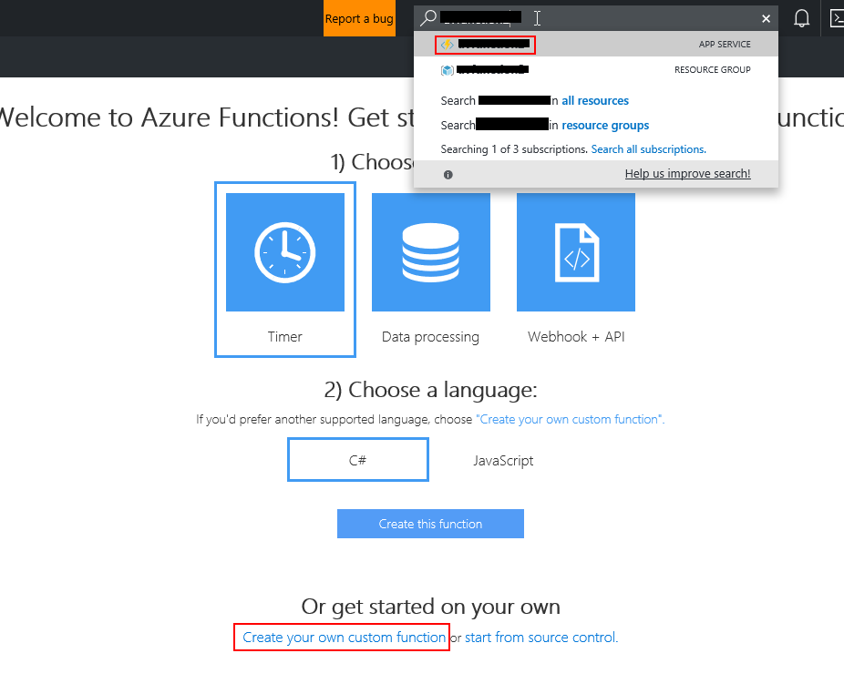
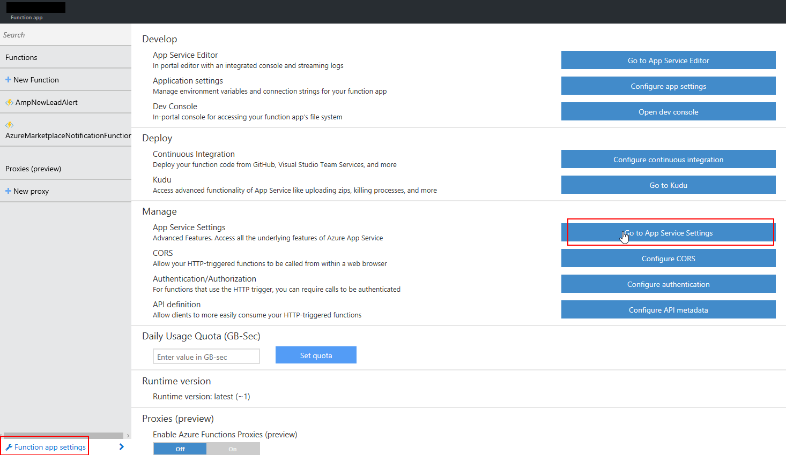
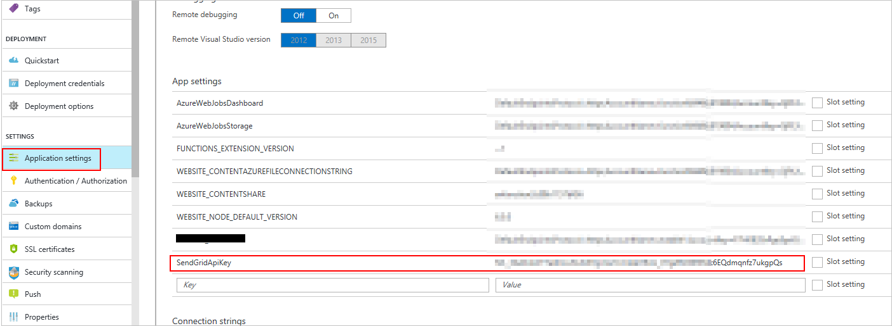

Lead Management Instructions for Azure Table
============================================

This article describes how to configure Azure Table for storing sales leads. Azure Table lets you store and customize customer information.

## To configure Azure Table

1.  If you don't have an Azure account, you can [create a free trial account](https://azure.microsoft.com/pricing/free-trial/).

2.  After your Azure account is active, sign in to the [Azure     portal](https://portal.azure.com).
3.  In the Azure portal, create a storage account. The next screen capture shows how to create a storage account. For more information about storage pricing, see [storage pricing](https://azure.microsoft.com/pricing/details/storage/).

    

4.  Copy the storage account connection string for the key and paste it into the **Storage Account Connection String** field on the Cloud Partner Portal. An example of a connection sting is `DefaultEndpointsProtocol=https;AccountName=myAccountName;AccountKey=myAccountKey;EndpointSuffix=core.windows.net `
    
    

You can use [Azure storage explorer](http://azurestorageexplorer.codeplex.com/) or any other tool to see the data in your storage table. You can also export the data in Azure Table.
data.

## **(Optional)** To use Azure Functions with an Azure table

If you want to customize how you're receiving leads, use [Azure Functions](https://azure.microsoft.com/services/functions/) with an Azure table. The Azure Functions service lets you automate the lead generation process.

The following steps show how to create an Azure Function that uses a timer. Every five minutes the function looks in the Azure table for new records and then uses the SendGrid service to send an email notification.

1.  [Create](https://portal.azure.com/#create/SendGrid.SendGrid) a free SendGrid service account in your Azure subscription.

    

2.  Create a SendGrid API Key 
    - Select **Manage** to go to SendGrid UI
    - Select **Settings**, **API Keys**, and then create a Key that has Mail Send -\> Full Access
    - Save the API key

    

3.  [Create](https://portal.azure.com/#create/Microsoft.FunctionApp) an Azure Function app using the Hosting Plan option named "Consumption Plan".

    

4.  Create a new function definition.

    
 

5.  To get the function to send an update on a specific
    time, select the **TimerTrigger-CSharp** as the starter option.

     

6.  Replace the "Develop" code with the following code sample. Edit the email addresses with addresses you want to use for sender and receiver.

        #r "Microsoft.WindowsAzure.Storage"
        #r "SendGrid"
        using Microsoft.WindowsAzure.Storage.Table;
        using System;
        using SendGrid;
        using SendGrid.Helpers.Mail;
        public class MyRow : TableEntity
        {
            public string Name { get; set; }
        }
        public static void Run(TimerInfo myTimer, IQueryable<MyRow> inputTable, out Mail message, TraceWriter log)
        {
            // UTC datetime that is 5.5 minutes ago while the cron timer schedule is every 5 minutes
            DateTime dateFrom = DateTime.UtcNow.AddSeconds(-(5 * 60 + 30));
            var emailFrom = "YOUR EMAIL";
            var emailTo = "YOUR EMAIL";
            var emailSubject = "Azure Table Notification";
            // Look in the table for rows that were added recently
            var rowsList = inputTable.Where(r => r.Timestamp > dateFrom).ToList();
            // Check how many rows were added
            int rowsCount = rowsList.Count;
            if (rowsCount > 0)
            {
                log.Info($"Found {rowsCount} rows added since {dateFrom} UTC");
                // Configure the email message describing how many rows were added
                message = new Mail
                {
                    From = new Email(emailFrom),
                    Subject = emailSubject + " (" + rowsCount + " new rows)"
                };
                var personalization = new Personalization();
                personalization.AddTo(new Email(emailTo));
                message.AddPersonalization(personalization);
                var content = new Content
                {
                    Type = "text/plain",
                    Value = "Found " + rowsCount + " new rows added since " + dateFrom.ToString("yyyy-MM-dd HH:mm:ss") + " UTC"
                };
                message.AddContent(content);
            }
            else
            {
                // Do not send the email if no new rows were found
                message = null;
            }
        }

    

7.  Select **Integrate** and **Inputs** to define the Azure Table
    connection.

    

8.  Enter the table name and define the connection string by selecting **new**.

    

9.  Now define the Output as SendGrid and keep all the defaults.

    

    

10. Add SendGrid API Key to Function App Settings using the Name
    "SendGridApiKey" and value obtained from API Keys in SendGrid UI

    
    

After you've finished configuring the function, the code in the Integrate section should look like the following example.

    {
      "bindings": [
        {
          "name": "myTimer",
          "type": "timerTrigger",
          "direction": "in",
          "schedule": "0 */5 * * * *"
        },
        {
          "type": "table",
          "name": "inputTable",
          "tableName": "MarketplaceLeads",
          "take": 50,
          "connection": "yourstorageaccount_STORAGE",
          "direction": "in"
        },
        {
          "type": "sendGrid",
          "name": "message",
          "apiKey": "SendGridApiKey",
          "direction": "out"
        }
      ],
      "disabled": false
    }

11. The final step is to navigate to the Develop UI of the function and then select **Run** to start the timer. Now you'll get a notification every time a new lead comes in.
