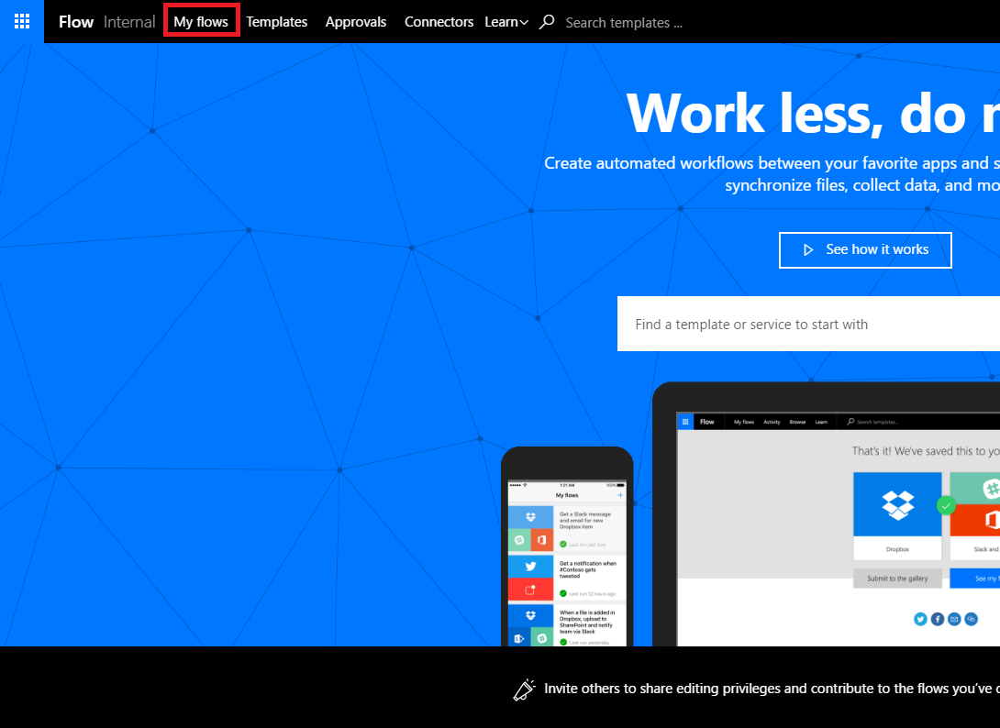
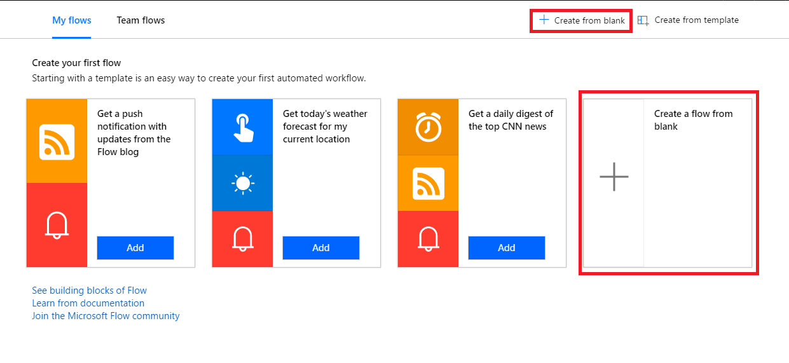
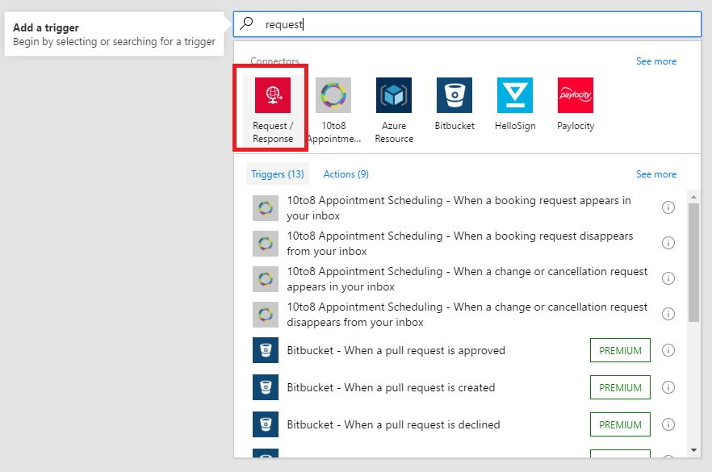
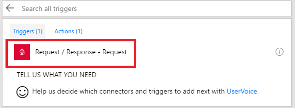
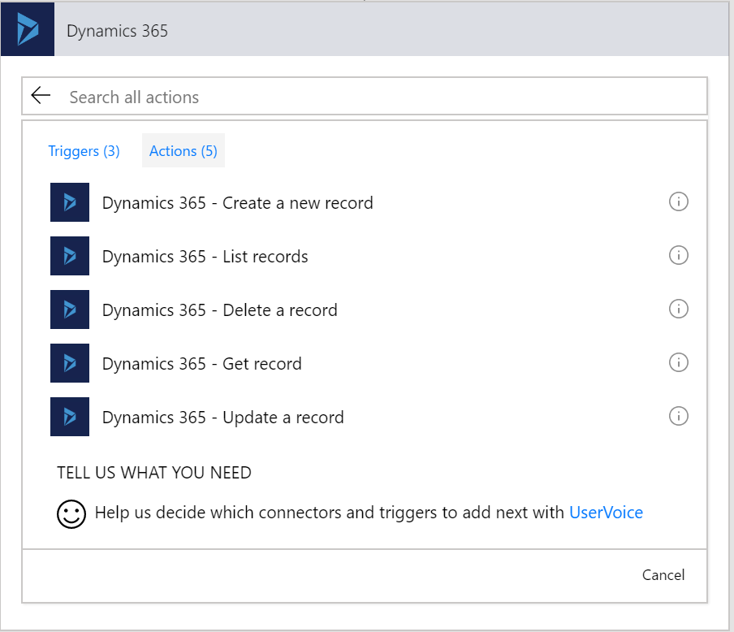
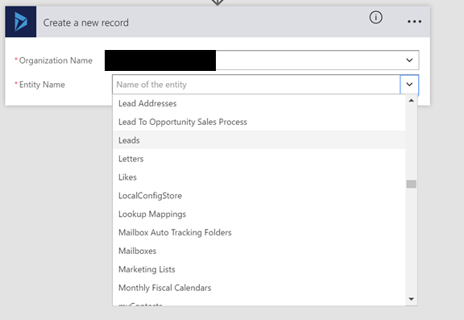
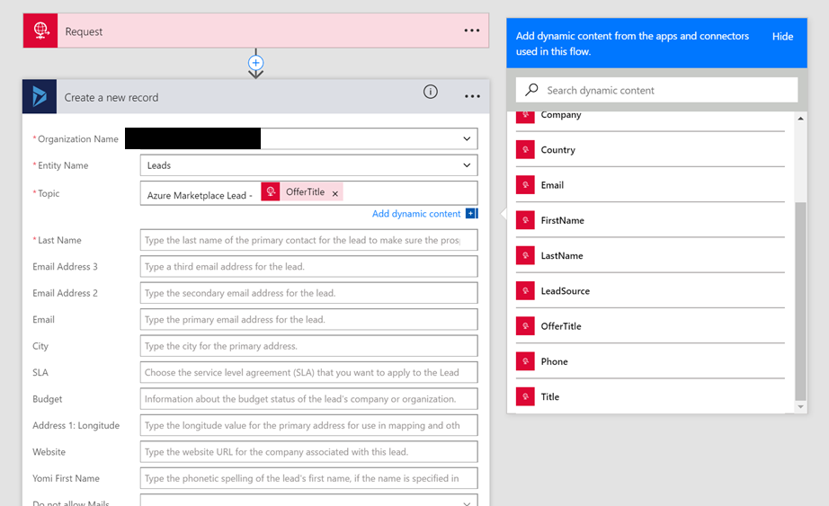
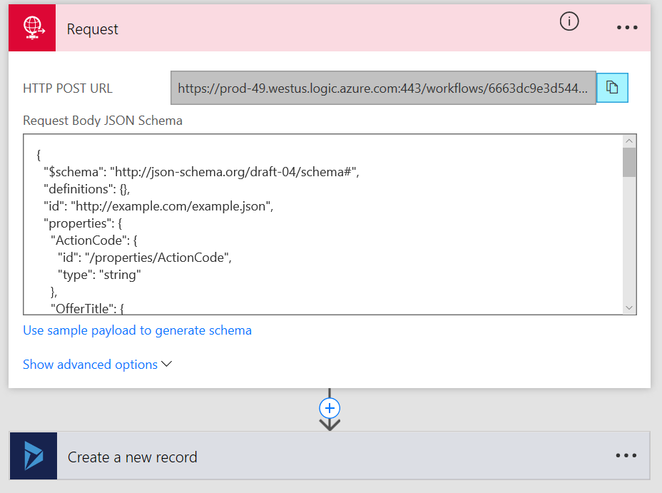
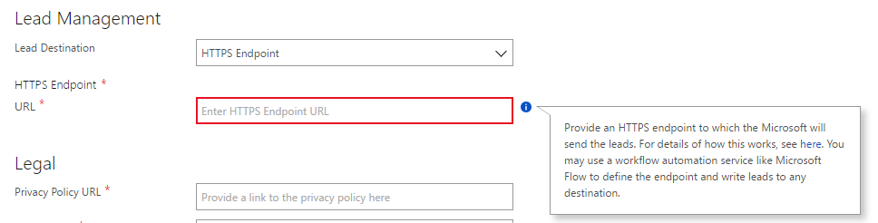

# Configure lead management using an HTTPS endpoint

You can use an HTTPS endpoint to handle Azure Marketplace and AppSource leads that can be written to a CRM system. This article describes how to configure lead management using the Microsoft Flow automation service.


## Create a flow using Microsoft Flow

1.  Open the [Flow](https://flow.microsoft.com/) webpage. Select **Sign in** or select **Sign up free** to create a free Flow account.

2.  Sign in and select **My flows** on the menu bar.

    

3.  Select **Create from blank**.

    


4.  Select the **Request/Response** connector, and then search for the request trigger. 

    

5. Select the **Request** trigger.
    


6.  Copy the **JSON Example** at the end of this article into the **Request Body JSON Schema**.

7.  Add a new step and choose the CRM system of your choice with the action to create a new record. The next screen capture shows **Dynamics 365 - Create a new record** as an example.

    

8.  Provide the connection inputs for your connector and select the **Leads** entity.

    

9.  Flows shows a form for providing lead information. You can map items from the input request by choosing to add dynamic content.

    

10.  Map the fields you want and then select **Save** to save your flow.

11. An HTTP POST URL is created in the Request. Copy this URL and use it as the HTTPS endpoint.

    

## Configure your offer to send leads to the HTTPS endpoint

When you configure the lead management information for your offer, select **HTTPS Endpoint** for the Lead Destination and paste in the HTTP POST URL you copied in the previous step.  



When leads are generated, Microsoft will send leads to the Flow, which get routed to the  CRM system you configured.


## JSON Example

``` json
{
  "$schema": "http://json-schema.org/draft-04/schema#",
  "definitions": {},
  "id": "http://example.com/example.json",
  "properties": {
    "ActionCode": {
      "id": "/properties/ActionCode",
      "type": "string"
    },
    "OfferTitle": {
      "id": "/properties/OfferTitle",
      "type": "string"
    },
    "LeadSource": {
      "id": "/properties/LeadSource",
      "type": "string"
    },
    "UserDetails": {
      "id": "/properties/UserDetails",
      "properties": {
        "Company": {
          "id": "/properties/UserDetails/properties/Company",
          "type": "string"
        },
        "Country": {
          "id": "/properties/UserDetails/properties/Country",
          "type": "string"
        },
        "Email": {
          "id": "/properties/UserDetails/properties/Email",
          "type": "string"
        },
        "FirstName": {
          "id": "/properties/UserDetails/properties/FirstName",
          "type": "string"
        },
        "LastName": {
          "id": "/properties/UserDetails/properties/LastName",
          "type": "string"
        },
        "Phone": {
          "id": "/properties/UserDetails/properties/Phone",
          "type": "string"
        },
        "Title": {
          "id": "/properties/UserDetails/properties/Title",
          "type": "string"
        }
      },
      "type": "object"
    }
  },
  "type": "object"
}
```
