# Configure lead management using an HTTPS endpoint

You can use an HTTPS endpoint to handle Microsoft AppSource and Azure Marketplace leads. These leads can be written to a Customer Relationship Management (CRM) system or sent as an email notification. This article describes how to use the [Microsoft Power Automate](https://powerapps.microsoft.com/automate-processes/) automation service to configure lead management.

## Create a flow using Microsoft Power Automate

1. Open the [Power Automate](https://flow.microsoft.com/) webpage. Select **Sign in** or select **Sign up free** to create a free Flow account.

1. Sign in and select **My flows** on the menu bar.
    > [!div class="mx-imgBorder"]
    > 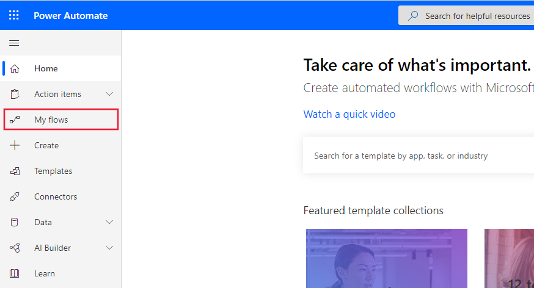

1. Under **+ New**, select **+ Instant—from blank**.
    > [!div class="mx-imgBorder"]
    > 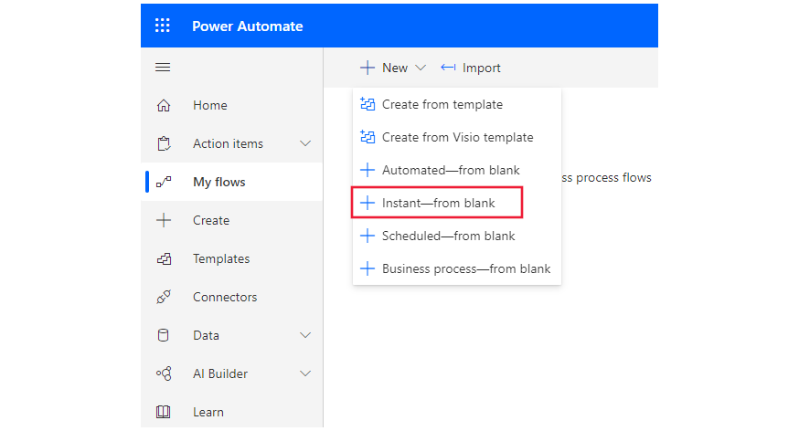

1. Name your flow, and then under **Choose how to trigger this flow**, select **When a HTTP request is received**.

    > [!div class="mx-imgBorder"]
    > 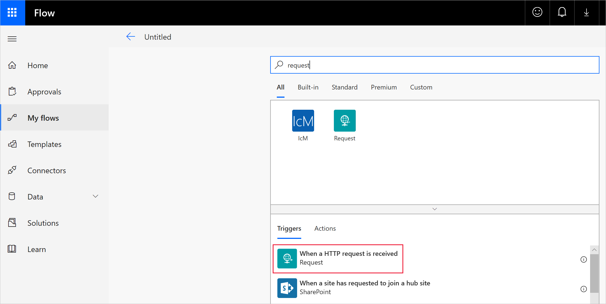

1. Click the flow step to expand it.

    > [!div class="mx-imgBorder"]
    > 

1. Use one of the following methods to configure the **Request Body JSON Schema**:

   - Copy the [JSON schema](#json-schema) at the end of this article into the **Request Body JSON Schema** text box.
   - Select **Use sample payload to generate schema**. In the **Enter or paste a sample JSON payload** text box, paste in the [JSON example](#json-example). Select **Done** to create the schema.

   >[!Note]
   >At this point in the flow you can either connect to a CRM system or configure an email notification.

### To connect to a CRM system

1. Select **+ New step**.
2. Choose the CRM system of your choice with the action to create a new record. The following screen capture shows **Dynamics 365 - Create a new record** as an example.

    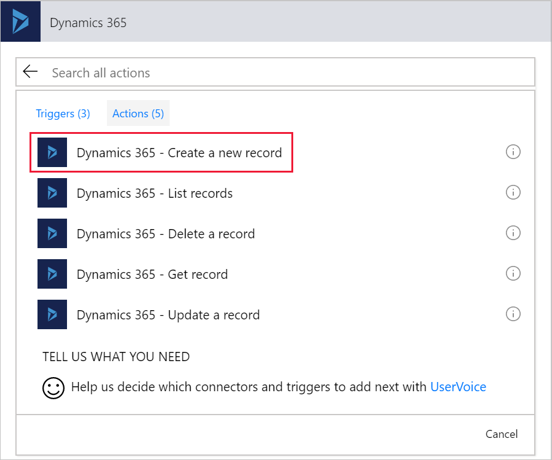

3. Provide the **Organization Name** that's the connection inputs for your connector. Select **Leads** from the **Entity Name** dropdown list.

    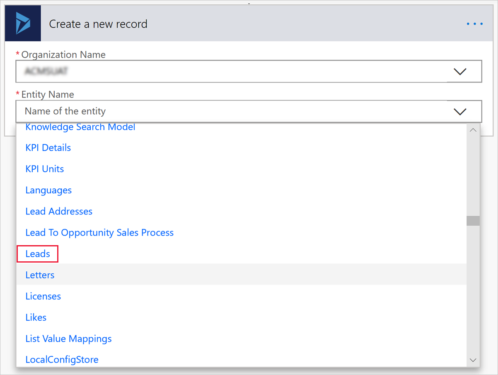

4. Flow shows a form for providing lead information. You can map items from the input request by choosing to add dynamic content. The following screen capture shows **OfferTitle** as an example.

    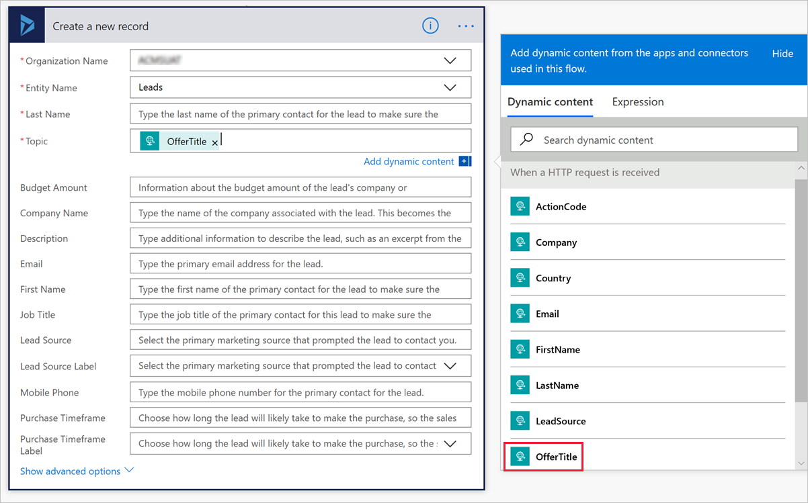

5. Map the fields you want and then select **Save** to save your flow.

6. An HTTP POST URL is created in the request. Copy this URL and use it as the HTTPS endpoint.

    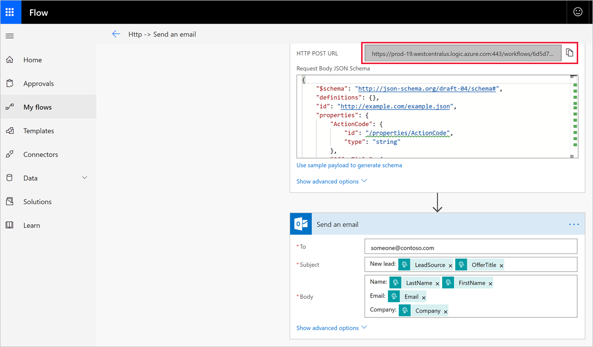

### To set up email notification

1. Select **+ New step**.
2. Under **Choose an action**, select **Actions**.
3. Under **Actions**, select **Send an email**.

    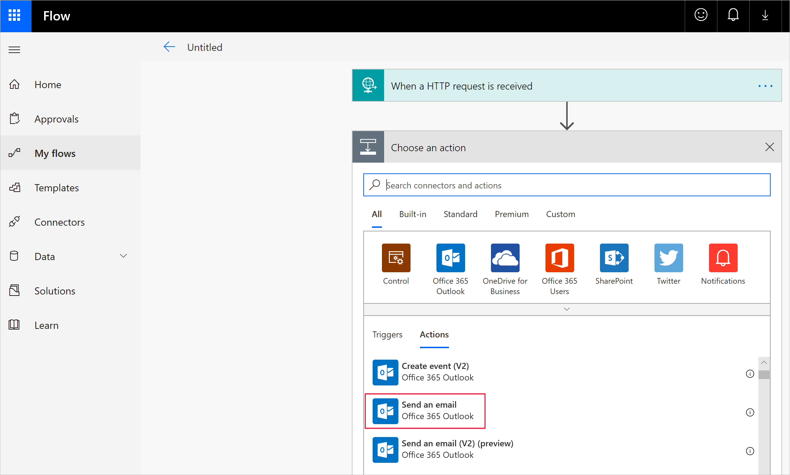

4. In **Send an email**, configure the following required fields:

   - **To** - Enter at least one valid email address.
   - **Subject** - Flow gives you the option of adding Dynamic content, like **LeadSource** in the following screen capture.

     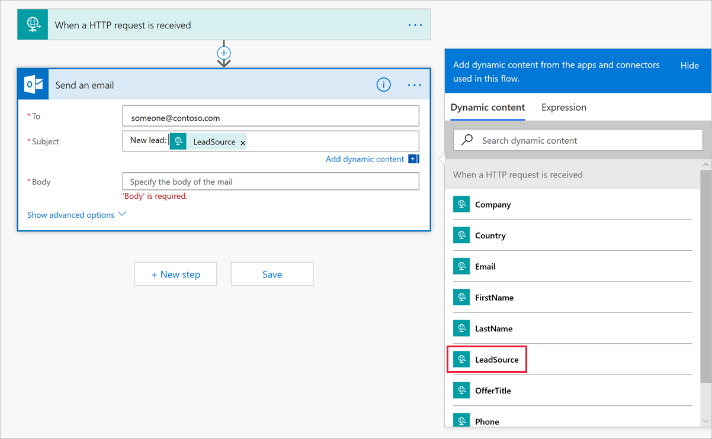

   - **Body** - From the Dynamic content list, add the information you want in the body of the email. For example, LastName, FirstName, Email, and Company.

   When you're finished setting up the email notification, it will look like the example in the following screen capture.

   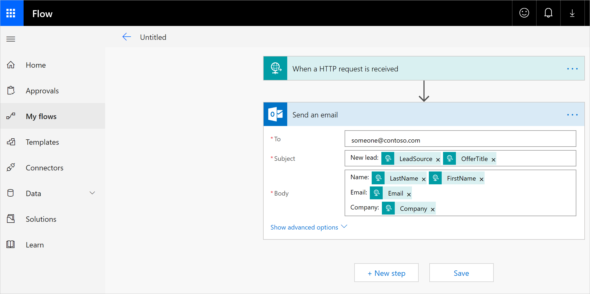

5. Select **Save** to finish your flow.

6. An HTTP POST URL is created in the request. Copy this URL and use it as the HTTPS endpoint.

    

## Configure your offer to send leads to the HTTPS endpoint

When you configure the lead management information for your offer, select **HTTPS Endpoint** for the **Lead Destination** and paste in the HTTP POST URL you copied in the previous step.  

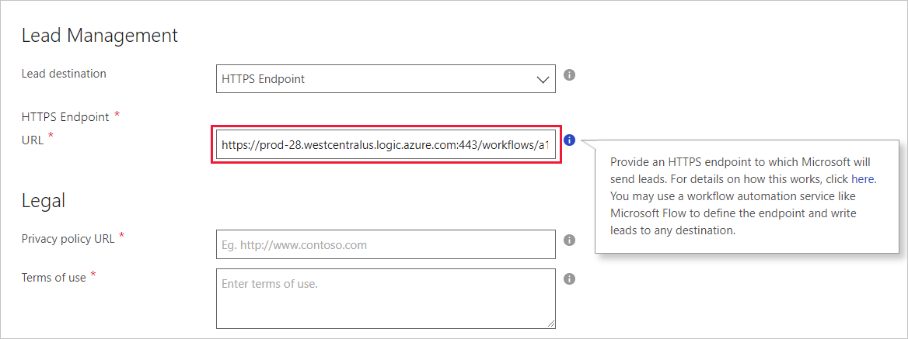

When leads are generated, Microsoft sends leads to your Power Automate flow, which get routed to the CRM system or email address you configured.

## JSON schema and example

The JSON test example uses the following schema:

### JSON schema

``` json
{
  "$schema": "https://json-schema.org/draft-04/schema#",
  "definitions": {},
  "id": "http://example.com/example.json",
  "properties": {
    "ActionCode": {
      "id": "/properties/ActionCode",
      "type": "string"
    },
    "OfferTitle": {
      "id": "/properties/OfferTitle",
      "type": "string"
    },
    "LeadSource": {
      "id": "/properties/LeadSource",
      "type": "string"
    },
    "Description": {
      "id": "/properties/Description",
      "type": "string"
    },
    "UserDetails": {
      "id": "/properties/UserDetails",
      "properties": {
        "Company": {
          "id": "/properties/UserDetails/properties/Company",
          "type": "string"
        },
        "Country": {
          "id": "/properties/UserDetails/properties/Country",
          "type": "string"
        },
        "Email": {
          "id": "/properties/UserDetails/properties/Email",
          "type": "string"
        },
        "FirstName": {
          "id": "/properties/UserDetails/properties/FirstName",
          "type": "string"
        },
        "LastName": {
          "id": "/properties/UserDetails/properties/LastName",
          "type": "string"
        },
        "Phone": {
          "id": "/properties/UserDetails/properties/Phone",
          "type": "string"
        },
        "Title": {
          "id": "/properties/UserDetails/properties/Title",
          "type": "string"
        }
      },
      "type": "object"
    }
  },
  "type": "object"
}
```

You can copy and edit the following JSON example to use as a test in your flow.

### JSON example

```json
{
  "UserDetails": {
    "FirstName": "Some",
    "LastName": "One",
    "Email": "someone@contoso.com",
    "Phone": "16175555555",
    "Country": "USA",
    "Company": "Contoso",
    "Title": "Esquire"
 },
  "LeadSource": "AzureMarketplace",
  "ActionCode": "INS",
  "OfferTitle": "Test Microsoft",
  "Description": "Test run through Power Automate"
}
```

## Next steps

If you haven't already done so, configure customer [leads](https://docs.microsoft.com/azure/marketplace/cloud-partner-portal-orig/cloud-partner-portal-get-customer-leads) in the Cloud Partner Portal.
