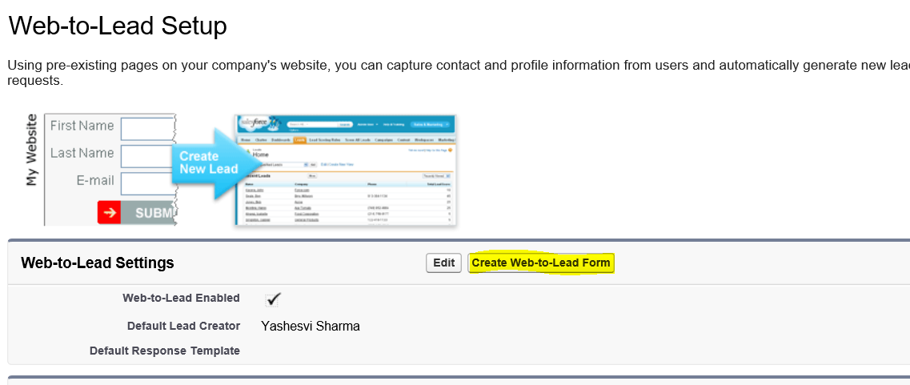
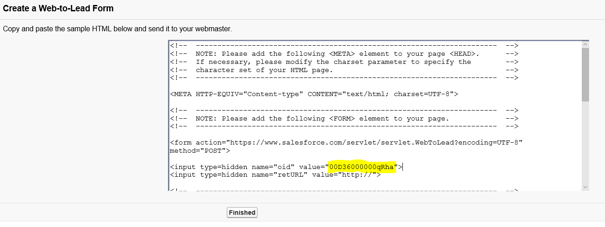

# Configure lead management for Salesforce

This article describes how to setup your Salesforce system to handle sales leads.

1. Sign in to Salesforce.
2. Select **Setup**.
    

3. Expand the **Build** menu to **Customize/Leads/Web-to-Lead**.
    

4. On **Web-to-Lead Setup**, select **Create Web-to-Lead Form**.
    

5. On **Create a Web-to-Lead Form**, select **Generate**
    

6. Copy the OID in the sample and save it. You'll paste the OID in the **Object Identifier** field on the Cloud Partner Portal.

