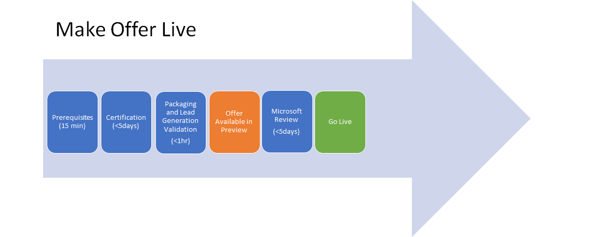

Make your Azure Application offer live on Azure Marketplace 
===========================================================

Now that you\'ve populated all the offer details, it\'s time to publish
your offer and make it live on Azure Marketplace. There are a few steps, make sure both your marketing content and
your application meet the quality requirements to be Azure Certified, before going live on the website.

Let\'s go through this process in more detail to better understand what
is happening during each step, and the action items in this process for you to ensure your offer continues to make progress.

Publishing Process 
------------------

You will click \"Publish\" under the
Editor tab to start the Publish process.

Under the Status tab, you will see the Publishing Steps and which step your offer is at.

At any point in the publishing process, you can also sign in and click
the All Offers tab to view the latest status for any of your offers. You
can click directly on the status for your offer and see the details on
where your offer is in the publishing process.

Let\'s walk through each of the publishing steps, discuss what happens
at each step and how long you should estimate each step will take.

### Validate Pre-Requisites (\<1 day) 

When you click \"Publish\", an automated check will take place to ensure
you\'ve populated all the required fields on your offer. If any fields
are not populated, a warning will appear next to the field, and you will
need to populate it accurately then click \'Publish\' again.

Once you\'ve completed this step correctly, a pop-up will appear to ask
for an email address. This is the email to which you will receive
publishing status notifications for the remainder of the publishing
process. Once you submit your email address, this step is complete.

### Certification (\<5 days) 

This step is where we run several tests to ensure your Azure Application
package meets the requirements to be Azure Certified.

Since this step can take several days, you can log out of the Cloud
Partner Portal. We will send you an email notification if there are any
errors. If everything passes with success, the
process will automatically move on to the Provisioning step.

### Packaging and Lead Generation Registration (\<1 hour) 

During this stage, we are combining the technical and marketing content
into what will be the product page on the website.

### Offer Available in Preview 

You will get a notification email that your offer has successfully
completed the steps required to access the offer in preview. In this
step, you should preview your offer and make sure everything looks as it
should be. Check to see if your VM is properly deployed in the staging environment.

Only whitelisted subscriptions can do this verification.\*

### Publisher sign out 

Once you verify everything looks correct and works properly in preview,
you are ready to go live. Click on Go Live under the status tab
and we will begin steps to make your offer live in production and on the
website. Typically, it will take several hours from the time you click
Go Live and when the offer is live on the website. We will send you an
email notification once your offer is officially live on the website.

### Microsoft Review 

Once you are ready to go, and clicked on \"Go Live\", a worksite
will be created in Visual Studio online, followed by a Microsoft code review of the package contents. The code review will cover best
patterns/practices to use when authoring templates, tips, and tricks to
optimize resource creation. If the feedback results in the publisher
making changes to the files, the publish process will have to be started
again. The current publishing will be canceled and you will have to
publish again with the feedback comments addressed.

### Live

Your offer is now Live on Azure Marketplace and Azure Portal. Your
customers will be able to view and deploy your azure managed application
in their Azure subscriptions. You can click on the All
offers tab, and see the status for all your offers listed on the right
column. You can click on the status to see the publishing flow status in
detail for your offer.

### Error Handling 

If you encounter an error, you will receive a notification email informing you that
an error occurred with instructions on next steps. You can also see
errors at any time during this process by clicking the Status tab. You
will see which point in the process the error occurred along with an
error message outlining what needs to be resolved.

If you encounter errors during the publishing process, you are required
to fix these then click \'Publish\' to restart the process. You must
start at the beginning of the publishing steps at Validate
Pre-Requisites when re-publishing after any error fix.

If you are having issues resolving an error, you should open a support
request to get help from our support engineers.

### Canceling the publishing request

You might start the process of publishing and have a need to cancel your
request. You can only cancel a publishing request once the publish
request reaches the Publisher Signoff step. To cancel, click on \'Cancel
Publish\'. The publishing status will reset to Step 1, and to publish
again, you should click Publish and follow the steps in the status.
