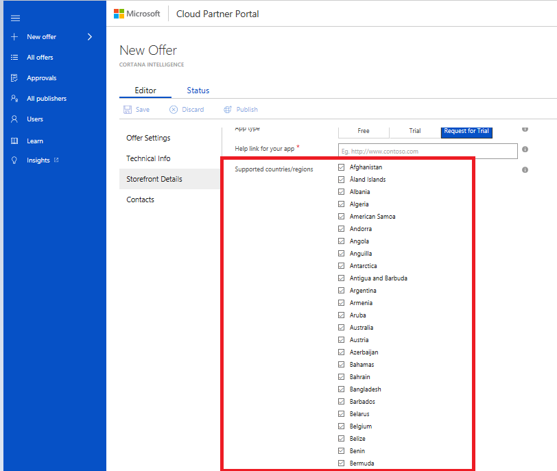

# Publish a Cortana Intelligence offer using the Cloud Partner Portal

This article describes how to publish a Cortana Intelligence offer using the Cloud Partner Portal.

## Prerequisites

The Cloud Partner Portal supports role-based access to the portal, which enables contributors to collaborate on publishing an
offer. For more information, see [Cloud Portal Manage Users](./cloud-partner-portal-manage-users.md).

Before an offer can be published on behalf of a publisher account, one
of individuals with \"owner\" role need to agree to comply with the
[Terms of Use](https://azure.microsoft.com/support/legal/website-terms-of-use/),
[Microsoft Privacy Statement](http://www.microsoft.com/privacystatement/default.aspx),
and [Microsoft Azure Certified Program Agreement](https://azure.microsoft.com/support/legal/marketplace/certified-program-agreement/).

## To start creating a Cortana Inteligence offer

Once all the pre-requisites have been met, you are ready to start
authoring your Cortana Inteligence offer.

1.  Sign in to the [cloud partner portal](http://cloudpartner.azure.com/).
2.  On the left navigation bar, select **+ New offer**.
3. Select **Cortana Intelligence**.
4. Select the **Editor** tab in the **New Offer** view to configure the following options:
    -   Offer Settings
    -   Technical Info
    -   Storefront Details
    -   Contacts

    Each of the preceding options display a form that you fill out.  Required fields for each form are marked with a red asterisk (\*).

## To configure Offer Settings

The Offer Settings provides basic information about the offer, such as an offer ID, publisher ID, and offer name.

### Offer ID

This is a unique identifier for the offer within a publisher profile.
This ID is visible in product URLs. It can only be composed of
lowercase alphanumeric characters or dashes (-). The ID can't end in a
dash and can have a maximum of 50 characters. 
>[!Note]
>This field is locked when an offer goes live.

**Example:**

If the publisher **contoso** creates an offer with the 
offer ID *sample-Cortana Intelligence*, it will show up in AppSource as
"https://appsource.microsoft.com/marketplace/apps/**contoso**.*sample-Cortana
Intelligence*?tab=Overview".

### Publisher ID

A dropdown list of publisher profiles. Use to choose the publisher profile that you want to publish this offer under.

>[!Note]
>This field is locked when an offer goes live.

### Name

The display name for your offer. This name is displayed in [AppSource](https://appsource.microsoft.com). It can have a
maximum of 50 characters.

When you finish providing the information needed in Offer Settings, select **Save** to move on to the Technical Info part of the offer. option.

## To configure Technical Info

Use this view to provide technical information that will be displayed in your offer page. The following fields apply to this view.

### Partner MPN Id

If you're a registered Microsoft partner, go to the [partners website](https://partners.microsoft.com/) and sign in to get your Organization
Partner Id. Enter that ID for the **Partner MPN Id**.

### Analytics components used

Select all the components that your offer uses. Select at least 1 component. Select **Microsoft R** only if you're using any one of the MRS licenses of SQL 2016 R services, HDInsight Premium, or MRS running on VMs.

### Additional components used

Select all the other components that your solution uses.

### Customer Name using solution

Provide the customer name that's using this solution in production. 

>[!Note]
>This information isn't published on AppSource. It's only used for solution evaluation.

### Azure consumption requirement met?

Indicate whether or not the solution generates at least $1 K per month per customer of Azure Suite components, or if the solution uses Microsoft R.

>[!Note]
>This information isn't published on AppSource. It's only used for solution evaluation.

### Demo Video URL

Provide a URL for a demo video for the solution/app that your pre-sales team can show customers. 

>[!Note]
>This information isn't published on AppSource. It's only used for solution evaluation.

#### Demo video guidelines

- Video length should be less than 15 minutes.
- The video should be minimally edited recording of the solution's functionality. 
- The video highlights the key aspects of the user-facing functionality and focuses on the integration of advanced analytics. 
- Demo videos **will not** be made available publicly to customers but are expected to be representative of how the solution *would be* shown to a prospective customer. As such, they should be scripted and repeatable.
- Use any screen recording tool that exports a standard video
format (for example, MPEG) to create your video. 

The following instructions show how to create a video using Skype for Business. 

1. [Begin a meeting](https://support.office.com/article/Start-a-Skype-for-Business-conference-call-8dc8ac52-91ac-4db9-8672-11551fdaf997)
2. [Share your desktop](https://support.office.com/article/Share-your-screen-in-Skype-for-Business-2d436dc9-d092-4ef1-83f1-dd9f7a7cd3fc)
3. [Begin recording](https://support.office.com/article/Share-sites-or-documents-with-people-outside-your-organization-80e49744-e30f-44db-8d51-16661b1d4232)
4. After you stop recording, [use the recording manager to publish your recording](https://support.office.com/article/Recording-Manager-save-and-publish-59a3beb7-c700-40cf-ab21-bc82a2b06351)

Upload your recorded video to a service that allows you to
generate a shared URL. For example, a [guest link in OneDrive or Sharepoint](https://support.office.com/article/Share-sites-or-documents-with-people-outside-your-organization-80e49744-e30f-44db-8d51-16661b1d4232).

### Supported regions

Select all regions that your solution supports. Select at least 1 region.

### Power BI desktop file (.pbix)

If applicable, upload a .pbix file. Make sure that data is imported into the file, not referenced externally. We'll create the embedded report for you.

### Solution architecture

Upload a document that details your solution's architecture. For  uploading a solution architecture diagram guideline, see
[Advanced Analytics Solution Workflow Template](https://partnersprofilesint.blob.core.windows.net/partner-assets/documents/AppSource%20Solution%20Publishing%20Guide%20Docs/Advanced%20Analytics%20Solution%20Workflow%20Template%20V.2017.3.23.pptx).

>[!Note]
>This information isn't published on AppSource. It's only used for solution evaluation.

### Select segments

Select all the related industry segments. If your app is for any unlisted segment, enter the segment name in the **Others** field. You are limited to three words for the segment.

### Select business processes

Select the business processes that best describe your solution. If your app is for any unlisted processes, enter the process name in the **Others** field. You are limited to three words for the process.

### Trial Info

-   **SaaS Trial URL:** Enter the URL for your app's trial experience.
-   **Test Drive Trial URL:** Enter the URL for your app's Test Drive
    experience.

For more information about trials, see **App type** in the next section of this article.

When you finish providing the information needed in Technical Info, select **Save** to move on to the Storefront Details part of the offer. 

## To configure Storefront Details

### Offer Summary

This is a summary of your offer's value proposition. It will appear on
your offer's search page. The maximum length of the summary is 100 characters.

### Offer Description

This is the description that will appear on your app's detail page.
The maximum length of the description is 1300 characters.

Note that this field takes html content with tags like \<p\>, \<h1\>,
\<h2\>, \<li\>, etc., which enables you to make the content much more
presentable. Publishing portal team is working on adding a feature to
enable one to see a preview of their storefront details to iteratively
making the content more presentable - in the meanwhile, you can use any
you can use any online real-time html tools like
[http://htmledit.squarefree.com](http://htmledit.squarefree.com/) to see
how your description would look.

The suggested format of description is to have break up the text into
sub-sections based on value propositions, each with highlighted with a
sub-heading. Visitors usually glance over the "offer summary" field and
sub-headings to get gist of what the app addresses and why should they
consider the app in just a quick glance. So, it is important to get the
user\'s attention give them a reason to read on to get the specifics.

#### Partner examples

- [Neal Analytics Inventory Optimization](https://appsource.microsoft.com/product/web-apps/neal_analytics.8066ad01-1e61-40cd-bd33-9b86c65fa73a?tab=Overview)
- [Plexure Retail Personalization](https://appsource.microsoft.com/product/web-apps/plexure.c82dc2fc-817b-487e-ae83-1658c1bc8ff2?tab=Overview)
- [AvePoint Citizen Services](https://appsource.microsoft.com/product/web-apps/avepoint.7738ac97-fd40-4ed3-aaab-327c3e0fe0b3?tab=Overview)

### Industries

Select the industry that your app is best aligned to. If your app 
relates to multiple industries, leave this field empty.

### Categories

Select the categories that are relevant to your app. Select a maximum of two categories.

### App type

Select the type of trial that your app will support on AppSource. Choose on of the following trials:
- **Free** means your app is free.
- **Trial** means customers can try your for a specified period.
- **Request for trial** means customers can request a trial of the app.

Partners can give two types of trial experiences on AppSource.

- The **Trial** option, also called **Customer Led Trials (CLT)** can be one of the following types: 
    - SaaS trial
        - The customer can navigate to a Url that you or your partner provide. The customer goes through AAD federated SSO to have a time boxed trial experience.
        - This is a SaaS app with multi-tenancy that isolates a user's configuration/data from other users. Or this experience only provides a subset that uses read-only operations.

        **Examples:**

        - [AFS POP Retail Execution](https://appsource.microsoft.com/product/web-apps/afs.fa9fc926-3bc3-43dd-becd-3ef41b52c10b?tab=Overview)
        - [AvePoint Citizen Services](https://appsource.microsoft.com/product/web-apps/avepoint.7738ac97-fd40-4ed3-aaab-327c3e0fe0b3?tab=Overview). (This app provides a curated experience with clear paths for
        a selected set of user personas.)

     - Test Drive
        - Your (or your partner's) solution or a subset of it can be packaged using Azure Resource Manager templates that AppSource can instantiate and . AppSource can manage the app in a partner subscription with time boxing and          maintaining hot/cold pool of instances etc.
        - We can provide templates and sample code to help you if you
            choose this option.

        **Examples:**

        - [Neal Analytics Inventory Optimization](https://appsource.microsoft.com/product/web-apps/neal_analytics.8066ad01-1e61-40cd-bd33-9b86c65fa73a?tab=Overview&tag=CISHome)

- The **Request for trial** (**Partner Led Trials / PLT**) option requires customers to fill a contact info form for partner followup. The partner follows up and gives a demonstration or trial of the app. For more information, see [AppSource trial experience walkthrough](http://aka.ms/trialexperienceforwebapps) video for a high-level overview.

>[!Note]
>Data shows that **Customer Led Trials** have a higher lead generation potential than **Partner Led Trials**.

### Help link for your app

Provide a URL to a page that has help information for your app.

### Supported countries/regions

This field determines the countries/regions where your offer will be available for trial.

### Supported languages

Select the languages that your app supports. If your app supports
languages that are not on this list, publish your
offer and email us at: <appsource@microsoft.com> to let us know about support for other languages.

### App version

Enter the version number for your app.

### Products your app works with

List specific products that your app works with. You can list maximum of 3 products. To list a product, select the **plus sign** (beside new) and an open text field is created for you. Enter the name of a
product that your app works with.

### Hide key

This is a key combined with the offer preview URL to hide the offer from public view. It's not a password. You can enter any alphanumeric string.

### Offer logo (small)

This logo appears on your app's search page. The png image format is the only format that's allowed. The image size is 48 pixels by 48 pixels.

### Offer logo (large)

This logo appears on your app's detail page. The png image format is the only format that's allowed. The image size is 48 pixels x 48 pixels.

### Video

You can upload maximum of four videos. For each video you want to
upload:
- Provide the video name
- Provide a URL (YouTube or Vimeo only)
- Provide a Thumbnail to associate with the video. The Thumbnail must use the png image format and it's size must be 1280 pixels X 720 pixels. 

To add new video(s), select **+ New**, shown in the next screen capture.

### Document

You can upload a maximum of three documents. Each document must use the PDF file format. To add a new document:

- Select **+ New**
- Enter a document name
- Select **Upload** to upload a document.

### Privacy Policy

Enter URL for your app's privacy policy

### Terms of use

Enter the terms of use of your app. AppSource customers are required to accept these terms before they can try your app.

>[!Note]
>This field accepts content using HTML tags such as  html content <p\>, <h1\>, and <li\>. You can use these tags to format your content. 

### Lead Destination

Select a CRM system where your leads will be stored. 

Select **Azure Table** if you're using one of these CRM systems: Salesforce,
Marketo, or Microsoft Dynamics CRM. 

To get more information about the CRM system you want to use, select one of the following links for supported systems.

-   [Azure Table](./cloud-partner-portal-lead-management-instructions-azure-table.md)
-   [Marketo](./cloud-partner-portal-lead-management-instructions-marketo.md)
-   [Microsoft Dynamics CRM](./cloud-partner-portal-lead-management-instructions-dynamics.md)
-   [Salesforce](./cloud-partner-portal-lead-management-instructions-salesforce.md)
