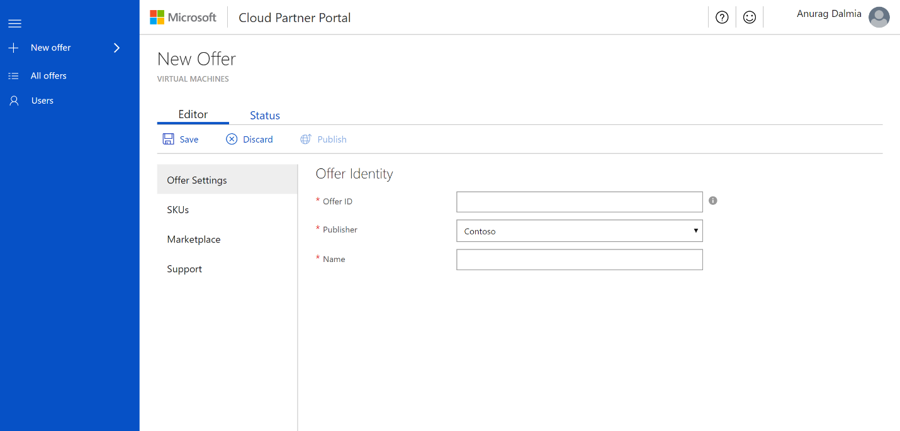
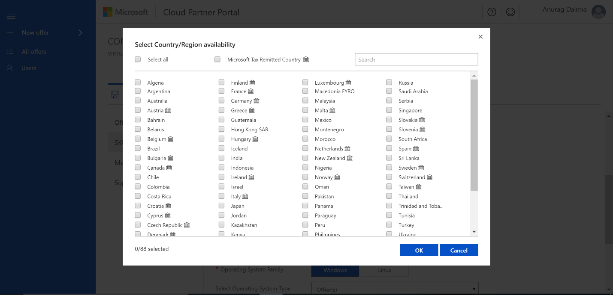
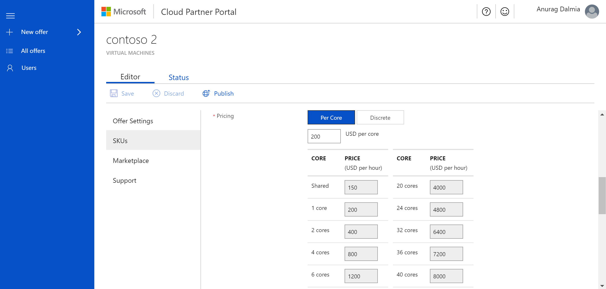
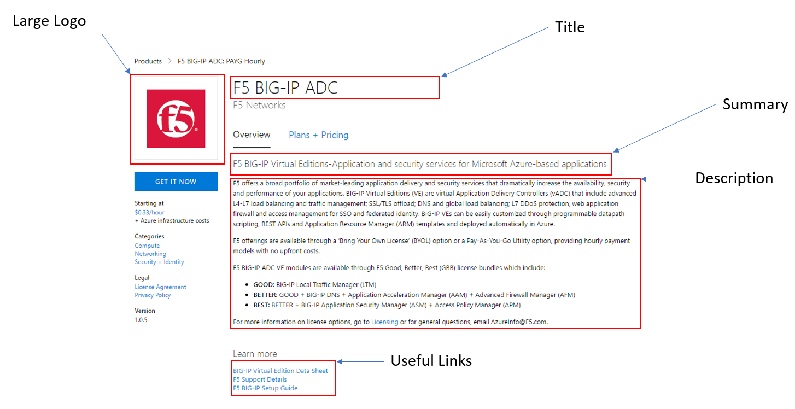

# Publish a virtual machine to Azure Marketplace

This article provides the steps you need to publish a virtual machine offer to Azure Marketplace.

## Prerequisites

The following technical and non-technical prerequisites apply to publishing a virtual machine on Azure Marketplace

### Technical

-   [Technical prerequisites for creating a virtual machine image for the Azure Marketplace](https://docs.microsoft.com/azure/marketplace-publishing/marketplace-publishing-vm-image-creation-prerequisites)

-   [Create and upload a Linux VHD](https://docs.microsoft.com/azure/virtual-machines/virtual-machines-linux-create-upload-generic?toc=%2fazure%2fvirtual-machines%2flinux%2ftoc.json)

-   [Create & test a Linux VM from an image](https://docs.microsoft.com/azure/virtual-machines/virtual-machines-linux-upload-vhd)

-   [Create and upload a Windows VHD ](https://docs.microsoft.com/azure/virtual-machines/virtual-machines-windows-prepare-for-upload-vhd-image?toc=/azure/virtual-machines/windows/toc.json)

-   [Create & test a Windows VM from an image](https://docs.microsoft.com/azure/virtual-machines/virtual-machines-windows-create-vm-generalized-managed?toc=/azure/virtual-machines/windows/toc.json)

-   [How to troubleshoot common issues encountered during VHD creation](https://docs.microsoft.com/azure/marketplace-publishing/marketplace-publishing-vm-image-creation-troubleshooting)

-   [Security recommendations for Azure Marketplace     images](https://docs.microsoft.com/en-us/azure/security/security-recommendations-azure-marketplace-images)

### Non-technical (business requirements)

 -   Your company (or its subsidiary) is located in a sell country supported by ​the Azure Marketplace

-   Your product must be licensed in a way that's compatible with the billing models supported ​by the Azure Marketplace

-   You're responsible for making technical support available to customers in a commercially reasonable manner. This support can be free, paid, or through community support.

-   You're responsible for licensing your software and any third-party software dependencies.

-   You provide content that meets the criteria for your offer to be listed on Azure Marketplace and in the Azure Management Portal.

-   You agree to the terms of the Azure Marketplace       Participation Policies and Publisher Agreement​.

-   You agree to comply with the [Terms of Use](https://azure.microsoft.com/support/legal/website-terms-of-use/)
        , [Microsoft Privacy Statement](http://www.microsoft.com/privacystatement/default.aspx), and [Microsoft Azure Certified Program        Agreement](https://azure.microsoft.com/support/legal/marketplace/certified-program-agreement/).

## Before you begin

After meeting all the prerequisites, you can start
authoring your Solution Template offer. Before you begin, review the following offer and SKU information.

**Offer**

An Azure Application offer corresponds to a class of product offering from a publisher. If you have a new type of solution/application that
you'd like to be available in Azure Marketplace, a new offer is the best approach. An offer is a collection of SKUs. Every offer appears as its own entity in Azure Marketplace.

**SKU**

A SKU is the smallest purchasable unit of an offer. While within the same product class (offer), SKUs allow you to differentiate between different supported features. For example, the offer is managed or unmanaged, and different billing models are supported.

Add multiple SKUs in the following scenarios:
- You want to support different billing models, such as Bring Your Own License (BYOL) or Pay as you Go (PAYG).
- Each SKU supports a different feature set and each feature set is priced differently.

A SKU shows up under the parent offer in Azure Marketplace and shows up as its own purchasable entity in Azure portal.

## To create a new offer

1.  Sign in to the [Cloud partner portal](http://cloudpartner.azure.com/).

2.  On left navigation bar, select **+ New offer**, and then select **Virtual Machines**.

    

3.  Under **New Offer**, select **Editor**.

4.  Under **Editor**, you'll provide information in the following views:
    - Offer Settings
    - SKUs
    - Marketplace
    - Support
Each view contains a set of fields for you to fill out. Required fields are indicated with a red asterix (\*)

## To configure Offer Settings

1. Configure the following **Offer Identity** fields in Offer Settings.

    **Offer ID**

     A unique identifier for the offer within a publisher profile. This ID is visible in product URLs, Azure Resource Manager templates, and billing reports. You can only use lowercase alphanumeric characters or dashes (-). The ID can't end in a dash and can have a maximum of 50 characters. For example, if a publisher **contoso** publishes an offer with offer ID **sample-vm**, it appears in Azure marketplace as **https://azuremarketplace.microsoft.com/marketplace/apps/contoso.sample-vm?tab=Overview**  
    >[!Note]
    >This field is locked when an offer goes live.

    **Publisher ID**

    A dropdown list for publisher profile. Choose the profile that you want to publish the offer under. 
    >[!Note]
    >This field is locked when an offer goes live.

    **Name**

    The display name for your offer. This name is shown  in Azure Marketplace and in Azure Portal. It can have a maximum of 50 characters. Use the following guidance for the offer name:
    -  Include a recognizable brand name for your product. 
    - Don't include your company name here unless that's how the offer is marketed.
    - If you're marketing this offer at your own website, make sure the name is identical to the name on your website.

2. Select **Save** to finish Offer Settings.

## To create a SKU

1. Select **SKUs**. 
2. Select **Add a SKU** to enter a SKU ID. The 
    SKU ID is a unique identifier for the SKU within an offer. This ID is visible in product URLs, Azure Resource Manager templates, and billing reports. The SKU ID:
    - Can only have a maximum of 50 characters.
    - Can only be composed of lowercase alphanumeric characters or dashes (-).
    - The ID can't end in a dash.

    

## Configure SKU details

After you add a SKU, it appears in the list of SKUs in the SKUs view. To see the SKU details, select the SKU name. You can use the details view to add information in the following fields.

### Hide this SKU

Use this setting to manage SKU visibility. If "Hide this SKU" is turned off, the SKU is visible in [Azure Marketplace](https://azuremarketplace.microsoft.com) and in [Azure Portal](https://portal.azure.com/) to customers. You may want to hide
the SKU if you only want it available via solution templates and not for purchase individually.

### Cloud Availability

This field allows you to define the availability of your SKU in the different Azure Clouds.

**Public Azure**

This SKU can be deployed to customers in all public Azure regions that have Marketplace integration.

**Azure Government Cloud**

This SKU can be deployed in the Azure Government Cloud. Before
publishing to [Azure Government](https://docs.microsoft.com/azure/azure-government/documentation-government-manage-marketplace-partners),
we recommend publishers test and validate their solution works as expected. To stage and test, [request a trial account](https://azure.microsoft.com/offers/ms-azr-usgov-0044p). 

>[!Note]
>Microsoft Azure Government is a government-community cloud
>with controlled access for customers from the US Federal, State, local or tribal, AND partners eligible to serve these entities.

### Country/Region availability

This field identifies the regions in which your SKU is going to be available for purchase. You need to carefully consider where you make your SKUs available. Some countries are classified as "Microsoft Tax Remitted Country".

-   In "Microsoft Tax Remitted Country", Microsoft collects taxes from customers and pays (remits) taxes to the government.

-   In other countries, partners are responsible for collecting taxes customers and paying taxes to the government. If you choose to sell in these countries, you must have the capability to calculate and pay taxes in them.

### Pricing

Two pricing models are currently supported.

#### Bring-Your-Own-License (BYOL)

You manage the licensing of the software running on the VM. Microsoft
will only charge the infrastructure costs.

#### Usage based monthly billed SKU

Customers get charged on a per-hour basis based on the rates set by the
publishers on the VM sizes. In case of **hourly billing** model of the
SKUs, the total price will be the summation of the software cost charged
by the publisher and the infrastructure cost charged by Microsoft. This
total cost will be displayed to the customer as an hourly and monthly
price when they are considering the purchase. The billing in this case
will be on a monthly basis.

Within the Usage based model, there are additional settings required by
you.

**Free Trial**

You can specify if you want to provide a free trial for your customers.
Here the customer doesn't get charged for software cost for the first
30/90 days(depending upon the selection) after deploying the VM. After
the free trial period has elapsed they get charged on a per-hour basis
based on the rates set by the publishers in the hourly model.

**Per Core Pricing**

You can set pricing per core for your SKU. For this, you just need to
enter a base price for a single core and we auto-compute the prices for
the rest of the cores. Enter the prices in USD in the portal and we will
auto-calculate the prices for other regions. You can verify the prices
in the other regions by using **Export Pricing Data**

**Discrete Pricing**

You can set the pricing for each sets of cores individually if you would
like to price each core separately.

**Export-Import Pricing**

You have the flexibility to export the pricing that has been configured
via the portal to make changes via the excel interface. This also allows
you to verify per-region pricing and pricing in local currencies.
Clicking on **Export-Pricing** will download an excel file with pricing
details pre-populated. You will be able to edit these within the excel
and then use **Import-Pricing** to import the changes that were made.
The imported pricing will reflect in the portal as well.

Within this pricing excel, the prices for the different regions are
listed in local currency. The exchange rate that we use is refreshed
daily.

>[!IMPORTANT]
>-   Prices can't be changed after an offer goes live. However, you may still be able to add or remove supported regions.
>-   This price is charged to the user in addition to [Azure\'s virtual machine pricing](http://aka.ms/vmpricingdetails).
>-   Prices are set for all regions in local currency, using the available currency rates at the time of setting prices.
>-   To set or view each region's price individually, export the pricing spreadsheet and import with custom pricing.

## VM Images

The next section to complete will be the VM Images section. Before going
to this section, you need to have the VHD that you want to publish
ready. Here are some links helping you to create your VHD:

-   [Technical prerequisites for creating a virtual machine image for the Azure Marketplace](https://docs.microsoft.com/azure/marketplace-publishing/marketplace-publishing-vm-image-creation-prerequisites)

-   [Creating and uploading a Linux VHD](https://docs.microsoft.com/azure/virtual-machines/virtual-machines-linux-create-upload-generic?toc=%2fazure%2fvirtual-machines%2flinux%2ftoc.json)

-   [Create & test a Linux VM from an image](https://docs.microsoft.com/azure/virtual-machines/virtual-machines-linux-upload-vhd)

-   [Creating and uploading a Windows VHD ](https://docs.microsoft.com/azure/virtual-machines/virtual-machines-windows-prepare-for-upload-vhd-image?toc=/azure/virtual-machines/windows/toc.json)

-   [Create & test a Windows VM from an image](https://docs.microsoft.com/azure/virtual-machines/virtual-machines-windows-create-vm-generalized-managed?toc=/azure/virtual-machines/windows/toc.json)

-   [How to troubleshoot common issues encountered during VHD creation](https://docs.microsoft.com/azure/marketplace-publishing/marketplace-publishing-vm-image-creation-troubleshooting)

Once you have your VHD ready, you can start filling out this section.
Here are some details for some of the fields.

### Recommended VM Sizes

Select up to six recommended virtual machine sizes. These are
recommendations that get displayed to the customer in Azure Marketplace
and the Pricing tier blade in the Azure Portal when they decide to
purchase and deploy your image. **These are only recommendations. The
customer is able to select any VM size that accommodates the disks
specified in your image.**  The following screen capture shows the recommended VM sizes that a customer will see in the Azure Portal.

### Open Ports

Specify the ports that you would like made open and available. These
ports are opened during this VMs deployment.

### Adding VM Images

The next step is to add a VM image for your SKU. You can add up to
8 disk versions per SKU. Only the highest disk version number for a
particular SKU will show up in Azure Marketplace. Others will be visible
via APIs.

Under **Disk version**, select **+ New version**. This shows the following fields that you need to fill out.

#### VM image version

The VM image version needs to follow the [semantic version](http://semver.org/) format. Versions should be of the form X.Y.Z, where X, Y, and Z are integers. Images in different SKUs can have
different major and minor versions. Versions within a SKU should only be
incremental changes, which increase the patch version (Z from X.Y.Z).

#### OS VHD URL

Enter the [shared access signature URI](https://docs.microsoft.com/azure/marketplace-publishing/marketplace-publishing-vm-image-creation#52-get-the-shared-access-signature-uri-for-your-vm-images) created for the operating system VHD.

If there are data disks associated with this SKU, you can choose to add
these disks by selecting the **+ New data disk** link. This action displays additional fields for you to fill out.

#### LUN VHD URL

Enter the [shared access signature URI](https://docs.microsoft.com/azure/marketplace-publishing/marketplace-publishing-vm-image-creation#52-get-the-shared-access-signature-uri-for-your-vm-images)
for your data disk.

#### LUN Number

Assign this LUN a number. This number will be reserved for this data
disk in this SKU.

>[!Note]
>After you publish a SKU with a given VM version and Data disks,
>these get locked and can't be changed. For any additional VM versions
>that get added to the SKU, the number of data disks that it needs to
support can't change.

#### Common SAS URL issues & fixes

| Issue                                                               	| Message                                                                       	| Fix                                                       	|  Link to Documentation                                                                            	|
|---------------------------------------------------------------------	|-------------------------------------------------------------------------------	|-----------------------------------------------------------	|---------------------------------------------------------------------------------------------------	|
| Failure in copying images - "?" isn't found in SAS url              	| Failure: Copying Images. Not able to  download blob using provided SAS Uri.   	| Update the SAS Url using recommended tools                	| https://azure.microsoft.com/documentation/articles/storage-dotnet-shared-access-signature-part-1/ 	|
| Failure in copying images - “st” and “se” parameters not in SAS url 	| Failure: Copying Images. Not able to download blob using provided SAS Uri.    	| Update the SAS Url with Start and End dates on it         	| https://azure.microsoft.com/documentation/articles/storage-dotnet-shared-access-signature-part-1/ 	|
| Failure in copying images - “sp=rl” not in SAS url                  	| Failure: Copying Images. Not able to download blob using provided SAS Uri     	| Update the SAS Url with permissions set as “Read” & “List 	| https://azure.microsoft.com/documentation/articles/storage-dotnet-shared-access-signature-part-1/ 	|
| Failure in copying images - SAS url have white spaces in vhd name   	| Failure: Copying Images. Not able to download blob using provided SAS Uri.    	| Update the SAS Url without white spaces                   	| https://azure.microsoft.com/documentation/articles/storage-dotnet-shared-access-signature-part-1/ 	|
| Failure in copying images – SAS Url Authorization error             	| Failure: Copying Images. Not able to download blob due to authorization error 	| Regenerate the SAS Url                                    	| https://azure.microsoft.com/documentation/articles/storage-dotnet-shared-access-signature-part-1/ 	|

## To configure the Marketplace

Use the Marketplace view to configure the fields that are displayed for the offer on [Azure Marketplace](https://azuremarketplace.microsoft.com) and on [Azure Portal](https://portal.azure.com/).

### Preview Subscription Ids

The list of Azure Subscription IDs that you'd like to have access to the offer when the offer is published. These white-listed subscriptions allow you to test the previewed offer before making it live. The partner portal allows you to white-list up to 100 subscriptions.

### Suggested Categories

Select up to 5 categories from the provided list that your offer can be best associated with. The selected categories will be used to map your offer to the product categories available in [Azure Marketplace](https://azuremarketplace.microsoft.com) and [Azure Portal](https://portal.azure.com/).

The following examples show marketplace information in the Azure Marketplace and the Azure Portal.

**Azure Marketplace**

**Azure Portal**

### Logo Guidelines

Follow these guidelines for logos uploaded to the Cloud Partner Portal:

-   The Azure design has a simple color palette. Keep the number of primary and secondary colors on your logo low.

-   The theme colors of the Azure portal are white and black. Avoid using these colors as the background color of your logos. Use a color that would make your logos prominent in the Azure portal. We recommend simple primary colors.

    >[!Note] 
    >If you're using a transparent
    background, then make sure that the logos/text aren't white, black or blue.

-   Don't use a gradient background on the logo.

-   Avoid placing text on the logo. This includes your company or brand name. The look and feel of your logo should be *flat* and should avoid gradients.

-   The logo shouldn't be stretched.

#### Hero Logo

The Hero logo is optional. The publisher can choose not to upload a Hero logo. However, after the logo is uploaded, it can't be deleted. The partner must follow the Azure Marketplace guidelines for Hero icons.

#### Guidelines for the Hero logo icon

-   The Publisher Display Name, plan title and the offer's long summary are displayed using a white colored font. Avoid using any light color in the background. Black, white and
    transparent backgrounds aren't allowed for Hero icons.

-   The publisher display name, plan title, the offer long summary and the Create button are embedded programmatically inside the Hero logo when the offer's listed. Don't enter any text when you're designing the Hero logo. Leave an empty space on the right of the logo. This space should be 415 x 100 pixels and is offset by 370 px from the left.

### Lead Management

To configure the lead management settings of the offer, follow
[these instructions](./cloud-partner-portal-get-customer-leads.md).

## To configure Support

Use the Support view to provide the following information:

- Support contacts from your company, such as engineering.
- Customer support contacts.

## To publish the offer

The final step is to publish the offer. Follow [these instructions to go live with your offer](./cloud-partner-portal-make-offer-live-on-azure-marketplace.md).
