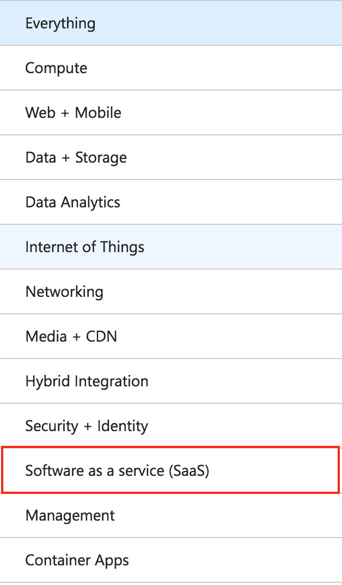
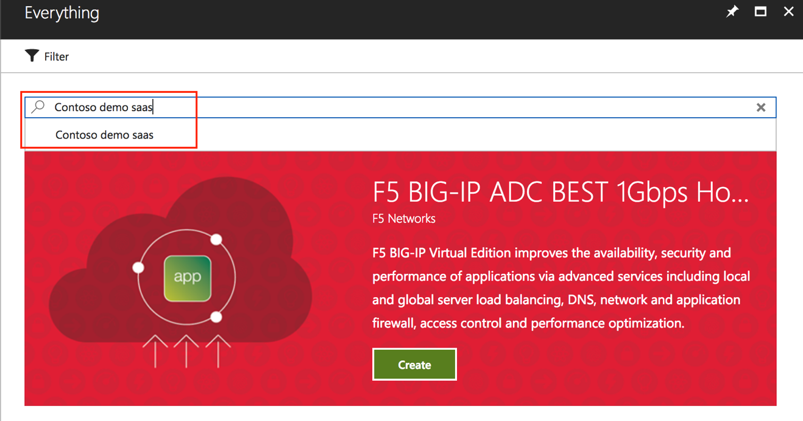
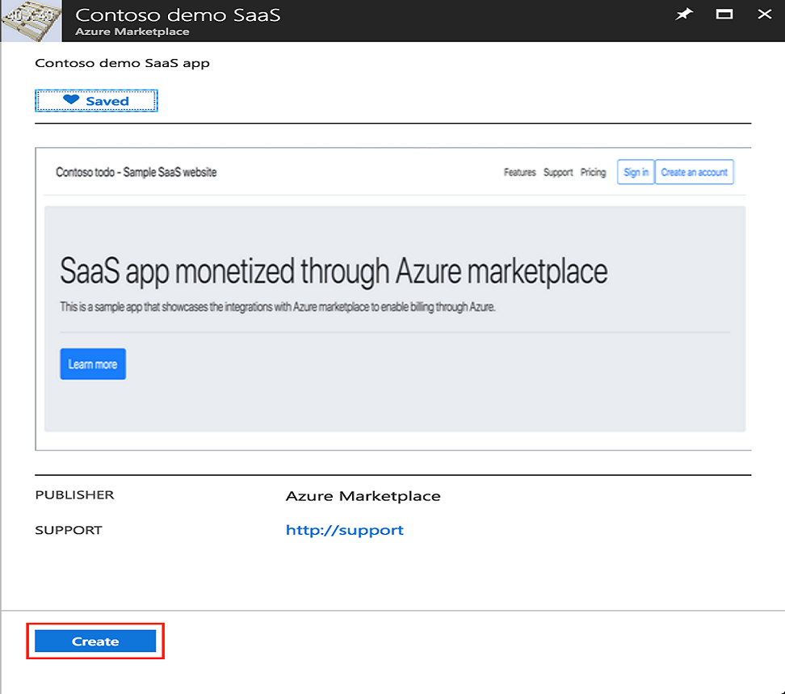
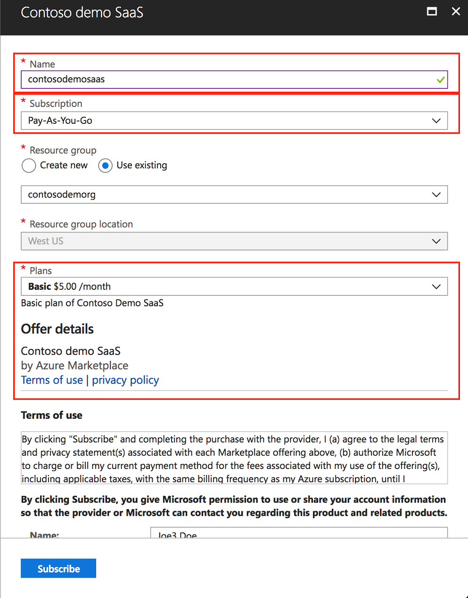
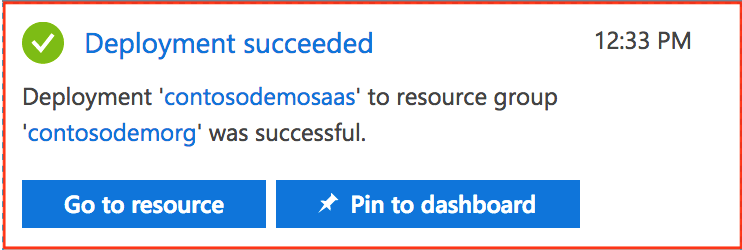
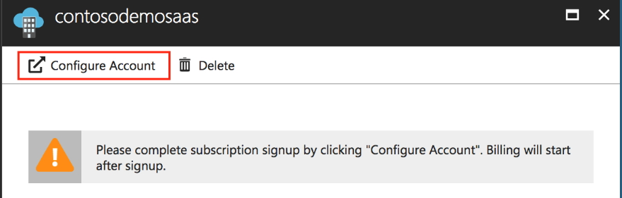
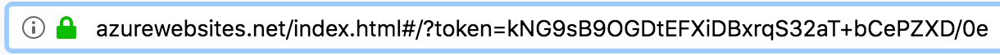
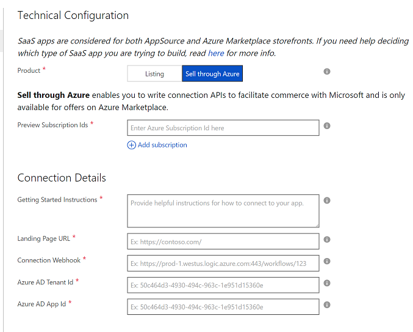

SaaS - Sell through Azure
=========================

This article describes the subscription billing model for SaaS applications and how to implement it in the Cloud Partner Portal.

Overview
--------

Azure marketplace allows you to publish and monetize your SaaS offers
through the Azure marketplace. For your customers, they can now be
charged through Azure's billing directly, and they will just receive one
bill from Azure for all their resources and services they have
activated. For publishing, SaaS subscriptions have the following
benefits:

-   **Consistent publishing experience** -- If you already publish SaaS
    offers or any other offer in Azure Marketplace, the publishing
    experience is through the same publishing portal.
-   **New storefront for discovery** -- All offers published will be
    visible both in the external Azure Marketplace storefront, as well
    as the Azure Marketplace extension inside of Azure portal.
-   **Integrated billing** - You can now sell in all regions where Azure
    sells, and let Azure take care of billing for you.
-   **Integrated lead generation** -- You can now automatically receive
    leads from Azure in the CRM of your choice, whenever an Azure user
    subscribes to your SaaS service using Azure marketplace.
-   **Co-sell with Microsoft sellers** -- You can qualify for
    bi-directional lead sharing, prioritized catalog listings, and the
    opportunity to engage and close on joint deals side-by-side with
    Microsoft sellers.

Billing Models
--------------

The only currently supported billing model is a flat monthly fee per
subscription of your SaaS service.

**Note:** Additional billing models may be available at a future time.

Each SaaS offer can have one or more plans (for example, Basic or
Premium). Each plan has some basic metadata associated with it, along
with the price associated with the plan.

You have full control over the definition of a plan. For example, what
does a Basic plan constitute? The plan is defined by you, and you
can provide the necessary text to describe it as part of publishing your
plan.

The price associated with the plan is the flat monthly fee that Azure
users will pay to use the service.

### What is not supported today?

-   Billing based on custom units -- for example, a set price based on
    the number of requests.
-   Billing based on seat allocation -- for example, allow Azure users
    to buy licenses based on the number of users.

End-to-end Flow
---------------

The SaaS subscription offer flow from an end-user perspective first

**Note:** This flow description assumes that you have published your
SaaS offer in Azure marketplace called 'Contoso demo SaaS'.

An Azure user can have following interactions with your SaaS service:

-   Discover your SaaS service in Azure Marketplace
-   Subscribe to your SaaS service in Azure
-   Navigate to the SaaS service from the Azure portal
-   Create an account in the SaaS service and manage (change
    plan/delete) the account in SaaS
-   Unsubscribe to the SaaS service from Azure portal

Discover your SaaS service in Azure Marketplace
-----------------------------------------------

When users launch Azure Marketplace in the Azure portal, they will see a
category called 'Software as a service (SaaS)'.

Users can also search for the SaaS service.

Users can then view the details of your service and then click
**Create**.

### Subscribe to SaaS service in Azure

The user can then subscribe to the SaaS service from Azure.

When the user subscribes to your SaaS service, the user provides the
following information

-   Name -- The name that users can discover or manage this SaaS
    subscription instance in Azure.
-   Subscription -- The subscription context that they want to
    associate billing for the SaaS service.
-   Plan -- The SaaS service plan that they wish to subscribe to.

The Terms of Use document provided as part of publishing the offer is also shown
to the user before the user subscribes to the SaaS service.

The user can now subscribe to the service by clicking **Subscribe**.
Azure sends a notification in the portal after the subscription is
complete.

### Navigate to the SaaS Service from Azure Portal

Users then click **Go to resource** to view or manage their SaaS
subscription instance.

The user is notified that they must configure the account in the SaaS
service first. Their billing will commence after the SaaS service
notifies Azure to start billing, which is when the user creates an
account on the SaaS service site.

When the user clicks on **Configure Account**, they are redirected to
your SaaS service endpoint. During this redirection, a token is passed
along as a query parameter. For example:

Note this token value. This token is a short-lived and needs to be
resolved to get a subscription identifier in Azure.

Creating a SaaS Offer Subscription
----------------------------------

To build this experience, there are two pieces of work that are
required:

-   Connect your SaaS service website with Microsoft\'s SaaS APIs. This
    document
    [SaaS Sell through Azure - APIs](./cloud-partner-portal-saas-subscription-apis.md)
    explains how to build this connection.  
-   Enable **Sell through Azure** on Cloud Partner Portal in the
    **Technical Info** section, and provide all of your configuration
    details.

Below is an explanation of all of the required fields for the **Technical Info** section:

|  **Offer Fields**                 |  **Description**                                   |
|  ----------------                 |  -------------------------------------             |
| Preview Subscription IDs          | All the Azure Subscription identifiers used to test your offer in preview before it is publicly available. |
| Getting Started Instructions      | Directions to share with your customers to help them connect to your SaaS app. Basic HTML usage is allowed, such tags as `
`, `<h1>`, `<li>`, etc.  |
| Landing Page URL                  | Your site URL that you will be directing your customers to land on after acquiring from Azure portal. This URL will also be the endpoint that will be receiving the connection APIs to facilitate commerce with Microsoft.  |
| Connection Webhook                | For all asynchronous events that Microsoft needs to send to you on behalf of the customer (example: Azure Subscription has gone invalid), we require you to provide us a connection webhook. If you don't already have a webhook system in place, the simplest configuration is to have an HTTP Endpoint Logic App that will listen for any events being posted to it and then handle them appropriately.  For more information, see [Call, trigger, or nest workflows with HTTP endpoints in logic apps](https://docs.microsoft.com/azure/logic-apps/logic-apps-http-endpoint). |
| Azure AD Tenant ID and App ID     | Inside Azure portal, we require that you create an Active Directory App so that we can validate the connection between our two services is behind an authenticated communication. For these fields, create an AD App and paste in the corresponding Tenant Id and App Id required. |
|  |  |

Finally, if you select **Sell through Azure**, there is an added section called **Plans**. Plans are only needed if Sell through Azure is
selected. This section lists the specific plans and their corresponding prices that your SaaS app supports. As of today, we allow for monthly
pricing, with the ability to allow for 1- or 3- months of free access. These plans and prices should match the exact plans and prices that you
have on your own SaaS app site.
