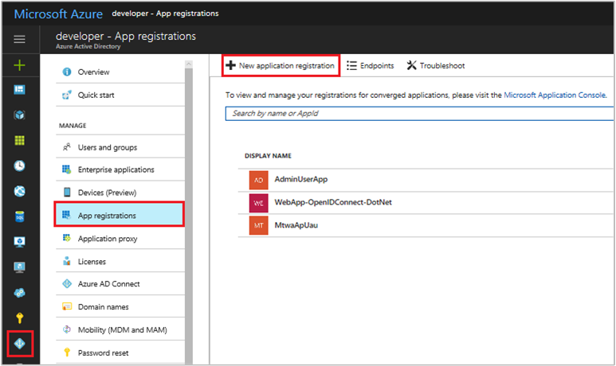

SaaS Sell through Azure - APIs
==============================

This article explains how to create a SaaS offer with APIs. The APIs are
necessary for allowing subscriptions to your SaaS offer if you have Sell
through Azure selected. If you want to build a regular SaaS listing that
does not have commerce enabled, see 
[SaaS Application Technical Publishing Guide]./cloud-partner-portal-saas-offers-tech-publishing-guide.md).

This article is divided into two sections:

-   Service-to-service Authentication between a SaaS Service and Azure Marketplace
-   API Methods and Endpoints

The following APIs are provided to help you integrate your SaaS service with Azure:

-   Resolve
-   Subscribe
-   Convert
-   Unsubscribe

The following diagram shows the subscription flow of a new customer and
when these APIs are used:


Service to service authentication between SaaS service and Azure marketplace
----------------------------------------------------------------------------

Azure does not impose any constraints on the authentication that the
SaaS service exposes to its end users. However, when it comes to the
SaaS service communicating with Azure Marketplace APIs, the
authentication is done in the context of an Azure Active Directory
(Azure AD) application.

The following section describes how to create an Azure AD application.

### Register an Azure AD Application

Any application that wants to use the capabilities of Azure AD must
first be registered in an Azure AD tenant. This registration process
involves giving Azure AD details about your application, such as the URL
where it's located, the URL to send replies after a user is
authenticated, the URI that identifies the app, and so on.

To register a new application using the Azure portal, perform the following steps:

1.  Sign in to the [Azure Portal](https://portal.azure.com/).
2.  If your account gives you access to more than one, click your
    account in the top right corner, and set your portal session to the
    desired Azure AD tenant.
3.  In the left-hand navigation pane, click the **Azure Active
    Directory** service, click **App registrations**, and click **New application registration**.

    

4.  On the Create page, enter your application\'s registration
    information:
    -   **Name**: Enter a meaningful application name
    -   **Application type**: 
        - Select **Native** for [client applications](https://docs.microsoft.com/azure/active-directory/develop/active-directory-dev-glossary#client-application) that are installed locally on a device. This setting is used for OAuth public [native clients](https://docs.microsoft.com/azure/active-directory/develop/active-directory-dev-glossary#native-client).
        - Select **Web app / API** for
        [client applications](https://docs.microsoft.com/azure/active-directory/develop/active-directory-dev-glossary#client-application)
        and [resource/API applications](https://docs.microsoft.com/azure/active-directory/develop/active-directory-dev-glossary#resource-server)
        that are installed on a secure server. This setting is used for
        OAuth confidential [web clients](https://docs.microsoft.com/azure/active-directory/develop/active-directory-dev-glossary#web-client)
        and public [user-agent-based  clients](https://docs.microsoft.com/azure/active-directory/develop/active-directory-dev-glossary#user-agent-based-client).
        The same application can also expose both a client and resource/API.
    -   **Sign-On URL**: For Web app/API applications, provide the base
        URL of your app. For example, **http://localhost:31544** might
        be the URL for a web app running on your local machine. Users
        would then use this URL to sign in to a web client application.
    -   **Redirect URI**: For Native applications, provide the URI used
        by Azure AD to return token responses. Enter a value specific to
        your application, for example **http://MyFirstAADApp**.

        
        For specific examples for web applications or native
        applications, check out the quick start guided setups that are
        available in the Get Started section of the [Azure AD Developers Guide](https://docs.microsoft.com/azure/active-directory/develop/active-directory-developers-guide#get-started).

5.  When finished, click **Create**. Azure AD assigns a unique
    Application ID to your application, and you\'re taken to your
    application\'s main registration page. Depending on whether your
    application is a web or native application, different options are
    provided to add additional capabilities to your application.

    **Note:**By default, the newly registered application is configured
    to allow only users from the same tenant to sign in to your
    application.

API Methods and Endpoints
-------------------------

The following sections describe the API methods and endpoints available
for enabling subscriptions for a SaaS offer.

### Get a token based on the Azure AD app

HTTP Method

`GET`

*Request URL*

**https://login.microsoftonline.com/*{tenantId}*/oauth2/token**

*URI parameter*

|  **Parameter name**  | **Required**  | **Description**                               |
|  ------------------  | ------------- | --------------------------------------------- |
| tenantId             | True          | Tenant ID of the registered AAD application   |
|  |  |  |


*Request header*

|  **Header name**  | **Required** |  **Description**                                   |
|  --------------   | ------------ |  ------------------------------------------------- |
|  Content-Type     | True         | Content type associated with the request. The default value is `application/x-www-form-urlencoded`.  |
|  |  |  |


*Request body*

| **Property name**   | **Required** |  **Description**                                                          |
| -----------------   | -----------  | ------------------------------------------------------------------------- |
|  Grant_type         | True         | Grant type. The default value is `client_credentials`.                    |
|  Client_id          | True         |  Client/app identifier associated with the Azure AD app.                  |
|  client_secret      | True         |  Password associated with the Azure AD app.                               |
|  Resource           | True         |  Target resource for which the token is requested. The default value is `62d94f6c-d599-489b-a797-3e10e42fbe22`. |
|  |  |  |


*Response*

|  **Name**  | **Type**       |  **Description**    |
| ---------- | -------------  | ------------------- |
| 200 OK    | TokenResponse  | Request succeeded   |
|  |  |  |

*TokenResponse*

Sample response token:

``` json
  {
      "token_type": "Bearer",
      "expires_in": "3600",
      "ext_expires_in": "0",
      "expires_on": "15251…",
      "not_before": "15251…",
      "resource": "b3cca048-ed2e-406c-aff2-40cf19fe7bf5",
      "access_token": "eyJ0eXAiOiJKV1QiLCJhbGciOiJSUzI1NiIsIng1dCI6ImlCakwxUmNxemhpeTRmcHhJeGRacW9oTTJZayIsImtpZCI6ImlCakwxUmNxemhpeTRmcHhJeGRacW9oTTJZayJ9…"
  }               
```

### Marketplace API endpoint and API version

The endpoint for Azure Marketplace API is `https://marketplaceapi.microsoft.com`.

The current API version is `api-version=2017-04-15`.


### Resolve subscription

POST action on resolve endpoint allows users to resolve a token to a persistent Resource ID.

*Request*

**POST**

**https://marketplaceapi.microsoft.com/api/saas/subscriptions/resolve?api-version=2017-04-15**

|  **Parameter Name** |     **Description**                                      |
|  ------------------ |     ---------------------------------------------------- |
|  api-version        |  The version of the operation to use for this request.   |
|  |  |


*Headers*

| **Header key**     | **Required** | **Description**                                                                                                                                                                                                                  |
|--------------------|--------------|-----------------------------------------------------------|
| x-ms-requestid     | No           | A unique string value for tracking the request from the client, preferably a GUID. If this value is not provided, one will be generated and provided in the response headers.  |
| x-ms-correlationid | No           | A unique string value for operation on the client. This correlates all events from client operation with events on the server side. If this value is not provided, one will be generated and provided in the response headers. |
| Content-type       | Yes          | `application/json`                                        |
| authorization      | Yes          | The JSON web token (JWT) bearer token.                    |
| x-ms-marketplace-token| Yes| The token query parameter in the URL when the user is redirected to SaaS ISV’s website from Azure. **Note:** URL decode the token value from the browser before using it.|
|  |  |  |
  

*Response Body*

 ``` json       
    { 
        “id”: “”, 
        “subscriptionName”: “”,
        “offerId”:””, 
         “planId”:””
    }     
```

| **Parameter name** | **Data type** | **Description**                       |
|--------------------|---------------|---------------------------------------|
| id                 | String        | ID of the SaaS subscription.          |
| subscriptionName| String| Name of the SaaS subscription set by user in Azure while subscribing to the SaaS service.|
| OfferId            | String        | Offer ID that the user subscribed to. |
| planId             | String        | Plan ID that the user subscribed to.  |
|  |  |  |


*Response Codes*

| **HTTP Status Code** | **Error Code**     | **Description**                                                                         |
|----------------------|--------------------| --------------------------------------------------------------------------------------- |
| 200                  | `OK`                 | Token resolved successfully.                                                            |
| 400                  | `BadRequest`         | Either required headers are missing or an invalid api-version specified. Failed to resolve the token because either the token is malformed or expired. |
| 403                  | `Forbidden`          | The caller is not authorized to perform this operation.                                 |
| 429                  | `RequestThrottleId`  | Service is busy processing requests, retry later.                                |
| 503                  | `ServiceUnavailable` | Service is down temporarily, retry later.                                        |
|  |  |  |


*Response Headers*

| **Header Key**     | **Required** | **Description**                                                                                        |
|--------------------|--------------|--------------------------------------------------------------------------------------------------------|
| x-ms-requestid     | Yes          | Request ID received from the client.                                                                   |
| x-ms-correlationid | Yes          | Correlation ID if passed by the client, otherwise this value is the server correlation ID.                   |
| x-ms-activityid    | Yes          | A unique string value for tracking the request from the service. This is used for any reconciliations. |
| Retry-After        | No           | This value is set only for a 429 response.                                                                   |
|  |  |  |


### Subscribe

The subscribe endpoint allows users to start a subscription to a SaaS
service for a given plan and enable billing in the commerce system.

**PUT**

**https://marketplaceapi.microsoft.com/api/saas/subscriptions/*{subscriptionId}*?api-version=2017-04-15**

| **Parameter Name**  | **Description**                                       |
|---------------------|-------------------------------------------------------|
| subscriptionId      | Unique Id of saas subscription that is obtained after resolving the token via Resolve API.                              |
| api-version         | The version of the operation to use for this request. |
|  |  |

*Headers*

|  **Header key**        | **Required** |  **Description**                                                  |
| ------------------     | ------------ | --------------------------------------------------------------------------------------- |
| x-ms-requestid         |   No         | A unique string value for tracking the request from the client, preferably a GUID. If this is not provided, one will be generated and provided in the response headers. |
| x-ms-correlationid     |   No         | A unique string value for operation on the client. This value is for correlating all events from client operation with events on the server side. If this is not provided, one will be generated and provided in the response headers. |
| If-Match/If-None-Match |   No         |   Strong validator ETag value.                                                          |
| content-type           |   Yes        |    `application/json`                                                                   |
|  authorization         |   Yes        |    The JSON web token (JWT) bearer token.                                               |
| x-ms-marketplace-session-mode| No | Flag to enable dry run mode while subscribing to a SaaS offer. If set, the subscription will not be charged. This is useful for ISV testing scenarios. Please set it to **‘dryrun’**|
|  |  |  |

*Body*

``` json
  { 
      “planId”:””
   }      
```

| **Element name** | **Data type** | **Description**                      |
|------------------|---------------|--------------------------------------|
| planId           | (Required) String        | Plan Id of the SaaS service user is subscribing to.  |
|  |  |  |

*Response Codes*

| **HTTP Status Code** | **Error Code**     | **Description**                                                           |
|----------------------|--------------------|---------------------------------------------------------------------------|
| 202                  | `Accepted`           | SaaS subscription activation received for a given plan.                   |
| 400                  | `BadRequest`         | Either required headers are missing or the body of the JSON is malformed. |
| 403                  | `Forbidden`          | The caller is not authorized to perform this operation.                   |
| 404                  | `NotFound`           | Subscription not found with the given ID                                  |
| 409                  | `Conflict`           | Another operation is in progress on the subscription.                     |
| 429                  | `RequestThrottleId`  | Service is busy processing requests,  retry later.                  |
| 503                  | `ServiceUnavailable` | Service is down temporarily, retry later.                          |
|  |  |  |

For a 202 response, follow up on the request operation’s status at the ‘Operation-location’ header. The authentication is the same as other Marketplace APIs.

*Response Headers*

| **Header Key**     | **Required** | **Description**                                                                                        |
|--------------------|--------------|--------------------------------------------------------------------------------------------------------|
| x-ms-requestid     | Yes          | Request ID received from the client.                                                                   |
| x-ms-correlationid | Yes          | Correlation ID if passed by the client, otherwise this value is the server correlation ID.                   |
| x-ms-activityid    | Yes          | A unique string value for tracking the request from the service. This value is used for any reconciliations. |
| Retry-After        | Yes          | Interval with which client can check the status.                                                       |
| Operation-Location | Yes          | Link to a resource to get the operation status.                                                        |
|  |  |  |

### Change plan endpoint

The change endpoint allows the user to convert their currently
subscribed plan to a new plan.

**PATCH**

**https://marketplaceapi.microsoft.com/api/saas/subscriptions/*{subscriptionId}*?api-version=2017-04-15**

| **Parameter Name**  | **Description**                                       |
|---------------------|-------------------------------------------------------|
| subscriptionId      | ID of SaaS subscription.                              |
| api-version         | The version of the operation to use for this request. |
|  |  |

*Headers*

| **Header key**          | **Required** | **Description**                                                                                                                                                                                                                  |
|-------------------------|--------------|---------------------------------------------------------------------------------------------------------------------|
| x-ms-requestid          | No           | A unique string value for tracking the request from the client. Recommend a GUID. If this is not provided, one will be generated and provided in the response headers.   |
| x-ms-correlationid      | No           | A unique string value for operation on the client. This value is for correlating all events from client operation with events on the server side. If this is not provided, one will be generated and provided in the response headers. |
| If-Match /If-None-Match | No           | Strong validator ETag value.                              |
| content-type            | Yes          | `application/json`                                        |
| authorization           | Yes          | The JSON web token (JWT) bearer token.                    |
|  |  |  |


*Body*

``` json
                { 
                    “planId”:””
                } 
```


|  **Element name** |  **Data type**  | **Description**                              |
|  ---------------- | -------------   | --------------------------------------       |
|  planId           |  (Required) String         | Plan Id of the SaaS service user is subscribing to.          |
|  |  |  |

*Response Codes*

| **HTTP Status Code** | **Error Code**     | **Description**                                                           |
|----------------------|--------------------|---------------------------------------------------------------------------|
| 202                  | `Accepted`           | SaaS subscription activation received for a given plan.                   |
| 400                  | `BadRequest`         | Either required headers are missing or the body of the JSON is malformed. |
| 403                  | `Forbidden`          | The caller is not authorized to perform this operation.                   |
| 404                  | `NotFound`           | Subscription not found with the given ID                                  |
| 409                  | `Conflict`           | Another operation is in progress on the subscription.                     |
| 429                  | `RequestThrottleId`  | Service is busy processing requests,  retry later.                  |
| 503                  | `ServiceUnavailable` | Service is down temporarily, retry later.                          |
|  |  |  |

*Response Headers*

| **Header Key**     | **Required** | **Description**                                                                                        |
|--------------------|--------------|--------------------------------------------------------------------------------------------------------|
| x-ms-requestid     | Yes          | Request ID received from the client.                                                                   |
| x-ms-correlationid | Yes          | Correlation ID if passed by the client, otherwise this value is the server correlation ID.                   |
| x-ms-activityid    | Yes          | A unique string value for tracking the request from the service. This value is used for any reconciliations. |
| Retry-After        | Yes          | Interval with which client can check the status.                                                       |
| Operation-Location | Yes          | Link to a resource to get the operation status.                                                        |
|  |  |  |

### Delete subscription

The Delete action on the subscribe endpoint allows a user to delete a subscription with a given ID.

*Request*

**DELETE**

**https://marketplaceapi.microsoft.com/api/saas/subscriptions/*{subscriptionId}*?api-version=2017-04-15**

| **Parameter Name**  | **Description**                                       |
|---------------------|-------------------------------------------------------|
| subscriptionId      | ID of SaaS subscription.                              |
| api-version         | The version of the operation to use for this request. |
|  |  |

*Headers*

| **Header key**     | **Required** | **Description**                                                                                                                                                                                                                  |
|--------------------|--------------| ----------------------------------------------------------|
| x-ms-requestid     | No           | A unique string value for tracking the request from the client. Recommend a GUID. If this value is not provided, one will be generated and provided in the response headers.                                                           |
| x-ms-correlationid | No           | A unique string value for operation on the client. This value is for correlating all events from client operation with events on the server side. If this is not provided, one will be generated and provided in the response headers. |
| authorization      | Yes          | The JSON web token (JWT) bearer token.                    |
|  |  |  |
 

*Response Codes*

| **HTTP Status Code** | **Error Code**     | **Description**                                                           |
|----------------------|--------------------|---------------------------------------------------------------------------|
| 202                  | `Accepted`           | SaaS subscription activation received for a given plan.                   |
| 400                  | `BadRequest`         | Either required headers are missing or the body of the JSON is malformed. |
| 403                  | `Forbidden`          | The caller is not authorized to perform this operation.                   |
| 404                  | `NotFound`           | Subscription not found with the given ID                                  |
| 429                  | `RequestThrottleId`  | Service is busy processing requests, please retry later.                  |
| 503                  | `ServiceUnavailable` | Service is down temporarily. Please retry later.                          |
|  |  |  |

For a 202 response, follow up on the request operation’s status at the ‘Operation-location’ header. The authentication is the same as other Marketplace APIs.

*Response Headers*

| **Header Key**     | **Required** | **Description**                                                                                        |
|--------------------|--------------|--------------------------------------------------------------------------------------------------------|
| x-ms-requestid     | Yes          | Request ID received from the client.                                                                   |
| x-ms-correlationid | Yes          | Correlation ID if passed by the client, otherwise this is the server correlation ID.                   |
| x-ms-activityid    | Yes          | A unique string value for tracking the request from the service. This is used for any reconciliations. |
| Retry-After        | Yes          | Interval with which client can check the status.                                                       |
| Operation-Location | Yes          | Link to a resource to get the operation status.                                                        |
|   |  |  |

### Get Operation Status

This endpoint allows user to track the status of a triggered async operation (Subscribe/Unsubscribe/Change plan).

*Request*

**GET**

**https://marketplaceapi.microsoft.com/api/saas/operations/*{operationId}*?api-version=2017-04-15**

| **Parameter Name**  | **Description**                                       |
|---------------------|-------------------------------------------------------|
| operationId         | Unique ID for the operation triggered.                |
| api-version         | The version of the operation to use for this request. |
|  |  |


*Headers*

| **Header key**     | **Required** | **Description**                                                                                                                                                                                                                  |
|--------------------|--------------|--------------------------------------------------------------------------------------------------------------------------|
| x-ms-requestid     | No           | A unique string value for tracking the request from the client. Recommend a GUID. If this value is not provided, one will be generated and provided in the response headers.   |
| x-ms-correlationid | No           | A unique string value for operation on the client. This value is for correlating all events from client operation with events on the server side. If this value is not provided, one will be generated and provided in the response headers.  |
| authorization      | Yes          | The JSON web token (JWT) bearer token.                    |
|  |  |  | 
  

*Response Body*

``` json
  { 
      “id”: “”, 
      “status”:””, 
       “resourceLocation”:””, 
      “created”:””, 
      “lastModified”:”” 
  } 
```

| **Parameter name** | **Data type** | **Description**                                                                                                                                               |
|--------------------|---------------|-------------------------------------------------------------------------------------------|
| id                 | String        | ID of the operation.                                                                      |
| status             | Enum          | Operation status, one of the following: `In Progress`, `Succeeded`, or `Failed`.          |
| resourceLocation   | String        | Link to the subscription that was created or modified. This helps the client to get updated state post operation. This value is not set for `Unsubscribe` operations. |
| created            | DateTime      | Operation creation time in UTC.                                                           |
| lastModified       | DateTime      | Last update on the operation in UTC.                                                      |
|  |  |  |

*Response Codes*

| **HTTP Status Code** | **Error Code**     | **Description**                                                              |
|----------------------|--------------------|------------------------------------------------------------------------------|
| 200                  | `OK`                 | Resolved the get request successfully and the body contains the response.    |
| 400                  | `BadRequest`         | Either required headers are missing or an invalid api-version was specified. |
| 403                  | `Forbidden`          | The caller is not authorized to perform this operation.                      |
| 404                  | `NotFound`           | Subscription not found with the given ID                                     |
| 429                  | `RequestThrottleId`  | Service is busy processing requests, retry later.                     |
| 503                  | `ServiceUnavailable` | Service is down temporarily, retry later.                             |
|  |  |  |

*Response Headers*

| **Header Key**     | **Required** | **Description**                                                                                        |
|--------------------|--------------|--------------------------------------------------------------------------------------------------------|
| x-ms-requestid     | Yes          | Request ID received from the client.                                                                   |
| x-ms-correlationid | Yes          | Correlation ID if passed by the client, otherwise this is the server correlation ID.                   |
| x-ms-activityid    | Yes          | A unique string value for tracking the request from the service. This is used for any reconciliations. |
| Retry-After        | Yes          | Interval with which client can check the status.                                                       |
|  |  |  |

### Get Subscription

The Get action on subscribe endpoint allows a user to retrieve a subscription with a given resource identifier.

*Request*

**GET**

**https://marketplaceapi.microsoft.com/api/saas/subscriptions/*{subscriptionId}*?api-version=2017-04-15**

| **Parameter Name**  | **Description**                                       |
|---------------------|-------------------------------------------------------|
| subscriptionId      | ID of SaaS subscription.                              |
| api-version         | The version of the operation to use for this request. |
|  |  |

*Headers*

| **Header key**     | **Required** | **Description**                                                                                           |
|--------------------|--------------|-----------------------------------------------------------------------------------------------------------|
| x-ms-requestid     | No           | A unique string value for tracking the request from the client, preferably a GUID. If this value is not provided, one will be generated and provided in the response headers.                                                           |
| x-ms-correlationid | No           | A unique string value for operation on the client. This value is for correlating all events from client operation with events on the server side. If this value is not provided, one will be generated and provided in the response headers. |
| authorization      | Yes          | The JSON web token (JWT) bearer token.                                                                    |
|  |  |  |

*Response Body*

``` json
  { 
      “id”: “”, 
      “saasSubscriptionName”:””, 
      “offerId”:””, 
       “planId”:””, 
      “saasSubscriptionStatus”:””, 
      “created”:””, 
      “lastModified”: “” 
  }
```
| **Parameter name**     | **Data type** | **Description**                               |
|------------------------|---------------|-----------------------------------------------|
| id                     | String        | ID of SaaS subscription resource in Azure.    |
| offerId                | String        | Offer ID that the user subscribed to.         |
| planId                 | String        | Plan ID that the user subscribed to.          |
| saasSubscriptionName   | String        | Name of the SaaS subscription.                |
| saasSubscriptionStatus | Enum          | Operation status.  One of the following:  <br/> - `Subscribed`: Subscription is active.  <br/> - `Pending`: User create the resource but it isn't activated by the ISV.   <br/> - `Unsubscribed`: User has unsubscribed.   <br/> - `Suspended`: User has suspended the subscription.   <br/> - `Deactivated`:  Azure subscription is suspended.  |
| created                | DateTime      | Subscription creation timestamp value in UTC. |
| lastModified           | DateTime      | Subscription modified timestamp value in UTC. |
|  |  |  |

*Response Codes*

| **HTTP Status Code** | **Error Code**     | **Description**                                                              |
|----------------------|--------------------|------------------------------------------------------------------------------|
| 200                  | `OK`                 | Resolved the get request successfully and the body contains the response.    |
| 400                  | `BadRequest`         | Either required headers are missing or an invalid api-version was specified. |
| 403                  | `Forbidden`          | The caller is not authorized to perform this operation.                      |
| 404                  | `NotFound`           | Subscription not found with the given ID                                     |
| 429                  | `RequestThrottleId`  | Service is busy processing requests,  retry later.                     |
| 503                  | `ServiceUnavailable` | Service is down temporarily, retry later.                             |
|  |  |  |

*Response Headers*

| **Header Key**     | **Required** | **Description**                                                                                        |
|--------------------|--------------|--------------------------------------------------------------------------------------------------------|
| x-ms-requestid     | Yes          | Request ID received from the client.                                                                   |
| x-ms-correlationid | Yes          | Correlation ID if passed by the client, otherwise this is the server correlation ID.                   |
| x-ms-activityid    | Yes          | A unique string value for tracking the request from the service. This is used for any reconciliations. |
| Retry-After        | No           | Interval with which client can check the status.                                                       |
| eTag               | Yes          | Link to a resource to get the operation status.                                                        |
|  |  |  |


### Get Subscriptions

The Get action on subscriptions endpoint allows a user to retrieve all subscriptions for all the offers from the ISV.

*Request*

**GET**

**https://marketplaceapi.microsoft.com/api/saas/subscriptions?api-version=2017-04-15**

| **Parameter Name**  | **Description**                                       |
|---------------------|-------------------------------------------------------|
| api-version         | The version of the operation to use for this request. |
|  |  |

*Headers*

| **Header key**     | **Required** | **Description**                                           |
|--------------------|--------------|-----------------------------------------------------------|
| x-ms-requestid     | No           | A unique string value for tracking the request from the client. Recommend a GUID. If this value is not provided, one will be generated and provided in the response headers.             |
| x-ms-correlationid | No           | A unique string value for operation on the client. This value is for correlating all events from client operation with events on the server side. If this value is not provided, one will be generated and provided in the response headers. |
| authorization      | Yes          | The JSON web token (JWT) bearer token.                    |
|  |  |  |


*Response Body*

``` json
  { 
      “id”: “”, 
      “saasSubscriptionName”:””, 
      “offerId”:””, 
       “planId”:””, 
      “saasSubscriptionStatus”:””, 
      “created”:””, 
      “lastModified”: “”
  }
```

| **Parameter name**     | **Data type** | **Description**                               |
|------------------------|---------------|-----------------------------------------------|
| id                     | String        | ID of SaaS subscription resource in Azure.    |
| offerId                | String        | Offer ID that the user subscribed to.         |
| planId                 | String        | Plan ID that the user subscribed to.          |
| saasSubscriptionName   | String        | Name of the SaaS subscription.                |
| saasSubscriptionStatus | Enum          | Operation status.  One of the following:  <br/> - `Subscribed`: Subscription is active.  <br/> - `Pending`: User create the resource but it isn't activated by the ISV.   <br/> - `Unsubscribed`: User has unsubscribed.   <br/> - `Suspended`: User has suspended the subscription.   <br/> - `Deactivated`:  Azure subscription is suspended.  |
| created                | DateTime      | Subscription creation timestamp value in UTC. |
| lastModified           | DateTime      | Subscription modified timestamp value in UTC. |
|  |  |  |

*Response Codes*

| **HTTP Status Code** | **Error Code**     | **Description**                                                              |
|----------------------|--------------------|------------------------------------------------------------------------------|
| 200                  | `OK`                 | Resolved the get request successfully and the body contains the response.    |
| 400                  | `BadRequest`         | Either required headers are missing or an invalid api-version was specified. |
| 403                  | `Forbidden`          | The caller is not authorized to perform this operation.                      |
| 404                  | `NotFound`           | Subscription not found with the given ID                                     |
| 429                  | `RequestThrottleId`  | Service is busy processing requests, please retry later.                     |
| 503                  | `ServiceUnavailable` | Service is down temporarily. Please retry later.                             |
|  |  |  |

*Response Headers*

| **Header Key**     | **Required** | **Description**                                                                                        |
|--------------------|--------------|--------------------------------------------------------------------------------------------------------|
| x-ms-requestid     | Yes          | Request ID received from the client.                                                                   |
| x-ms-correlationid | Yes          | Correlation ID if passed by the client, otherwise this is the server correlation ID.                   |
| x-ms-activityid    | Yes          | A unique string value for tracking the request from the service. This is used for any reconciliations. |
| Retry-After        | No           | Interval with which client can check the status.                                                       |
|  |  |  |
