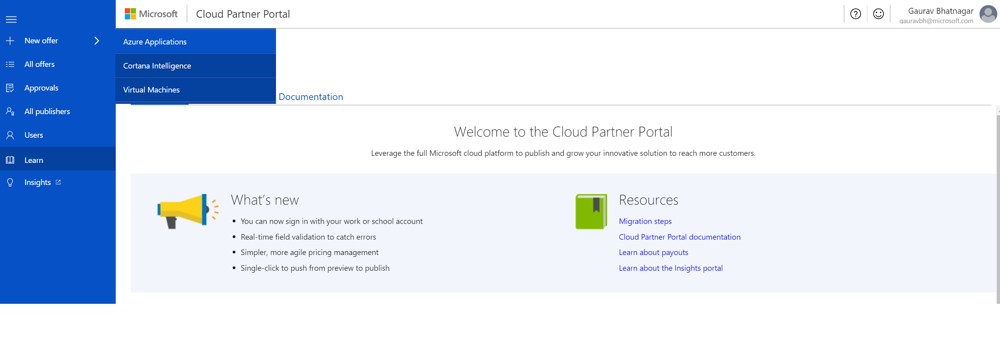
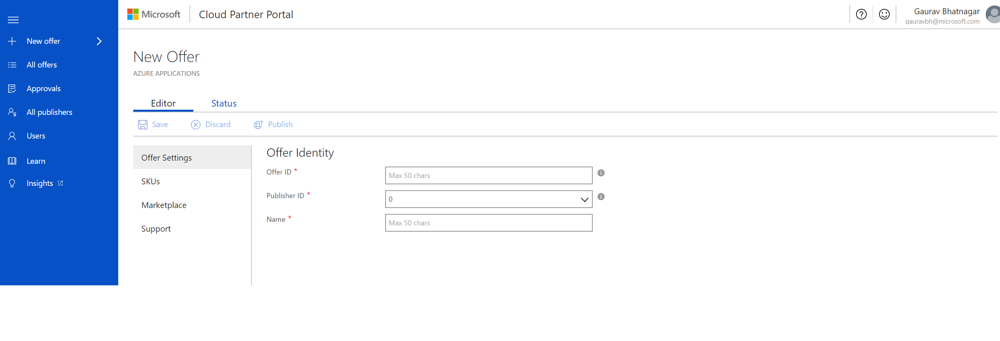
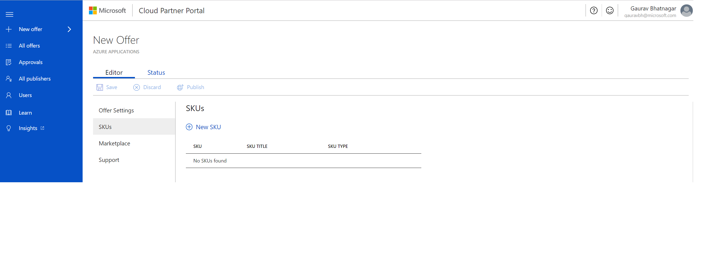
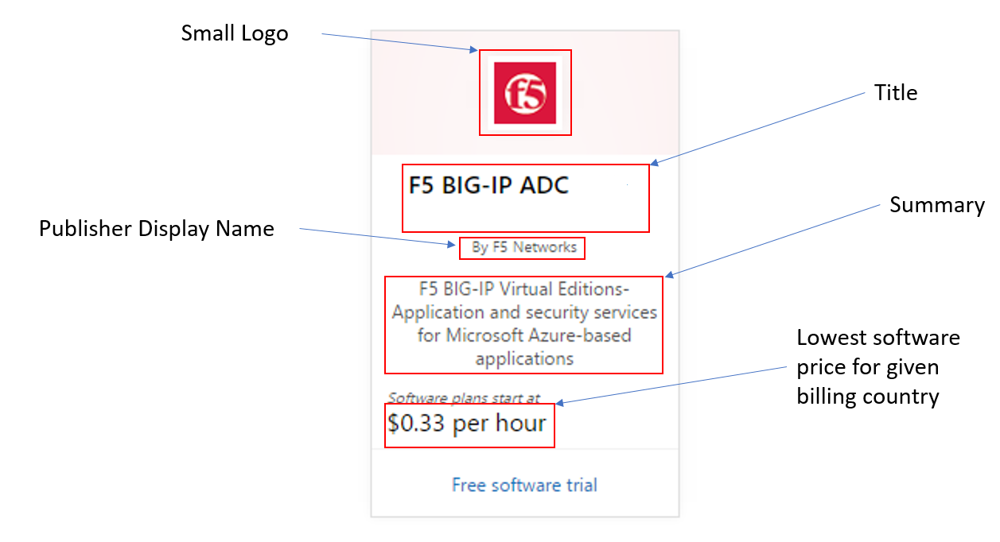
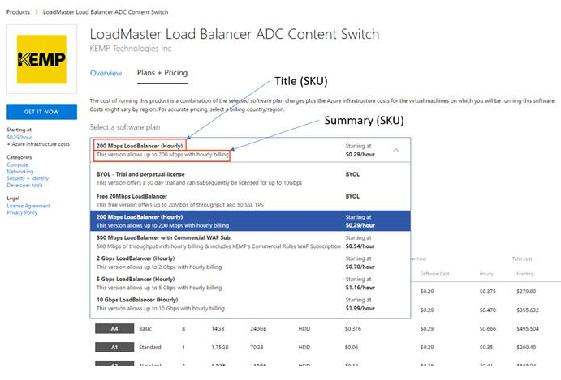

# Publish a Solution Template to Azure Marketplace

This article provides the steps for publishing a Solution
Template offer to Azure Marketplace.

## Prerequisites

The following technical and non-technical prerequisites apply to listing a solution template on Azure Marketplace.

### Technical

- [Understand Azure Resource Manager Templates](https://docs.microsoft.com/azure/azure-resource-manager/resource-group-authoring-templates)

- Azure Quickstart templates:

    - [Azure quickstart template documentation](https://azure.microsoft.com/documentation/templates/)

    - [Azure quickstart documentation on GitHub](https://github.com/azure/azure-quickstart-templates)

 - [Create Azure portal user interface file](https://docs.microsoft.com/azure/azure-resource-manager/managed-application-createuidefinition-overview)

### Non-technical (business requirements)

-   Your company (or its subsidiary) must be located in a sell from country supported by the Azure Marketplace.

-   Your product must be licensed in a way that is compatible with billing models supported by the Azure Marketplace.

-   You're responsible for making technical support available to customers in a commercially reasonable manner, whether free, paid, or through community support.

-   You're responsible for licensing your software and any third-party software dependencies.

-   Provide content that meets criteria for your offering to be listed on Azure Marketplace and in the Azure Management Portal.

-   Agree to the terms of the Azure Marketplace    Participation Policies and Publisher Agreement.

-   Agree to comply with the Terms of Use, Microsoft Privacy Statement, and Microsoft Azure Certified Program Agreement.

## Before you begin

After meeting all the pre-requisites, you can start
authoring your Solution Template offer. Before you begin, review the following offer and SKU information.

**Offer**

An Azure Application offer corresponds to a class of product offering from a publisher. If you have a new type of solution/application that
you'd like to be available in Azure Marketplace, a new offer is the best approach. An offer is a collection of SKUs. Every offer appears as its own entity in Azure Marketplace.

**SKU**

A SKU is the smallest purchasable unit of an offer. While within the same product class (offer), SKUs allow you to differentiate between different supported features. For example, the offer is managed or unmanaged, and different billing models are supported.

Add multiple SKUs in the following scenarios:
- You want to support different billing models, such as Bring Your Own License (BYOL) or Pay as you Go (PAYG).
- Each SKU supports a different feature set and each feature set is priced differently.

A SKU shows up under the parent offer in Azure Marketplace and shows up as its own purchasable entity in Azure portal.

## To create a new offer

1.  Sign in to the [Cloud Partner Portal](http://cloudpartner.azure.com/).

2.  On left navigation bar, select **+ New offer**, and then select **Azure Applications**.

    

3.  Under **New Offer**, select **Editor**.

    

4.  Under **Editor**, you'll provide information in the following views:
    - Offer Settings
    - SKUs
    - Marketplace
    - Support
Each view contains a set of fields for you to fill out. Required fields are indicated with a red asterix (\*)

## To configure Offer Settings

1. Configure the following **Offer Identity** fields in Offer Settings.

    **Offer ID**

     A unique identifier for the offer within a publisher profile. This ID is visible in product URLs, ARM templates, and billing reports. You can only use lowercase alphanumeric characters or dashes (-). The ID can't end in a dash and can have a maximum of 50 characters. 
    >[!Note]
    >This field is locked when an offer goes live.

    **Publisher ID**

    A dropdown list for publisher profile. Choose the profile that you want to publish the offer under. 
    >[!Note]
    >This field is locked when an offer goes live.

    **Name**

    The display name for your offer. This name is shown  in Azure Marketplace and in Azure Portal. It can have a maximum of 50 characters. Use the following guidance for the offer name:
    -  Include a recognizable brand name for your product. 
    - Don't include your company name here unless that's how the offer is marketed.
    - If you're marketing this offer at your own website, make sure the name is identical to the name on your website.

2. Select **Save** to finish Offer Settings.
for your offer.

## To create SKUs
------------------

1. Select **SKUs**. 

    

    SKU ID is a unique identifier for the SKU within an offer. This ID is visible in product URLs, ARM templates, and billing reports. The SKU ID:
    - Can only have a maximum of 50 characters.
    - Can only be composed of lowercase alphanumeric characters or dashes (-).
    - The ID can't end in a dash.

    >[!Note]
    >After a SKU is added, it appears in the list of SKUs in the SKUs view. To see the SKU details, select the SKU name. 

2. Select **New SKU** to provide the information shown in the following screen capture. 

    

### SKU settings

Provide the following SKU settings.

- **Title** - A title for the SKU. This title is displayed in the gallery for this item.

- **Summary** - A short summary description of the SKU. (Maximum length is 100 characters.)

- **Description** - A detailed description of the SKU.

- **SKU Type** - A dropdown list with these values: "Managed Application (Preview)" and "Solution Template". For this scenario, select **Solution Template**.

- **Cloud Availability** - The location of the SKU. The default is Public Azure.

### Package Details

After you finish the SKU settings, provide the following Package Details.

- **Current version** - The version of the package that you will upload. It should be in the format - ..

- **Package File** - This package contains the following files, which are saved in a .zip file.

    -   MainTemplate.json - The deployment template file that's used to deploy the solution/application and create the resources defined for the solution. For more information, see [how to author deployment template files](https://docs.microsoft.com/azure/azure-resource-manager/resource-manager-create-first-template)

    -   createUIDefinition.json - This file is used by the Azure Portal to generate the user interface for provisioning this solution/application. For more information, see [Create Azure portal user interface for your managed application](https://docs.microsoft.com/azure/azure-resource-manager/managed-application-createuidefinition-overview)

    >[!IMPORTANT]
    >This package should contain any other nested templates or scripts that are needed to provision this application. The mainTemplate.json and createUIDefinition.json must be in the root folder.

## To configure the Marketplace

Use the Marketplace view to configure the fields that are displayed for the offer on [Azure Marketplace](https://azuremarketplace.microsoft.com) and on [Azure Portal](https://portal.azure.com/).

### Preview Subscription Ids

The list of Azure Subscription IDs that you'd like to have access to the offer when the offer is published. These white-listed subscriptions allow you to test the previewed offer before making it live. The partner portal allows you to white-list up to 100 subscriptions.

### Suggested Categories

Select up to 5 categories from the provided list that your offer can be best associated with. The selected categories will be used to map your offer to the product categories available in [Azure Marketplace](https://azuremarketplace.microsoft.com) and [Azure Portal](https://portal.azure.com/).

The following examples show marketplace information in the Azure Marketplace and the Azure Portal.

**Azure Marketplace**

**Azure Portal**

### Logo Guidelines

Follow these guidelines for logos uploaded to the Cloud Partner Portal:

-   The Azure design has a simple color palette. Keep the number of primary and secondary colors on your logo low.

-   The theme colors of the Azure portal are white and black. Avoid using these colors as the background color of your logos. Use a color that would make your logos prominent in the Azure portal. We recommend simple primary colors.

    >[!Note] 
    >If you're using a transparent
    background, then make sure that the logos/text aren't white, black or blue.

-   Don't use a gradient background on the logo.

-   Avoid placing text on the logo. This includes your company or brand name. The look and feel of your logo should be *flat* and should avoid gradients.

-   The logo shouldn't be stretched.

#### Hero Logo

The Hero logo is optional. The publisher can choose not to upload a Hero logo. However, after the logo is uploaded, it can't be deleted. The partner must follow the Azure Marketplace guidelines for Hero icons.

#### Guidelines for the Hero logo icon

-   The Publisher Display Name, plan title and the offer's long summary are displayed using a white colored font. Avoid using any light color in the background. Black, white and
    transparent backgrounds aren't allowed for Hero icons.

-   The publisher display name, plan title, the offer long summary and the Create button are embedded programmatically inside the Hero logo when the offer's listed. Don't enter any text when you're designing the Hero logo. Leave an empty space on the right of the logo. This space should be 415 x 100 pixels and is offset by 370 px from the left.

## To configure Support

Use the Support view to provide the following information:

- Support contacts from your company, such as engineering.
- Customer support contacts.

## To publish the offer

The final step is to publish the offer. Select **Publish**.
