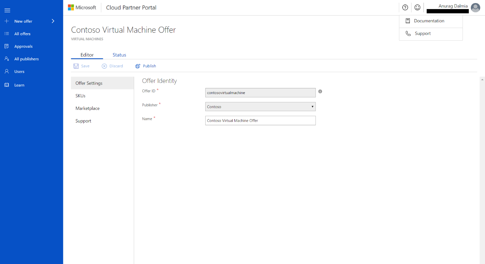

# Get Support for Cloud Partner Portal

Microsoft provides support for a wide variety of products and services.
Ensuring that your query finds the right support team is important to
ensure an appropriate and timely response. Consider the following
scenarios, which should help you route your query to the appropriate
team:

-   If you're a publisher and have a question from a customer, ask your customer to request support using the support links at [Azure Portal](https://portal.azure.com/)

-   If you're a publisher and have a question relating to your app or service, review the following steps for opening a support ticket.

## To open a support ticket

1. Go to [Cloud Partner Portal](https://cloudpartner.azure.com/) and sign in with your work or school account.

2. In the upper menu on the right side of the page, select **Help** icon and then select **Support**.

3. On **Create an incident**, identify the **Problem type** and **Category**.

4. Select **Start request**.

5. Provide contact information and describe the problem. Describe the problem as fully as you can. Provide any files (for example, screen captures, error descriptions, or network traces) that might be helpful in resolving your issue.

6. Select **Submit** to create the ticket.

### Support followup

We'll acknowledge receipt of your ticket within
24 hours and assign your issue a priority and severity. Our dedicated team of support engineers will assist with its resolution according to our Service Level Agreement response times. 

The next screen capture shows the incident information that you'll receive as confirmation from Microsoft support.

-   If you need to talk to us about your issue, reply to the email you received for the support time and we can schedule time to talk to you.

-   You can view the progress on your issue at any time by selected the **View incident online** link shown in the previous screen capture.
