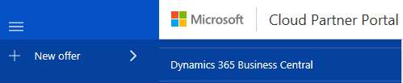
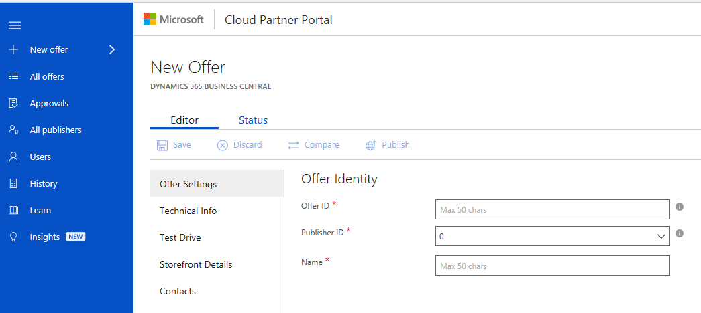

How to create your new Microsoft Dynamics 365 Business Central offer
====================================================================

After you have built your app, you must define all the attributes that
will determine how your app will be listed in Microsoft AppSource. For
example, you must provide your company information, your offer and
plans, marketing information, a support contact, and the Microsoft
AppSource categories. 

To define the attributes, Sign into the Microsoft [Cloud Partner
Portal](http://cloudpartner.azure.com/), using the Microsoft
account you used for registration in the Developer Center.

1.  In the Cloud Partner Portal, from the left navigation bar, click 
on **+ New offer** and select **Dynamics 365 Business Central** from the list of applications.

   

2.  A new offer "Editor" view is now opened for you, and you are ready
    to start authoring.

   

3.  In the "Editor" view, you can see an overview of the tabs that
    have to be completed. Each tab consists of a set of fields that
    are to be filled out. Required fields are marked with a red asterisk
    (\*). You won't be able to proceed to the next publishing step
    without completing these fields. The following tabs are displayed for
    a Dynamics 365 Business Central app:

-   **Offer Settings**
-   **Technical Info**
-   **Storefront Details**
-   **Contacts**
