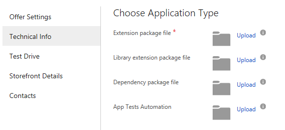
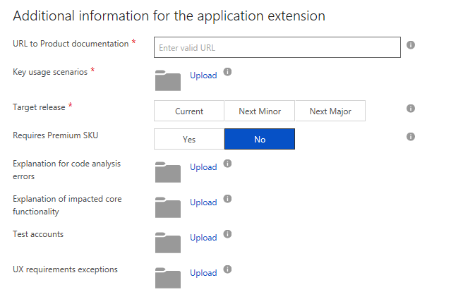

How to fill out the Technical Info form
===========================================

1.  In the **Choose Application Type** section, upload your extension
    package file (.app) and any extension package files your extension
    has a dependency on.

    

-   **Extensions Package File** -- Required - the extension
    package file (.app).

-   **Dependency package file** -- Required if the app has a dependency
    on another app published in AppSource. This .app file of an already published 
extension in AppSource, which the current app is dependent upon. 

-   **Library Package File** - Required if the app has a dependency on
    another app that is *not* published in AppSource. This .app file of an existing app, but one that 
has not been and will not be published in AppSource.

-   **App Test Automation** -- Required - the VS Coded test
    package that you must create for automated testing of extensions.

2.  In the **Additional Information for the extension** section, upload
    additional information for your extension. This information is used during
    validation.

    

-   **URL to Product Documentation** -- Required - URL to the
    documentation for the extension.

-   **Key Usage Scenarios** -- Required - a document that lists the step
    by step setup and usage details for the extension. An example can be
    found in the article 
    [User Scenario Documentation](https://docs.microsoft.com/dynamics-nav/compliance/apptest-userscenario/).

-   **Target Release** -- Required - Select the release on which to
    deploy the app. Select **current** to deploy on the current in
    market version. Select **next minor** to deploy with the next minor
    version to be released. Select **next major** to deploy with the
    next major version to be released.

-   **Requires Premium SKU** -- Optional -- Select the Premium button if
    the app requires the Premium SKU. Service Management and
    Manufacturing are available only on premium. Detailed information on
    Essential vs Premium can be found in the article [Changing Which Features are Displayed](https://docs.microsoft.com/dynamics365/financials/ui-experiences).

-   **Explanation for Code Analysis Errors** -- Optional -- Document
    that lists and justifies any code that doesn't meet the
    requirements.

-   **Explanation of Impacted Core Functionality** -- Optional --
    Document that lists and explains any core functionality that is
    limited by the extension.

-   **Test Accounts** -- Optional -- User accounts for remote services,
    web sites, etc. that will be needed to complete the end to end usage
    test.

-   **UX requirements exceptions** -- Optional -- Document that lists
    and justifies any user experience requirements not met by the
    extension.

The next step is to add storefront details for your offer.
