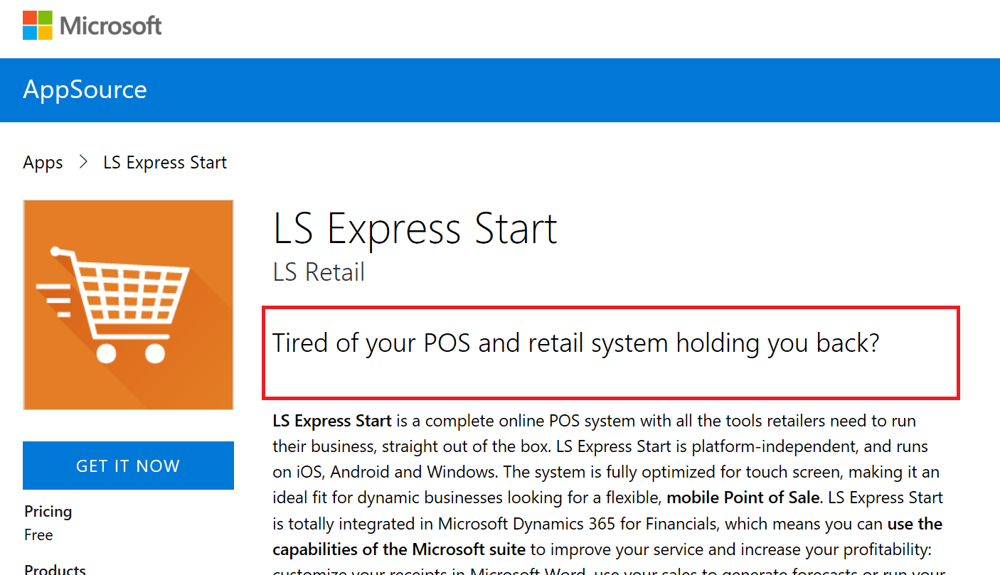
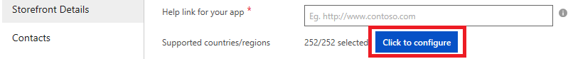
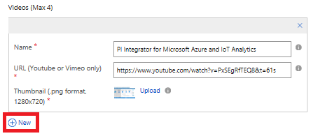

How to fill out the Storefront Details form
===========================================

Simply listing your app's features and functionality will not convert
prospects to buyers. For more information about how to best market your
app in the AppSource marketplace, see the white paper 
[Developing Apps for Dynamics 365 for Finance and Operations](https://go.microsoft.com/fwlink/?linkid=841518).  

### Offer Summary

This summary will appear on AppSource, as a summary in the overview of
apps, as well as on the app detail page just below your app name and the
publisher name. We recommend you to create curiosity and a positive
mental acknowledgement by asking prospects a question they either do not
know the answer to or can relate to. The question should stimulate a
strong emotional response. Speak to a core pain they are likely
experiencing that has a negative measurable impact. It should be a
maximum of 100 characters.

### Offer Description

This description will appear on AppSource, just below your
**Offer Summary**. When describing your solution, do not focus on the
underlying technology or operational features. Prospects can learn about
the details later. Your primary objective is conversion, which means
motivating prospects into action. The optimal approach is to remind them
of the pain they are likely experiencing and reference the benefits they
will experience once they start using your solution. Clearly articulate
a compelling desired outcome and result. We recommend you to add a link
to your app landing page at the end of your description. Maximum allowed
is 1300 characters

### Industries

Select the industry that your app is best aligned to. If your app
relates to multiple industries, you can leave this blank

### Categories

Select the categories that are relevant to your app. Select at
least one category and a maximum of three. Choose carefully
because customers can search on AppSource based on the categories

### App type

Select the type of trial that your app will enable on AppSource.
**Free** means your app is free. **Trial** means customers can try your
app for a short period on AppSource. **Request for trial** means
customers can request a trial of the app from AppSource.

### Help link for your app

There must be an active help link that guides customers to online
product help related to your app. It is best practice to include
instructions about set up, links to existing videos and documentation,
and to the most frequently asked questions.

### Supported countries/regions

This field determines the countries/regions in which your offer will be
available for trial. You can only choose countries where Microsoft
Dynamics 365 Business Central is already available or in preview. For the current list, see
[Countries and Translations Supported](https://docs.microsoft.com/en-gb/dynamics-nav/compliance/apptest-countries-and-translations).

### Supported languages

Select the languages that your app supports. If your app supports
additional languages that are not on this list, continue to publish your
offer and email us at <appsource@microsoft.com> to let us know.

### App version

Enter the version number for your app

### Products your app works with (Max 3)

List specific products that your app works with. You can list maximum of
three products. To list a product, click on the plus sign (beside new) and a
new open text field will be created for you to enter the name of a
product that your app works with.

### Hide key

Provide a hide key that can be used to view your staged offer in
AppSource. You can enter any string here

### Offer logo (png format, 48x48)

This logo will appear on AppSource in the overview of app or app results,
when completing a search. *Only png format is allowed.*  Upload a png
image with resolution of 48PX\*48PX

### Offer logo (png format, 216x216)

This will appear on AppSource on your app's detail page. *Only png
format is allowed.* Upload a png image with resolution of 216PX\*216PX

### Video

It is recommended that you upload at least one video (but not a
requirement). Up to a total of four videos are permitted. For each video
you want to upload, you need to fill in the video name, URL (YouTube or
Vimeo only) and Thumbnail to associate with the video. Thumbnail must be
in png format and must be 1280PX\*720PX. To add new video(s), click on
the plus sign - see screenshot below. Videos thumbnail(s) will appear on
AppSource.

### Document

Documents you upload here will appear on AppSource under \"Learn more\".
You can upload maximum three documents in PDF format. For each document
you want to upload, you need to fill in the document name, and upload
the document. Document must be in pdf format. To add new document(s),
click on the plus sign - see screenshot below

### Screenshots

A minimum of three screenshots is required, up to a maximum of five are
permitted. Take the screenshots in the Financials sandbox and
choose screenshots that include realistic demo data and tell a
compelling, engaging story.

### Privacy Policy

Enter URL to your app's Privacy Policy document.

### Terms of use

Enter the Terms of Use for your app. AppSource customers are required to
accept these terms before they can try your app

### Customer Support

There must be a specific support page that provides customers with
different contact options. Include support via phone, email message, and
ideally live chat, if possible.

### Lead Destination

Select a CRM system where you lead will be stored. Select \"Azure
Table\" here if you have one of the following CRM systems: Salesforce,
Marketo, Microsoft Dynamics CRM. The CRM system you select here is where
we will write details of end users that try your app on AppSource
(leads). Depending on the CRM system you select, click the corresponding
URL below for information on how to complete the next set of fields

-   [Azure Table](./cloud-partner-portal-lead-management-instructions-azure-table.md)
-   [Marketo](./cloud-partner-portal-lead-management-instructions-marketo.md)
-   [Microsoft Dynamics CRM](./cloud-partner-portal-lead-management-instructions-dynamics.md)
-   [Salesforce](./cloud-partner-portal-lead-management-instructions-salesforce.md)

Next step is to proceed with app publishing.
