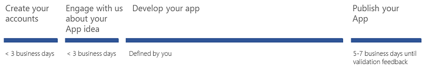

# Bring your Microsoft Dynamics 365 Business Central app into Microsoft AppSource

There are plenty of benefits of using Dynamics 365 Business Central as a platform for application builders:

-   Enrich Dynamics 365 Business Central, a proven Microsoft online solution, with your expertise.
-   Leverage the Dynamics 365 brand--a brand that millions of users know and trust.
-   Reach more customers for your business apps with Microsoft AppSource.
-   Achieve more from a platform that delivers a modern experience and offers scale.
-   Bundle with intelligent business apps such as Microsoft PowerApps, Microsoft Flow, Power BI, Cortana Intelligence, and many more.

To bring your Business Central app into Microsoft AppSource:

1.  Create your accounts.
2.  Engage with us about your app idea.
    - Develop the technical aspects of your app
    - Develop the marketing aspects of your app
4.  *Publish your app.*

## Application process and timeline

The typical application process and timeline is depicted in the following diagram: 

## Next steps

To learn more about this application type, see [Announcing Dynamics 365 Business Central](https://dynamics.microsoft.com/business-central/finance-and-operations-business-edition-to-business-central/).  Also, if you have not already done so, review the [Office 365, Dynamics 365, PowerApps, and Power BI Offer Publishing Guide](../appsource-offer-publishing-guide.md)

After these preparations, you can create a new [Microsoft Dynamics 365 Business Central offer](./d365-finance-create-new-offer.md).
