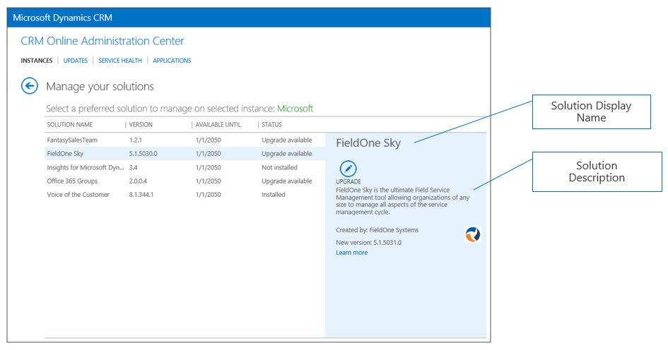

# Dynamics 365 Solution Preparation

The Dynamics 365 solutioning system is a framework for packaging, installing, and uninstalling components that provide specific business functionality. Solutions are used by ISVs and other Microsoft Dynamics 365 partners to distribute extensions they create.

If you are an existing Dynamics 365 (xRM) ISV, you most likely already have created a managed solution and have a solution.zip file. In your solution, please make sure the "Display Name" and "Description" fields reflect what you want customers to see. These are displayed in the CRM Online Administration Center.

_**Note:** In the package example that follows we will assume the solution name is "SampleSolution.zip"_

If you're a new ISV, you can get more details on creating a solution here: [https://msdn.microsoft.com/library/gg334530.aspx](https://msdn.microsoft.com/library/gg334530.aspx)

If your solution requires supporting data:

* Create the sample data in your test environment
* Use the Configuration Migration Tool to create a Schema with comparison rules for your data.
* Save your configuration schema with your project files. You will need this later if you update your configuration data.
* Export your configuration data. Be sure to give the export file a name that is meaningful to your export.
