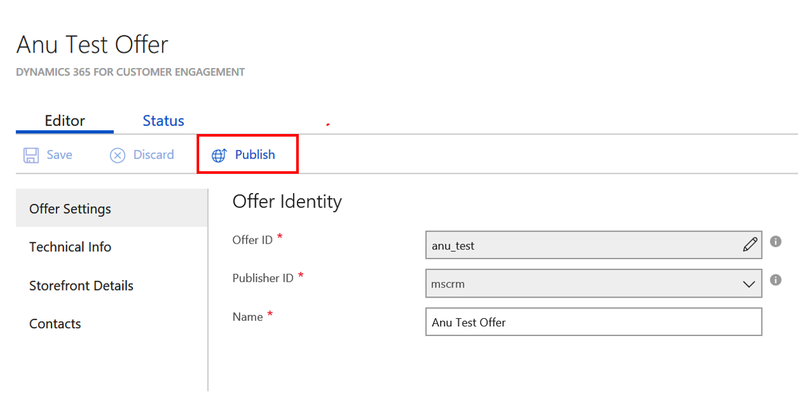
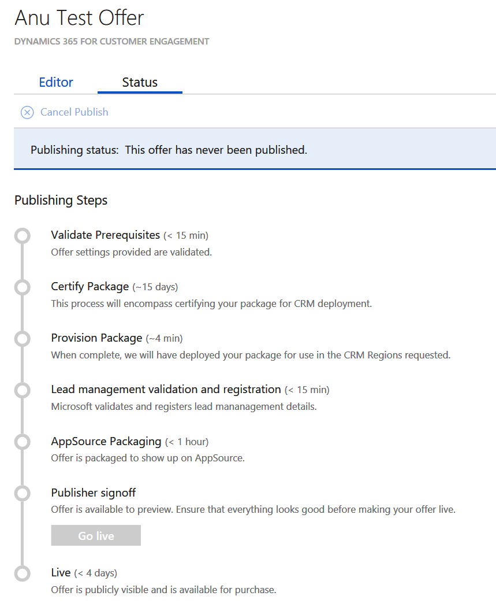
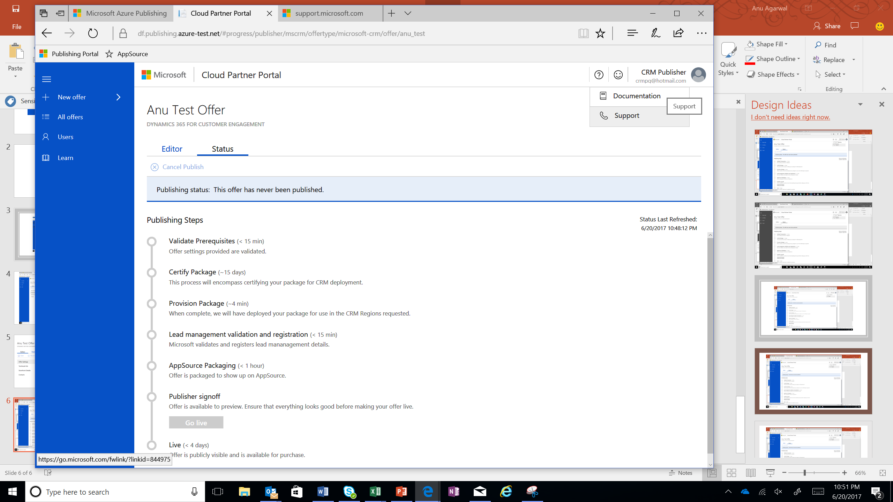

# Request to publish the app

1. Click the Publish button to submit your offer to our certification team. You'll be able to view the status of your offer under the Status tab.

## Republish the app

 If you need to make a request to republish an app, first click the Cancel Publish button under the Status tab (if the request is no longer active, skip this step). Make your changes to the app, update the offer accordingly, then click the Publish button to resubmit. # Special considerations for Microsoft Dynamics 365 Business Edition Please note that solutions built for Microsoft Dynamics 365 Business Editions will undergo additional checks during certification to ensure the Business Edition limits are adhered to. The Business Edition limits are documented here. # Getting help. If you run into issues, you can log a support ticket by clicking the in the top right corner and going to.

