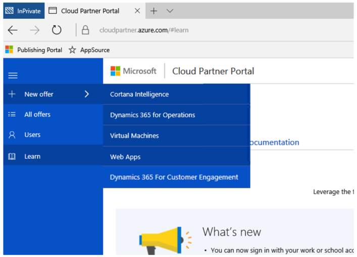
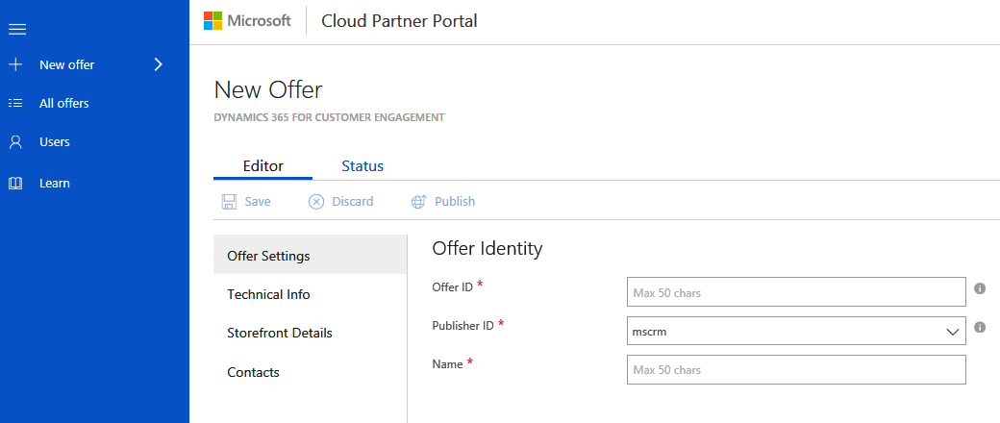
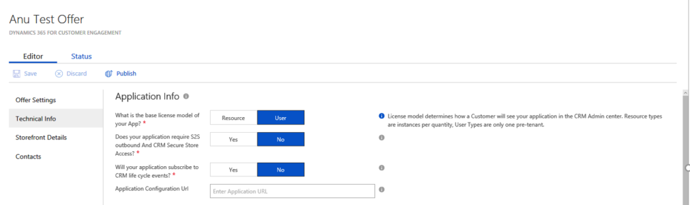
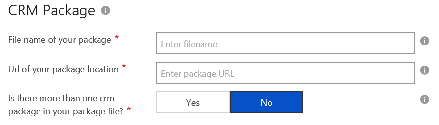

# Setup your application in the Publishing Portal

You are now ready to set up your application in the publishing portal.

## Login and Create a New Offer

1. Sign in to the [Cloud Partner Portal](http://cloudpartner.azure.com/).
2. From the left navigation bar, click on "+ New offer" and select "Dynamics 365 for Customer Engagement."

3. A new offer "Editor" view is now opened for you, and we are ready to start authoring.

4. The "forms" that need to be filled out are visible on the left within the "Editor" view. Each "form" consists of a set of fields that are to be filled out. Required fields are marked with a red asterisk (\*).

There are four main forms for authoring a Dynamics 365 for Customer Engagement offer

* Offer Settings
* Technical Info
* Storefront Details
* Contacts

## Fill out the Offer Settings form

The offer settings form is a basic form to specify the offer settings. The different fields are described below.

### Offer ID

This is a unique identifier for the offer within a publisher profile. This ID will be visible in product URLs. It can only be composed of lowercase alphanumeric characters or dashes (-). The ID cannot end in a dash and can have a maximum of 50 characters. This field is locked once an offer goes live.

for example, if a publisher **"contoso"** publishers creates an offer with offer ID **"sample-WebApp"**, it will show up in AppSource as "https://appsource.microsoft.com/marketplace/apps/contoso.sample-WebApp?tab=Overview"

### Publisher ID

This dropdown allows you to choose the publisher profile you want to publish this offer under. This field is locked once an offer goes live.

### Name

This is the display name for your offer. This is the name that will show up in [AppSource](https://appsource.microsoft.com/). It can have a maximum of 50 characters.

Click on "Save" to save your progress. Next step would be to add Technical Info for your offer.

## Fill out the Technical Info form

The technical info form is where you will fill in information specific to your Dynamics 365 for Customer Engagement solution. Hovering over the will present you with more information. See the example below.

### Application Info

Most publishers will leave these fields with the default values, User, No, No, and a blank Application Configuration URL as per the screenshot above.

### CRM Package

Here is an explanation for these fields:

* File name of your package: The file name you created in the above step when creating the zip file that is your CRM AppSource Package. In the above example, it is "Microsoft\_SamplePackage.zip".
* Url of your package location: This is the URL to the Azure Storage account that contains the package file name specified above. It is the URL created in Step 9 of the section above.
* Is there more than one crm package in your package file: Select Yes **ONLY** if you are supporting multiple versions of crm with different packages. For most partners this will be "No". If you select Yes, you need to create AppSource Packages for each version of your solution. _Note: This is NOT asking if you have multiple **zip** files. If you have multiple solution.zip files but only one version, you should still select "No." The packaging tool will bring these together in automatically._

### CRM Package Availability

In this section, select what regions of CRM your package will be made available to. For information on which regions serve which countries, please see the link: [http://o365datacentermap.azurewebsites.net/](http://o365datacentermap.azurewebsites.net/)

Note: Deploying to Germany "Sovereign and US Gov Cloud" Sovereign REQUIRES SPECIAL PERMISSION and VALIDATION DURING CERTIFICATION

## Storefront Details

### Offer Summary

This is a summary of your offer's value proposition. It will appear on your offer's search page. It should be a maximum of 100 characters.

### Offer Description

This is the description that will appear on your app detail page. Maximum allowed is 1300 characters

### Industries

Select the industry that your app is best aligned to. If your app has relates to multiple industries, you can leave this blank.

### Categories

Select the categories that are relevant to your app. Select a maximum of 3.

### App type

Select the type of trial that your app will enable on AppSource. 'Free' means your app is free. 'Trial' means customers can try your app for a short period on AppSource. 'Request for trial' is not supported for Dynamics 365 for Customer Engagement apps. Do not select this option.

### Help link for your app

Enter URL to a page that has help related information for your app.

### Supported countries/regions

This field determines the countries/regions in which your offer will be available for trial.

### Supported languages

Select the languages that your app supports. If your app supports additional languages that are not on this list, continue to publish your offer and email us at: [appsource@microsoft.com](mailto:appsource@microsoft.com) to let us know.

### App version

Enter the version number for your app

### App Release Date

Enter the release date for your app

### Products your app works with (Max 3)

List-specific products that your app works with. You can list maximum of three products. To list a product, click on the plus sign (beside new) and a new open text field will be created for you to enter the name of a product that your app works with.

### Search keywords (Max 3)

AppSource allows customer to do search based on keywords. You can enter the set of keywords for which your application will be shown to the customers.

For example if the application is "My Emailing Service" Emails, Mailing, Mail service might be some keywords. Choose words that users will likely use to search for your app in the AppSource search box.

### Hide key

This is a key that will be combined with the offer preview URL to hide it from public view. It is not a password. You can enter any string here.

### Offer logo (png format, 48x48)

This will appear on your app's search page. **Only png format is allowed.** Upload a png image with resolution of 48PX\*48PX

### Offer logo (png format, 216x216)

This will appear on your app's detail page. **Only png format is allowed.** Upload a png image with resolution of 216PX\*216PX

### Videos

You can upload maximum of four videos. For each video you want to upload, you need to fill in the video name, URL (YouTube or Vimeo only) and Thumbnail to associate with the video. Thumbnail must be in png format and must be 1280PX\*720PX. To add new video(s), click on the plus sign. Videos thumbnail(s) will appears on your app's detail page.

### Documents

You can upload maximum of three documents in PDF format. For each document you want to upload, you need to fill in the document name, and upload the document. Document must be in pdf format.

To add new document(s), click on the plus sign

### Screenshots

These are screenshots that will appear on the AppSource detail page for your app.

### Privacy Policy

Enter URL to your app's privacy policy

### Terms of use

Enter the terms of use of your app. AppSource customers are required to accept these terms before they can try your app

### Support URL

Enter the support URL for your app.

### Lead Destination

Select a CRM system where you lead will be stored. Select "Azure Table" here if you have one of the following CRM systems: Salesforce, Marketo, Microsoft Dynamics CRM. The CRM system you select here is where we will write details of end users that try your app on AppSource (leads). Depending on the CRM system you select, click the corresponding URL below for information on how to complete the next set of fields

* [Azure Table](./cloud-partner-portal-lead-management-instructions-azure-table.md)
* [Marketo](./cloud-partner-portal-lead-management-instructions-marketo.md)
* [Microsoft Dynamics CRM](./cloud-partner-portal-lead-management-instructions-dynamics.md)
* [Salesforce](./cloud-partner-portal-lead-management-instructions-salesforce.md)

## Storefront Details

The contact details are used for internal communication between the partner and Microsoft only. Note: It is important to use an email address that is monitored in these fields. We will use this email to communicate with you on your progress in publishing to AppSource. Only the support URL will be visible to the customers.
