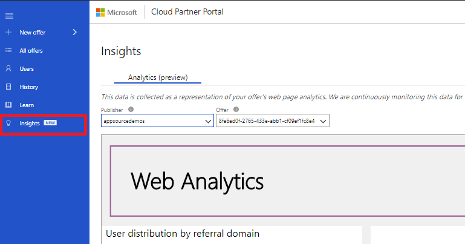
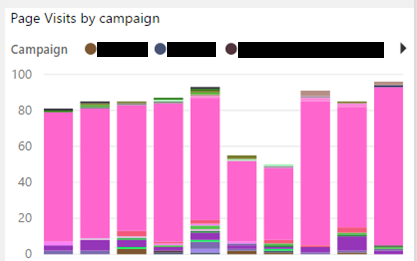
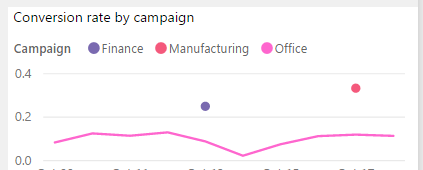
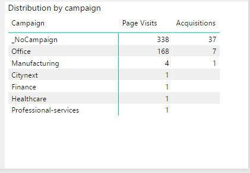
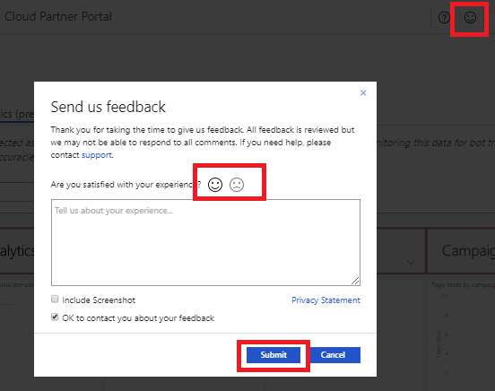

Web Analytics
=============

This article provides you with instructions on how to learn and use Web Analytics to best grow your business. Currently this Insights tab is available for any AppSource offers.

Now that you've built and published your offer, the next part of your journey is to track and measure its\' success. With **Web Analytics**, we have added the ability to see exactly how well each of your offers is doing on the marketplace. To start your journey, navigate to the Insights page on the left side of Cloud Partner Portal to see the new Analytics tab.



You will see a rich dashboard for your Publisher ID that has been  built with Microsoft Power BI and enables you to see each of your offers\' data, which is refreshed daily.

**Microsoft Campaigns**
-----------------------

In order to grow your offers and track the growth of your offers, we have enabled the ability to use **Microsoft campaigns** on the Cloud Partner Portal. Campaigns are a newly supported feature for the
marketplace that will allow for you to track the different channels that are sending customers into your app details page.

### **How to make a Campaign**

The simplest way to describe campaigns is that you are adding a custom word/term to your URL that lands on your app detail page in the
marketplace. Google, Bing, LinkedIn, and many other sites encourage you to build an advertisement, link from their site into your desired site.

In general, these efforts are to help drive new customers into your
product and it is essential to measure the success of how each of your channels is doing. This is where campaigns come in.

There are two ways to generate your own campaign.

1. Add to your URL the query parameter **mktcmpid** that describes what the campaign is and what page/event these customers are coming from.

For example you can use:
```https://appsource.microsoft.com/product/dynamics-365/contoso.offername?mktcmpid=NewCampaign```

1. (Advanced): Use one of our supported, generic campaign IDs in the
    URL. We want to be accommodating with additional ref tags that you
    need to use, so we support the convention to automatically recognize these additional tags:
    
    1. **utm\_campaign**
    2. **utm\_source**
    3. **ref**
    4. **src**

For example you can use:
```https://appsource.microsoft.com/product/dynamics-365/contoso.offername?utm_campaign=NewCampaign```

You can choose to have a combination of multiple of these campaign IDs
to further identify multiple sources driving traffic for the campaign
such as where the customer came from (email, blog, social media source, etc.).

For example:

1. Newsletter referrer:
    ```https://appsource.microsoft.com/product/dynamics-365/contoso.offername?mktcmpid=NewCampaign&src=newsletter```
2. LinkedIn referrer:
    ```https://appsource.microsoft.com/product/dynamics-365/contoso.offername?mktcmpid=NewCampaign&src=LinkedIn```

### **Ensuring campaigns pass through all your pages**

There may be a scenario where your campaigns have an intermediate page
that you are driving traffic to that then proceeds to send the customers to the marketplace. It is important to pass through your initial campaign IDs into the final URL that you send to the marketplace.

Here is an example:

1. Marketing employee buys ads from Google to drive traffic to the
    company\'s landing page ```https://contoso.com```. This landing page has
    a \"try my product\" link that goes to ```https://appsource.com```.
2. A user clicks the ad and lands on his company\'s landing page.
    1.  Referral URL = google.com
    2.  Landing Page URL =
        ```https://contoso.com/?utm_campaign=MyCampaignAdName&utm_source=MySourceAdName```
3. The user clicks the \"try my product\" link and goes into AppSource.
    1. Referral URL =
        ```https://contoso.com/?utm_campaign=MyCampaignAdName&utm_source=MySourceAdName```
    2. Landing Page URL (**Ensure that this URL has utm\_campaign and
        utm\_source added to this URL**) =
        ```https://appsource.microsoft.com/product/dynamics-365/contoso.offername?**utm\_campaign=MyCampaignAdName&utm\_source=MySourceAdName**```

How to evaluate the success of a Campaign
-----------------------------------------

### **Page Visits by campaign**



This is the breakdown of each of your daily page visits by the campaign they came from.

### **Conversion rate by campaign**



Similar to how we show the conversion rate of your entire offer, in this chart you can see the breakdown of how your different campaigns are doing. This chart should help you to identify where your higher
conversion rate campaigns are coming from.

### **Distribution by campaign**



Similar to how we look at the domains of your customers, this chart
allows you to see the distribution of your data per campaign that the
users are coming to the marketplace under. \_NoCampaign means that the
customer did not have a campaign ID in the url when they navigated to
the marketplace.

**Next Steps**
--------------

Now that you have the ability to track your offers' success, we want to encourage you to create your own campaigns.

If you have questions/feature requests, share them via Feedback, located in the upper right corner.


