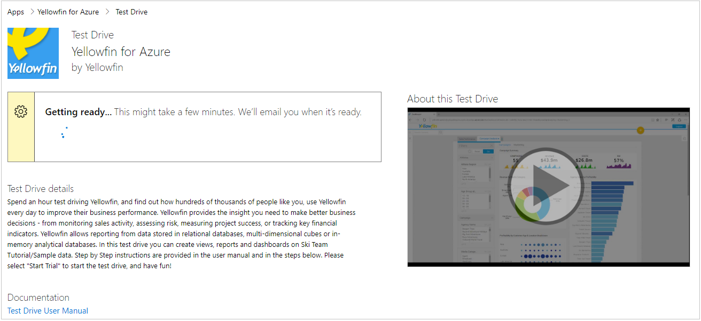
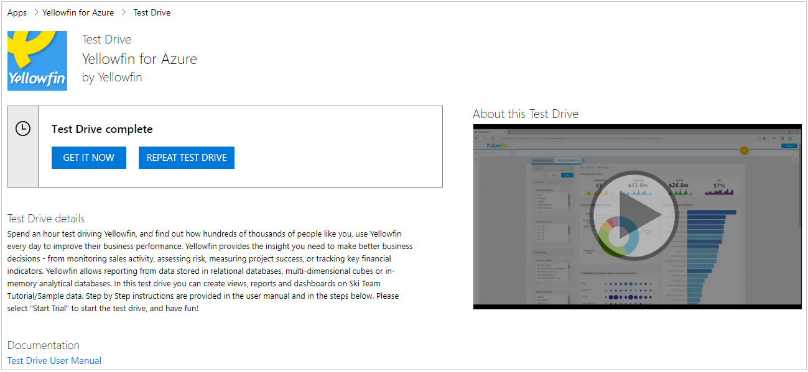

What is Test Drive?
===================

Test Drive is a great way to showcase your offer to potential customers by giving them the option to \'try before you buy\', resulting in increased conversion and the generation of highly qualified leads.

After providing their contact information, customers can access your
pre-built Test Drive experience: a hands-on, self-guided trial of your product\'s key features, and benefits being demonstrated in a real world implementation scenario.

Test Drive allows you to bring your product to life and generate highly qualified leads in the process.

How does a Test Drive work?
---------------------------

A potential customer discovers your application on the Marketplace,
signs in and agrees to the terms of use. At this point, the customer
receives your pre-configured environment to try for a fixed number of
hours, while you receive a highly qualified lead to follow up with.

And here below is an example of how an offer looks when it needs time to deploy:

No matter how complex your application, your Microsoft Test Drive helps you bring your product to life for the customer. Today we offer three different types of Test Drives based on the type of product, scenario, and marketplace you are on.

- **[Azure Resource
    Manager](./azure-resource-manager-test-drive.md)**:
    An Azure Resource Manager Test Drive is a deployment template that contains all
    the Azure resources that comprise a solution being built by the
    publisher. Products that fit this scenario are ones that use only
    Azure resources.
- **[Logic App](./logic-app-test-drive.md)**:
    A Logic App Test Drive is a deployment template that is meant to
    encompass all complex solution architectures. All Dynamics
    applications or custom products should use this type of Test Drive.
- **Power BI**: A Power BI Test Drive is simply an embedded link to a
    custom built dashboard. Any product that wants to just demonstrate
    an interactive Power BI visual should use this type of Test Drive.
    All you need to upload here is your embedded Power BI URL.

What goes on in the background?
-------------------------------

The Test Drive service is built to continuously support and serve your
customers without requiring any manual effort from you. As a Publisher, your job is to manage and configure the Test Drive settings from theCloud Partner Portal, and then that setting will directly be available for your customers.

That is because after setting your configurations for your Test Drive,
each Test Drive becomes a managed instance that will be deployed on
demand for the customer requesting it. Once a Test Drive instance is
assigned, the Test Drive is available for use for the set amount of time and then it is deleted to create room for another customer.

Next steps
----------

Now that you know what a Test Drive is all about, go visit the specific Test Drive type that you want to go publish to learn all about the required fields needed.

- **[Azure Resource
    Manager](./azure-resource-manager-test-drive.md)**
- **[Logic App](./logic-app-test-drive.md)**

If you have more questions, are looking for troubleshooting advice, or
want to make your Test Drive more successful, please go to [FAQ,
Troubleshooting, & Best Practices](./marketing-and-best-practices.md).
