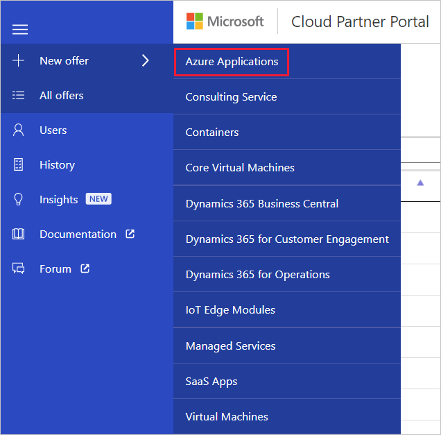

# Create an Azure application offer

This article describes how to create and publish an Azure application offer entry for the Azure Marketplace. Every offer appears as its own entity in Azure Marketplace and is composed of the following groupings of assets and supporting services: offer details, SKUs, marketing artifacts, and support information.

## New Offer form

Sign in to the [Cloud Partner Portal](https://cloudpartner.azure.com/), and then select **+ New offer** on the left menu bar. On the New offer menu, select **Azure Applications** to display the **New Offer** form and start the process of defining assets for a new offer.

## Next steps

The New Offer page provides a set of tabs and form fields that you'll use to create a new offer. The following articles explain how to define the asset groups and supporting services for your new offer.

* [Offer Settings tab](./cpp-offer-settings-tab.md)
* [SKUs tab](./cpp-skus-tab.md)
* [Test Drive tab](./cpp-testdrive-tab.md)
* [Marketplace tab](./cpp-marketplace-tab.md)
* [Support tab](./cpp-support-tab.md)
