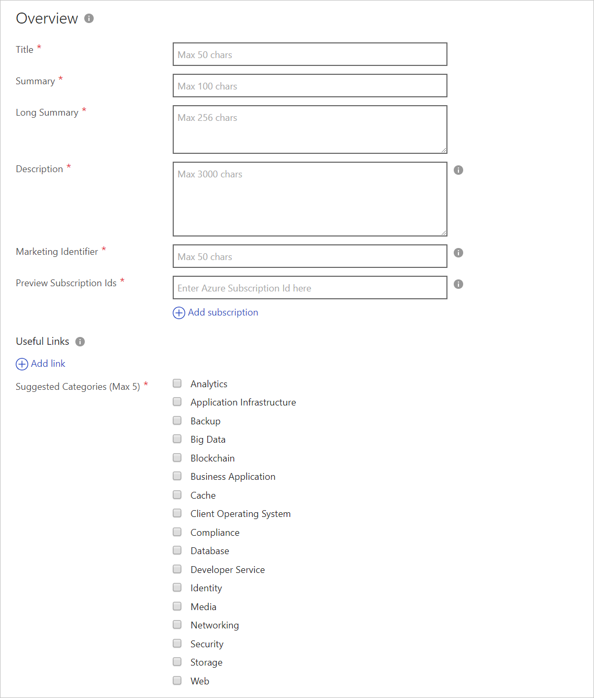
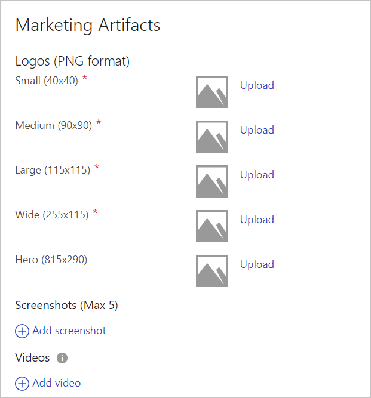
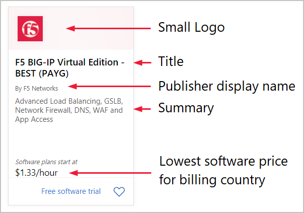
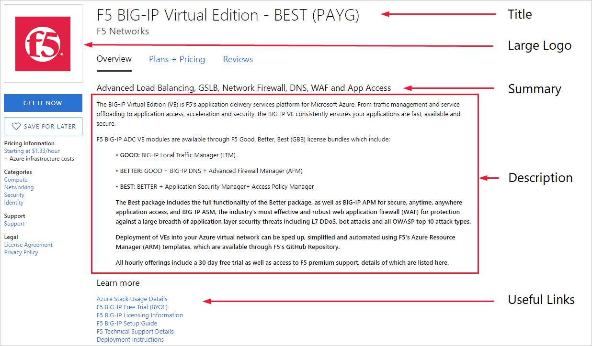
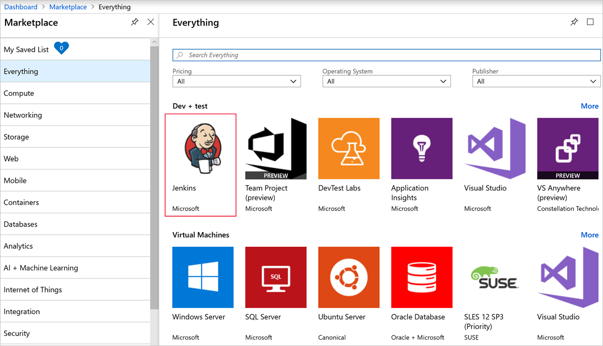
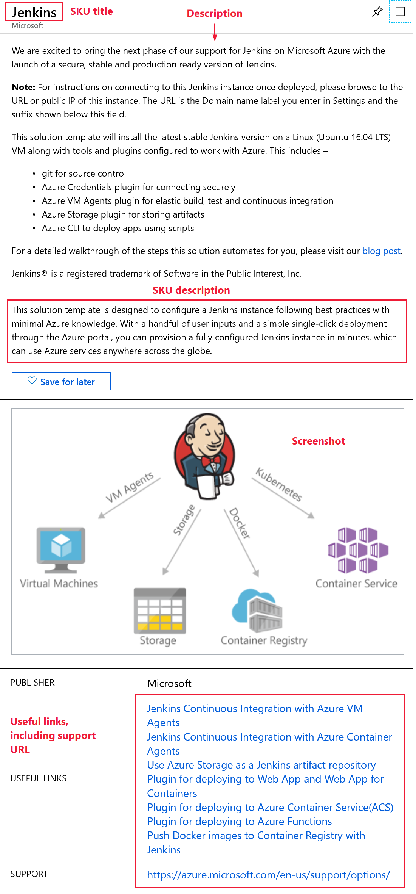
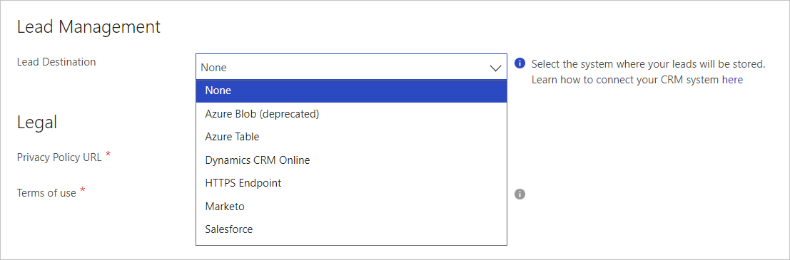
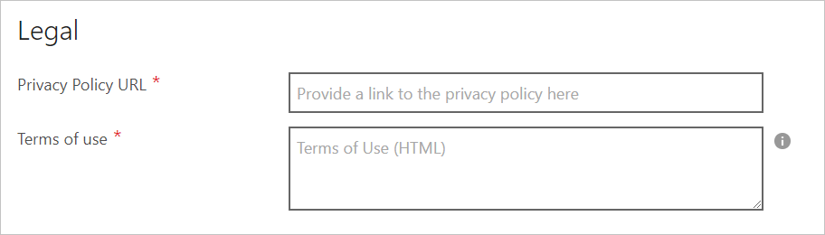

# Azure application Marketplace tab

Use the Marketplace tab to describe your Azure application and provide marketing assets. This tab includes the following forms: Overview, Marketing Artifacts, Lead Management, and Legal.

## Overview form

The Overview form has the required and optional fields shown in the next screen capture. Required fields are indicted by an asterisk (*).

The following table describes the settings to use for creating a storefront for the offer.   The fields appended with an asterisk are required.

|      Field         |    Description    |
|  ---------------   |  ---------------  |
| **Title\***        | Title of the offer. It will be displayed prominently in the marketplace. The maximum length is 50 characters. |
| **Summary\***      | Short summary of the offer. The maximum length is  100 characters.           |
| **Long Summary\*** | Longer summary of the offer (though it could be the same as the summary). The maximum length is  256 characters.           |
| **Description\***  | Description of the offer. The maximum length is 3000 characters. Simple HTML formatting is allowed, including &lt;p&gt;, &lt;em&gt;, &lt;ul&gt;, &lt;li&gt;, &lt;ol&gt; and header tags.  |
| **Marketing Identifier\*** | A unique URL to associate to this offer, typically includes your organization and solution name, maximum length 50 characters. Choose a short, friendly marketing identifier for your service. This will be used in marketplace URLs for this offer. For example, if your publisher ID is “contoso” and your marketing identifier is “sampleApp”, the URL for your offer in Azure Marketplace will be https://azuremarketplace.microsoft.com/en-us/marketplace/apps/contoso.sampleApp  
| **Preview Subscription IDs\*** | Add from one to 100 subscription identifiers of previewers. These white-listed subscriptions will have access to your offer while it’s available in preview after it’s published, before it goes live.          |
| **Useful Links**    | Optionally, you can provide links to various resources for users of your offer, such as support, documentation, forums, etc.  It is recommended that you add at least one link to your documentation.            |
| **Suggested Categories (Max 5)\*** | Select one to five categories. The selected categories are used to map your offer to the product categories available in Azure Marketplace and Azure Portal. They'll be shown on browse pages and on your product details page. |
|  |  |

## Marketing Artifacts

The Marketing Artifacts form has the required and optional fields shown in the next screen capture. Required fields are indicted by an asterisk (*).

The following table describes the marketing artifacts.

|      Field         |    Description    |
|  ---------------   |  ---------------  |
| **Small\***        | Small logo: 40x40 pixels in PNG format     |
| **Medium\***       | Medium logo: 90x90 pixels in PNG format    |
| **Large\***        | Large logo: 115x115 pixels in PNG format   |
| **Wide\***         | Wide logo: 255x115 pixels in PNG format    |
| **Hero**           | Optional hero logo: 815x290 pixels in PNG format. **Note:** The hero icon can't be deleted after it's uploaded. |
| **Screenshots (Max 5)** |        Screenshots are displayed on your product details page. They're a good way to visually communicate what your app does and how it works. For example, you can show architecture diagrams or use case illustrations. Screenshots are optional, and you limited to 5 per SKU. To add a screenshot:<ul><li>Select **+ Add screenshot** to open the Screenshot window</li><li>**Name** - Enter a name/title (Maximum length of 100 characters.)</li><li>**Upload** - Upload the image. It must be in PNG format, and the size is 533 x 324 pixels.</li></ul>           |
| **Add video**      | Optional, videos are displayed on your product details page. They're a good way to visually communicate what your application does and how it works. To add a video: <ul><li>Select **+ Add video** to open the Video window</li><li>**Name** - Enter a name/title (Maximum length of 100 characters.)</li><li>**Link** – Enter the URL for the site that’s hosting the video (YouTube or Vimeo)</li><li>**Thumbnail** – Upload a thumbnail. It must be in PNG format, and the size is 533 x 324 pixels.</li></ul>          |
|  |  |

### Artifact examples in Azure Marketplace

The next screen capture shows an example of a Marketplace search result.

The following image shows how the offer is displayed in the Marketplace after a customer clicks on the offer’s tile in the search result.

### Artifact examples in Azure Portal

The following screen captures show how an offer is displayed in the Azure Portal. The application offer in this example is found by browsing to **Marketplace>Everything>Dev + Test>Jenkins**. The Jenkins offer shows a logo, title, and publisher display name.

The next screen capture shows detailed information about the application when a user selects Jenkins.

### Logo guidelines

All the logos uploaded to the Cloud Partner Portal should follow the guidelines:

- The Azure design has a simple color palette. Keep the number of primary and secondary colors on your logo low.
- The theme colors of the Azure Portal are white and black. Avoid using these colors as the background color for your logos. Use a color that will make your logos prominent in the Azure portal. We recommend simple primary colors. If you're using a transparent background, make sure that the logos/text aren't white, black, or blue.
- Don't use a gradient background on your logo.
- Avoid placing text, even your company or brand name, on the logo. The look and feel of your logo should be "flat" and should avoid gradients.
- Don't stretch the logo.

#### Hero logo

The Hero logo is optional.

>[!IMPORTANT]
>You can’t delete the Hero logo after it’s uploaded.

Use the following guidelines for a Hero logo:

- Black, white, and transparent backgrounds aren't allowed.
- Avoid using any light color as the background for the logo. The publisher display name, plan title and the offer long summary are displayed in white font color and must stand out against the background.
- Avoid using most text when you're designing the logo. The publisher name, plan title, the offer long summary, and a create button are embedded programmatically inside the logo when the offer's listed.
- Include an unused rectangular space on the right-side of your hero logo. This blank space is 415x100 pixels and offset from the left by 370 pixels.

## Lead Management

The Lead Management form has an optional field to configure lead management. To configure lead management, select the Lead destination from the dropdown list. The next screen capture shows the available destinations.

>[!TIP]
>Select the information icon to see this message: “Select the system where your leads will be stored. Learn how to connect to your CRM system [here](https://docs.microsoft.com/azure/marketplace/cloud-partner-portal-orig/cloud-partner-portal-get-customer-leads) .”

For more information, see [Configure customer leads](https://docs.microsoft.com/azure/marketplace/cloud-partner-portal-orig/cloud-partner-portal-get-customer-leads).

## Legal

Use the Legal form to provide the legal documentation required for every offer.

Provide the following information:

- **Privacy policy URL\*** – Enter a link to your app’s privacy policy.
- **Terms of use\*** – Enter the terms of use for your app. Customers are required to accept these terms before they can try your app.

## Next steps

[Support tab](./cpp-support-tab.md)
