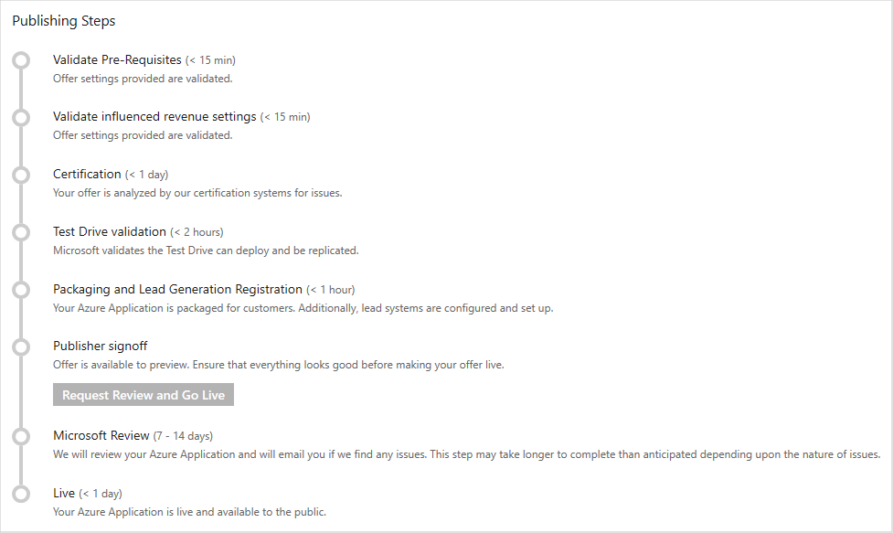
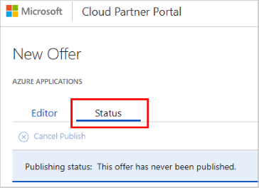

# Publish Azure application offer

After you create an offer by providing the information on the **New Offer** page, you can publish the offer. Select **Publish** to start the publishing process.

The following diagram shows the main steps in the publishing process for an offer to "go live".

## Detailed description of publishing steps

The following table lists and describes each publishing step, and provides a time estimate to complete each step.  Times estimates in "days" are defined as business days, which exclude weekends and holidays.

|  **Publishing Step**           | **Time**    | **Description**                                                            |
|  -------------------           | --------    | ---------------                                                            |
| Validate prerequisites         | < 15 min    | Offer information and offer settings are validated.                        |
| Validate influenced revenue settings | < 15 min  | Azure resource usage attribution for the offer is checked.             |
| Certification                  | < 1 day     | Offer is analyzed by the Azure Certification Team. The offer is scanned for viruses, malware, safety compliance, and security issues. The offer is checked to see that it meets all the eligibility criteria. For more information, see [prerequisites](./cpp-prerequisites.md). Feedback is provided if an issue is found. |
| Test Drive validation          | < 2 hours   | (Optional) If a Test Drive is present, Microsoft validates that it can be deployed and replicated.  |
| Packaging and lead generation registration | < 1 hour  | Offer’s technical assets are packaged for customer use and the lead systems are configured and deployed. |
|  Publisher sign-off             |  manual    | Final publisher review and confirmation before the offer goes live. The offer is now available for preview.  You can deploy your offer in the selected subscriptions (in the offer information steps) to verify that it meets all your requirements.  After you verify the offer, select **Go Live** so your offer can move to the next step. |
| Microsoft review                | 7 - 14 days | Microsoft holistically reviews your Azure application and emails you if issues are discovered.  The length of this step depends upon the complexity of the application, the issues uncovered, and how promptly you respond to them.  |
| Live                           | < 1 day | Offer is released, replicated to the specified regions, and made available to the public. |
|   |&nbsp;&nbsp;&nbsp;&nbsp;&nbsp;&nbsp;&nbsp;&nbsp;&nbsp;&nbsp;&nbsp;&nbsp;&nbsp;&nbsp;&nbsp;&nbsp;&nbsp;&nbsp;&nbsp;&nbsp;|   |

You can monitor the publishing process in the **Status** tab for your offer in the Cloud Partner Portal.

After you finish the publishing process, your offer will be listed in the [Microsoft Azure Marketplace application category](https://azuremarketplace.microsoft.com/marketplace/apps/).

>[!Note]
>Cloud Solution Providers (CSP) partner channel opt-in is now available.  Please see [Cloud Solution Providers](../../cloud-solution-providers.md) for more information on marketing your offer through the Microsoft CSP partner channels.

## Errors and review feedback

In addition to displaying the publishing status of your offer, the **Status** tab also displays error messages and feedback from any publishing steps where an issue is encountered.  If the issue is critical, then publishing is canceled.  You must then correct the reported issue(s) and republish the offer.  Because the **Microsoft review** step represents an extensive review of your offer and its associated technical assets (especially the Azure Resource Manager template), issues are typically presented as pull request (PR) links.  An explanation of how to view and respond to these PRs, see [Handling review feedback](./cpp-handling-review-feedback.md).

## Next steps

If you encountered errors in one or more of the publishing steps, you must correct them and republish your offer.  If critical issues are encountered in the **Microsoft review** step, you must [handle the review feedback](./cpp-handling-review-feedback.md) by accessing the Microsoft review team's Azure DevOps repository.

Once an Azure app is successfully published, you can [update the existing offer](./cpp-update-existing-offer.md) to reflect changing business or technical requirements. 
