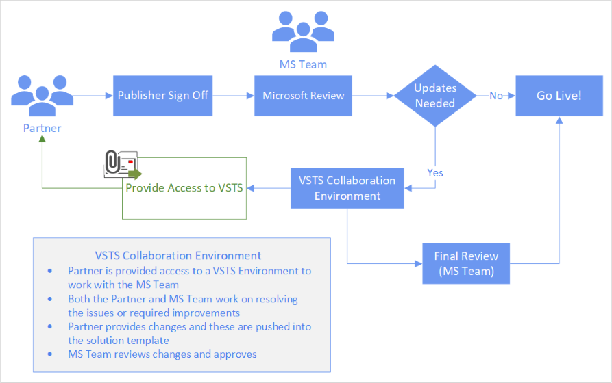
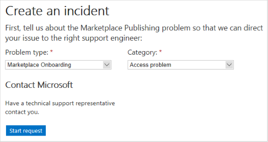

# Publish Azure application offer

After you create an offer by providing the information on the **New Offer** page, you can publish the offer. Select **Publish** to start the publishing process.

The following diagram shows the main steps in the publishing process for an offer to "go live".

## Detailed description of publishing steps

The following table lists and describes each publishing step, and provides a time estimate to complete each step.  Times estimates in "days" are defined as business days, which exclude weekends and holidays.

|  **Publishing Step**           | **Time**    | **Description**                                                            |
|  -------------------           | --------    | ---------------                                                            |
| Validate prerequisites         | < 15 min    | Offer information and offer settings are validated.                        |
| Validate influenced revenue settings | < 15 min  |      |
| Certification                  | < 1 day     | Offer is analyzed by the Azure Certification Team. The offer is scanned for viruses, malware, safety compliance, and security issues. The offer is checked to see that it meets all the eligibility criteria. For more information, see [prerequisites](./cpp-prerequisites.md). Feedback is provided if an issue is found. |
| Test Drive validation          | < 2 hours   | (Optional) If a Test Drive is present, Microsoft validates that it can be deployed and replicated.  |
| Packaging and lead generation registration | < 1 hour  | Offer’s technical assets are packaged for customer use and the lead systems are configured and deployed. |
|  Publisher sign-off             |  manual    | Final publisher review and confirmation before the offer goes live. The offer is now available for preview.  You can deploy your offer in the selected subscriptions (in the offer information steps) to verify that it meets all your requirements.  After you verify the offer, select **Go Live** so your offer can move to the next step. |
| Microsoft review                | 7 - 14 days | Microsoft holistically reviews your Azure application and emails you if issues are discovered.  The length of this step depends upon the complexity of the application, the issues uncovered, and how promptly you respond to them.  |
| Live                           | < 1 day | Offer is released, replicated to the specified regions, and made available to the public. |
|   |&nbsp;&nbsp;&nbsp;&nbsp;&nbsp;&nbsp;&nbsp;&nbsp;&nbsp;&nbsp;&nbsp;&nbsp;&nbsp;&nbsp;&nbsp;&nbsp;&nbsp;&nbsp;&nbsp;&nbsp;|   |
 
You can monitor the publishing process in the **Status** tab for your offer in the Cloud Partner Portal.

After you finish the publishing process, your offer will be listed in the [Microsoft Azure Marketplace application category](https://azuremarketplace.microsoft.com/marketplace/apps/).

## Errors and Review feedback

In addition to displaying the publishing status of your offer, the **Status** tab also displays error messages and feedback from the **Microsoft review** step.  Typically, review issues are referenced as pull request (PR).  Each PR is linked to an online Visual Studio Team Services (VSTS, renamed to [Azure DevOps](https://azure.microsoft.com/services/devops/)) item, which contains details about the issue.  The following image displays an example of a review PR reference.  For more complex situations, the review and support teams may email you. 

You must address each reported issue before the offer continues through the publishing process.  The following diagram illustrates how this feedback process relates to the publishing process.

### VSTS access

To view the VSTS items referenced in review feedback, publishers must be granted proper authorization.  Otherwise, new publishers receive a `401 - Not Authorized` response page.  To request access to the offer review VSTS system, perform the following steps:

1. Collect the following information:
    - Your publisher name and ID
    - Offer type (Azure app), offer name, and SKU ID
    - The pull request link, for example: `https://solutiontemplates.visualstudio.com/marketplacesolutions/_git/contoso/pullrequest/<number>`  This URL can be retrieved from the notification message or the address of the 401 response page.
    - The email address(es) of the individuals from your publishing organization that you want access granted to.  These should include the owner address(es) you provided when registering as a publisher on the Cloud Partner Portal.
2. Create a support incident.  In the title bar of the Cloud Partner Portal, select the **Help** button, then choose **Support** from the menu.  You default web browser should launch and navigate to the Microsoft new support incident page.  (You may have to sign in first.)
3. Specify the **Problem type** as **marketplace onboarding** and **Category** as **Access problem**, then select **Start request**.

    

4. In **Step 1 of 2** page, supply your contact information and select **Continue**.
5. In **Step 2 of 2** page, specify an incident title (for example `Request VSTS access`) and supply the information you collected in the first step (above).  Read and accept the agreement, then select **Submit**.

If the incident creation was successful, a confirmation page is displayed.  Save the confirmation information for your reference.  Microsoft support should reply to your access request within a few business days.

## Next steps

Once an Azure app is published, you can [Update existing offer](./cpp-update-existing-offer.md) to reflect changing business or technical requirements. 
