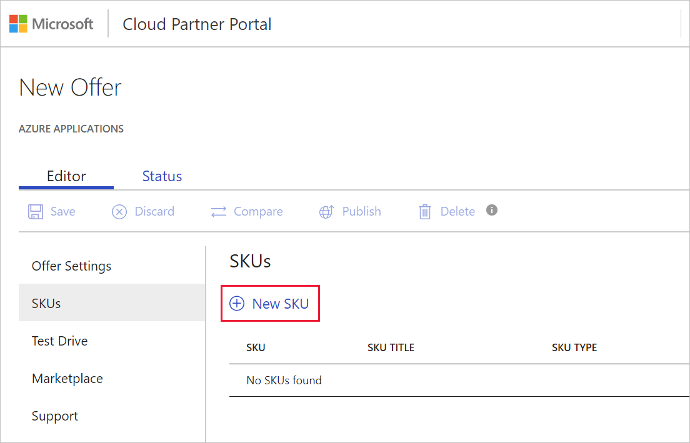
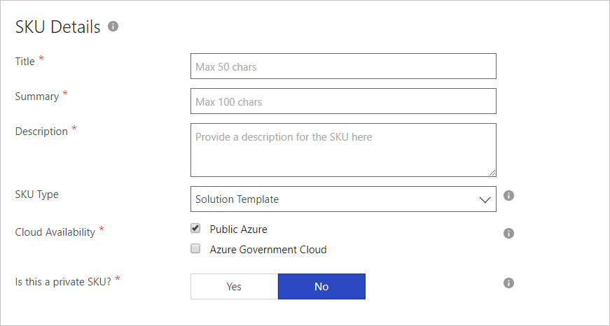
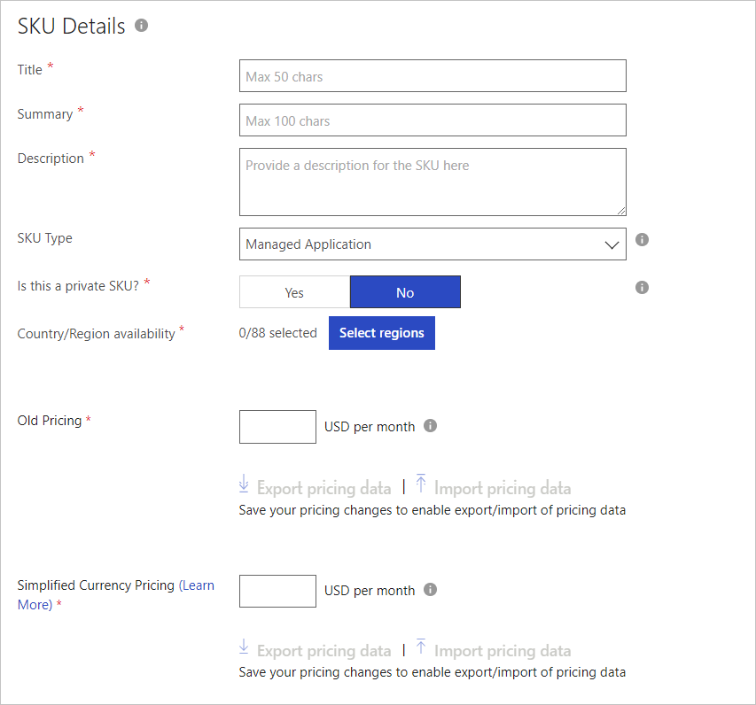
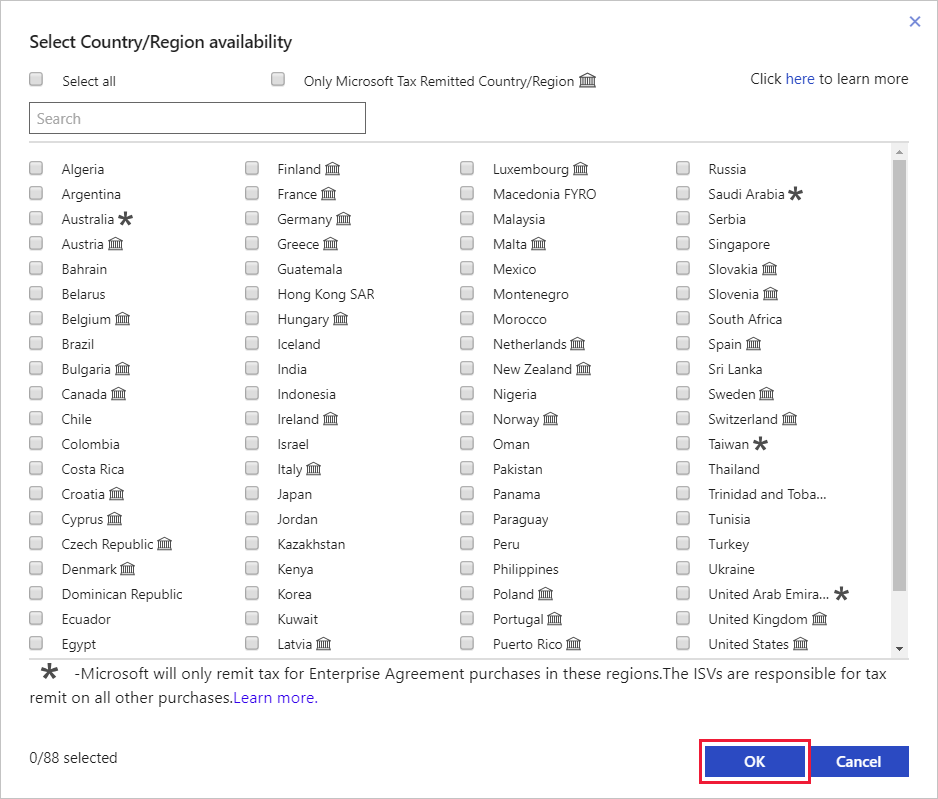
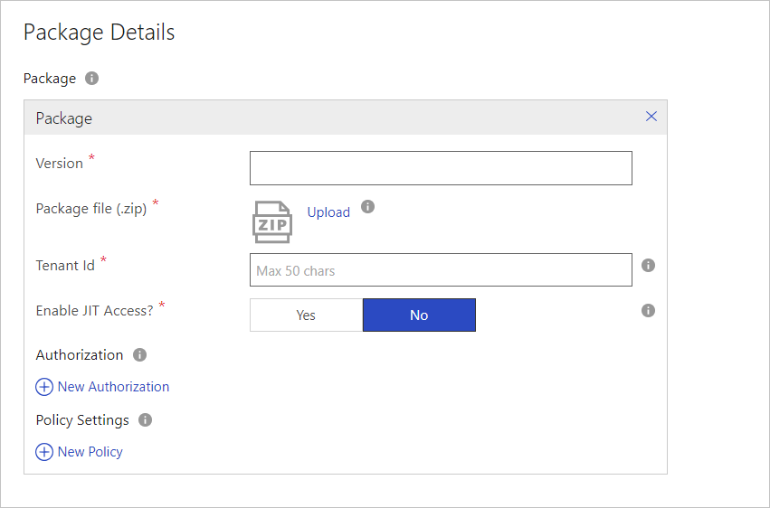
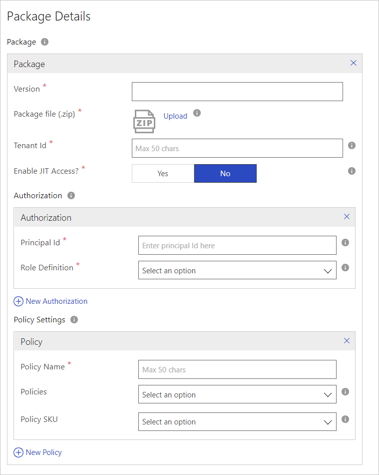
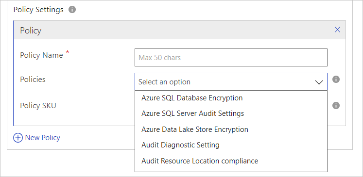

# Azure application SKUs tab

This article describes how to use the SKUs tab to create SKUs for your Azure application. 

> [!IMPORTANT]
> The steps for configuring a SKU are different for a Managed application offer and a Solution template offer. These differences are documented in this article. 

## Configure Azure application SKUs

### Create a new SKU

Use these steps to create a new SKU:

1. Select the **SKUs** tab.
2. Under SKUs, select **+ New SKU**.

    

3. In the New SKU popup window, type a **SKU ID**. This id is limited to 50 characters and must consist only  of lowercase, alphanumeric characters, dashes or underscores. The SKU ID can’t end in a dash.
4. The SKU ID is visible to customers in product URLs, Resource Manager templates (if applicable), and billing reports. You can’t modify this id after the offer’s published.

### SKU Details for a Solution Template

The next screen capture shows the SKU Details form for a Solution Template.

Provide the following SKU values.  The fields appended with an asterisk are required.

|    Field         |       Description                                                            |
|  ---------       |     ---------------                                                          |
|  **Title\***     | A title for the SKU. This title is displayed in the gallery for this item.   |
| **Summary\***    | A short summary description of the SKU. (Maximum length is 100 characters.)  |
| **Description\*** | A detailed description of the SKU. Basic HTML is supported.                 | 
| **SKU Type\***   | Type of Azure application solution, select ***Solution Template** for this scenario. |
| **Cloud Availability\*** | The location of the SKU. The default is **Public Azure**.  <b/>   **Public Azure** - App will be deployable to customers in all public Azure regions that have marketplace integration.  <b/>   **Azure Government Cloud** - App will be deployed in the Azure Government Cloud. Before publishing to [Azure Government](https://docs.microsoft.com/azure/azure-government/documentation-government-manage-marketplace-partners), Microsoft recommends publishers test and validate their solution works as expected in this environment. To stage and test, request a [trial account](https://azure.microsoft.com/offers/ms-azr-usgov-0044p/).  |
| **Is this a private SKU?\*** | Select **Yes** if this SKU is only available to a select group of customers. |
|   |   |

  > [!NOTE] 
  > Microsoft Azure Government is a government-community cloud with controlled access for customers from the US Federal, State, local or tribal AND partners eligible to serve these entities.

### SKU Details for Managed Application

The next screen capture shows the SKU Details form for a Managed Application.

   

Configure the following SKU settings. The fields appended with an asterisk are required.

|    Field         |       Description                                                            |
|  ---------       |     ---------------                                                          |
|  **Title\***     | A title for the SKU. This title is displayed in the gallery for this item.   |
| **Summary\***    | A short summary description of the SKU. (Maximum length is 100 characters.)  |
| **Description\*** | A detailed description of the SKU. Basic HTML is supported.                 | 
| **SKU Type\***   | Type of Azure application solution, select ***Managed Application** for this scenario. 
| **Cloud Availability\*** | The location of the SKU. The default is **Public Azure**.  <b/>   **Public Azure** - App will be deployable to customers in all public Azure regions that have marketplace integration.  <b/>   **Azure Government Cloud** - App will be deployed in the Azure Government Cloud. Before publishing to [Azure Government](https://docs.microsoft.com/azure/azure-government/documentation-government-manage-marketplace-partners), Microsoft recommends publishers test and validate their solution works as expected in this environment. To stage and test, request a [trial account](https://azure.microsoft.com/offers/ms-azr-usgov-0044p/).   Microsoft Azure Government is a government-community cloud with controlled access for customers from the US Federal, State, local or tribal AND partners eligible to serve these entities. |
| **Is this a private SKU?\*** | Select **Yes** if this SKU is only available to a select group of customers. |
| **Country/Region availability\*** | Use **Select regions** to view the list of countries/regions that are available. Check each country/region, and then select **OK** to save your picks.  <b/>     |
| **Old Pricing\*** | The price for the SKU, in USD per month. Prices are set in local currency using current exchange rates upon configuration. Validate these since you ultimately own these settings. To set or view each country/region’s price individually, please export the pricing spreadsheet and import with custom pricing.  You must save your pricing changes to enable export/import of pricing data.  |
| **Simplified Currency Pricing\*** | The price for the SKU, in USD per month. This must be the same as Old Pricing. For more information, see [Simplified Currency Pricing](https://docs.microsoft.com/azure/marketplace/cloud-partner-portal-orig/cloud-partner-portal-update-existing-offer). |
|  |  |

### Package Details for Solution Template

   

Provide the following **Package Details** values.  The fields appended with an asterisk are required.

- **Version\*** - The version of the package that you will upload. Version tags must be of the form X.Y.Z, where X, Y, and Z are integers.
- **Package file (.zip)\*** - This package contains the following files, saved in a .zip file.
  - MainTemplate.json - The deployment template file that's used to deploy the solution/application and create the resources defined for the solution. For more information, see [How to author deployment template files](https://docs.microsoft.com/azure/azure-resource-manager/resource-manager-create-first-template).
  - createUIDefinition.json - This file is used by the Azure portal to generate the user interface for provisioning this solution/application. For more information, see [Create Azure portal user interface for your managed application](https://docs.microsoft.com/azure/azure-resource-manager/managed-application-createuidefinition-overview).

  >[!IMPORTANT] 
  >This package should contain any nested templates or scripts that are needed to provision this application. The MainTemplate.json file and createUIDefinition.json file must be in the root folder.

### Package Details for Managed Application

   

Provide the following Package Details.  The fields appended with an asterisk are required.

- **Version\*** - The version of the package that you will upload. Version tags must be of the form X.Y.Z, where X, Y, and Z are integers.
- **Package file (.zip)\*** - This package contains the following files, saved in a .zip file.
  - applianceMainTemplate.json - The deployment template file that is used to deploy the solution/application and create the resources that are defined. For more information, see [Quickstart: Create and deploy Azure Resource Manager templates by using the Azure portal](https://docs.microsoft.com/azure/azure-resource-manager/resource-manager-quickstart-create-templates-use-the-portal). 
  - applianceCreateUIDefinition.json - This file is used by the Azure portal to generate the user interface for provisioning this solution/application. For more information, see [Create Azure portal user interface for your managed application](https://docs.microsoft.com/azure/azure-resource-manager/managed-application-createuidefinition-overview).
  - mainTemplate.json - The template file that contains only the Microsoft.Solution/appliances resource. For more information, see [Understand the structure and syntax of Azure Resource Manager Templates](https://docs.microsoft.com/azure/azure-resource-manager/resource-group-authoring-templates).  
Note the following key properties of this resource:
    - “kind” - The value should be "Marketplace" in the case of Marketplace-Managed application.
    - "ManagedResourceGroupId” - The resource group in the customer's subscription where all the resources defined in the applianceMainTemplate.json will be deployed.
    - "PublisherPackageId"- The string that uniquely identifies the package. This value needs to be constructed as follows: it’s a concatenation of [publisherId].[OfferId]-preview[SKUID].[PackageVersion].

  >[!IMPORTANT] 
  >This package should contain any nested templates or scripts that are needed to provision this application. These files must be in the root folder:  MainTemplate.json, applianceMainTemplate.json, and applianceCreateUIDefinition.json.

- **Tenant Id\*** - The Azure Active Directory tenant id of your organization.
- **Enable JIT Access?\*** – Select **Yes** to enable Just-In-Time management access for customer deployments using this offer.

  >[!NOTE] 
  >If you enable JIT, you must update the  CreateUiDefinition.json file to support JIT access.

For a managed application you must configure Authorization and Policy Settings.

#### Authorization

Add the Azure Active Directory Identifier of user, group or application to which you want to grant the permission to the managed resource group. The permission that is granted is indicated by the role definition Id. It could be an Owner, Contributor or any custom role.

#### Policy Settings

Add the policies that the Managed App complies with. Learn more about Azure Resource policies, see [What is Azure Policy?](../../../governance/policy/overview.md)

   

**To create a new authorization:**

1. Under **Authorization**, select **+ New Authorization**.
2. For **Principal Id**, type the Azure Active Directory Identifier of user, group or application to which you want to grant the permission to the managed resource group. The permission that’s granted is indicated by the Role Definition.
3. For **Role Definition**, select one of these options from the dropdown list:  Owner or Contributor. For more information, see [Built-in roles for Azure resources](https://docs.microsoft.com/azure/role-based-access-control/built-in-roles).

>[!NOTE] 
>Multiple authorizations can be added. However, it’s recommended to create an Active Directory user group and specify its ID in the "PrincipalId." This will enable addition of more users to the user group without having to update the SKU.

**To create a new policy:**

1. Under **Policy Settings**, select **+ New Policy**.
2. For **Policy Name**, enter a name for the policy. The maximum length of the name is 50 characters.
3. For **Policies**, select one of the options from the dropdown list. Choose the policy that the data provider wants to be enabled when the application uses the data. For more information, see the [Azure Policy Samples](https://docs.microsoft.com/azure/governance/policy/samples/index).

    

4. For **Policy SKU**, select Free or Standard as the policy SKU type. The Standard SKU is required for audit policies.

## Next steps

You will further describe your offer and supply marketing assets in the [Marketplace tab](./cpp-marketplace-tab.md). 
