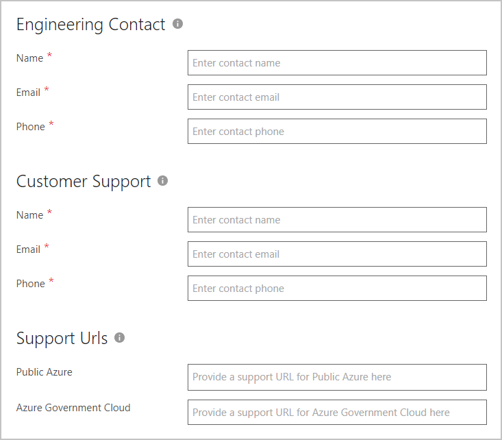

# Azure application Support tab

Use the Support tab to provide engineering and customer support information.
 
## Identify contacts and websites

Use the next screen capture as a guide to provide the required information. All field names appended with a red asterisk (*) must be completed.

  

1. Under **Engineering Contact**, provide information for the following fields:

   - **Name\*** - Enter the name of the engineering contact for your app. This contact will receive technical communications from Microsoft.
   - **Email\*** - Enter the email address of the engineering contact.
   - **Phone\*** - Enter the phone number of the engineering contact.
  
2. Under **Support Contact**, provide information for the following fields:

   - **Name\*** - Enter the name of the support contact for your app. This contact will receive support-related communications from Microsoft.
   - **Email\*** - Enter the email address of the support contact for your app.
   - **Phone\*** - Enter the phone number of the support contact.
 
3. Under **Support Urls**, provide the appropriate support URLs that Microsoft will use when your customers open support tickets. These Urls will be for either Public Azure or the Azure Government Cloud.
4. Select **Save** when you’re done.

## Next steps

[Publish Azure application offer](./cpp-publish-offer.md)
