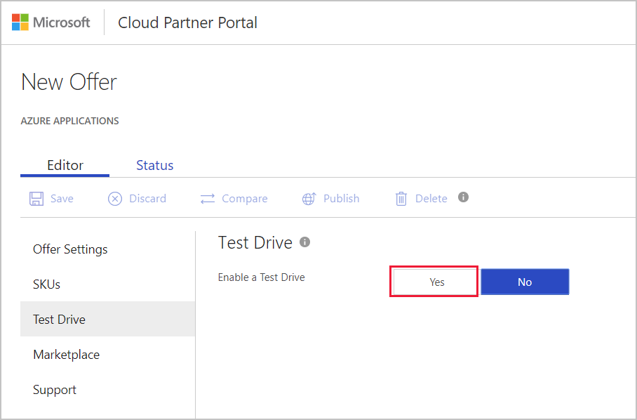
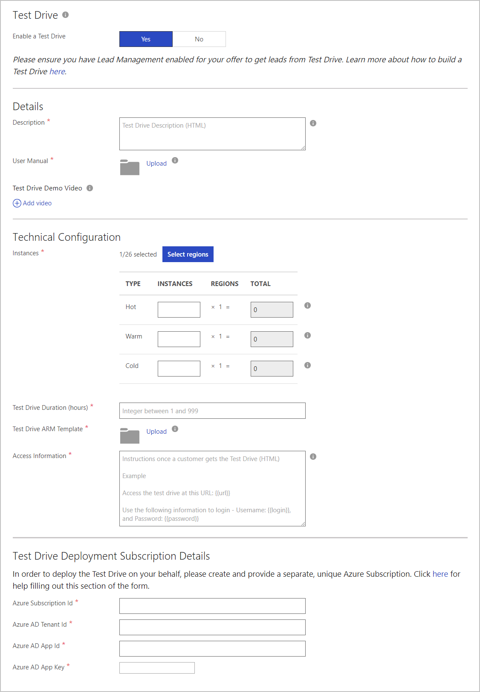

# Azure applications Test Drive tab

Use the Test Drive tab to provide a trial experience for your customers.

## Test Drive benefits

Creating a trial experience for your customers is a best practice to ensure they can buy with confidence. Of the trial options available, Test Drive is the most effective at generating high-quality leads and increased conversion of those leads.

It provides customers with a hands-on, self-guided trial of your product's key features and benefits, demonstrated in a real-world implementation scenario.

## How a test drive works

A potential customer searches and discovers your application on the Marketplace. The customer signs in and agrees to the terms of use. At this point, the customer receives your pre-configured environment to try for a fixed number of hours, while you receive a highly qualified lead to follow up with. For more information, see [What is Test Drive?](https://docs.microsoft.com/azure/marketplace/cloud-partner-portal/test-drive/what-is-test-drive)

## Setting up a test drive

Use the following steps to enable and configure a test drive.

### To enable a test drive:

1. Under **New Offer**, select the **Test Drive** tab.
2. Under **Test Drive**, select **Yes** for **Enable a Test Drive**.

   

### To configure a test drive:

After you enable a test drive,  you’ll fill out the following forms to set up the test drive:
  
 - Details
 - Technical Configuration
 - Test Drive Deployment Subscription Details

The next screen capture shows all the Test Drive forms. An asterisk (*) appended to the field name indicates that it’s required. 

The following table describes the fields required to set up the test drive for your managed application.  The fields appended with an asterisk are required.

|      Field         |  Description      |
|  ---------------   |  ---------------  |
| **Description\***  |  Describe what can be done on your Test Drive. You can use basic HTML tags to format this description. For example, &lt;p&gt;, &lt;em&gt;, &lt;ul&gt;, &lt;li&gt;, &lt;ol&gt;, and headings.                |
| **User Manual\***  |  Upload a user manual that your customers can use to walk through the Test Drive experience. This document must be a .pdf file.    |
| **Test Drive Demo Video** |  An optional video walkthrough of your Test Drive. A customer can watch this video before they take a test drive. Provide a URL to the video on YouTube or Vimeo. If you select **+ Add Video**, you’ll be prompted to provide the following information:<ul><li>Name</li><li>URL</li><li>Thumbnail (in PNG format, 533 x 324 pixels)</li></ul>  |
| **Instances\***      | Configure how many instances you want, in what region(s), and how fast your customers can get the Test Drive. For more information, see [How to publish a Test Drive](https://docs.microsoft.com/azure/marketplace/cloud-partner-portal/test-drive/azure-resource-manager-test-drive#how-to-publish-a-test-drive).           |
| **Test Drive Duration (hours)\*** | Enter an integer for the number of hours. The allowed range is from 1 to 999. |
| **Test Drive ARM Template\***     | Upload a compressed (.zip) file that has your Azure Resource Manager Templates for your app. For more information, see [Azure Resource Manager Test Drive](https://docs.microsoft.com/azure/marketplace/cloud-partner-portal/test-drive/azure-resource-manager-test-drive). |
| **Access Information\***          | Provide access information after your customer gets the Test Drive. For example, a URL to access the test drive, and sign information. . You can use basic HTML tags to format this description. For example, &lt;p&gt;, &lt;em&gt;, &lt;ul&gt;, &lt;li&gt;, &lt;ol&gt;, and headings. |
| **Azure Subscription Id\***       | This grants access to Azure services and the Azure portal. The subscription is where resource usage is reported, and services are billed. If you don’t already have a separate Azure Subscription for Test Drives only, create a subscription.  |
| **Azure AD Tenant Id\***          | Provide an existing Tenant in Azure Active Directory or create a tenant for this test drive.  |
| **Azure AD App Id\***             | Create and register a new application. Microsoft uses this application to perform operations on your Test Drive instance.  |
| **Azure AD App Key\***            | Create an authentication key for the app and paste it into this field.   |
|  |  |

After you provide all the required information, select **Save** to finish setting up the test drive.

## Next steps

[Marketplace tab](./cpp-marketplace-tab.md)
