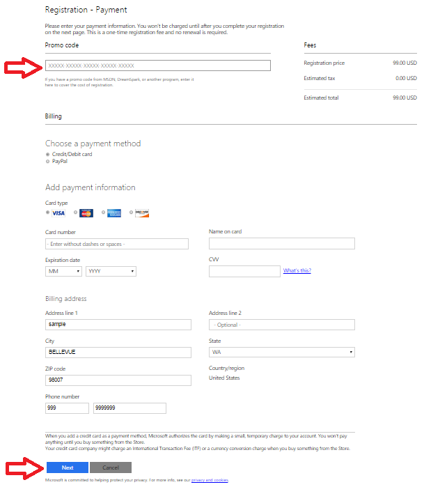
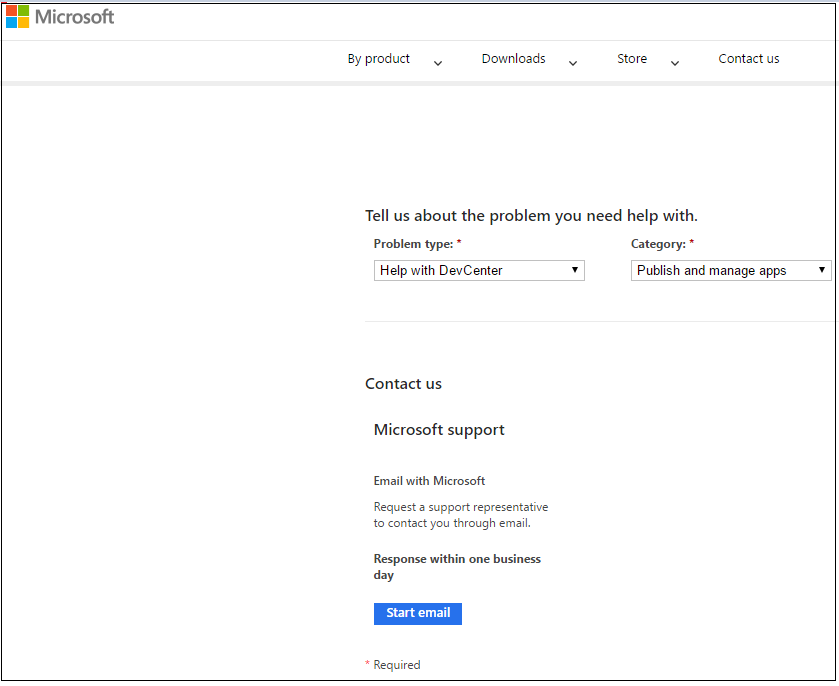

# Create a Microsoft developer account
This article walks you through the necessary account creation and registration process to become an approved Microsoft developer for Azure Marketplace publishing.

## Step 1. Create a Microsoft account
To start the publishing process, complete the Microsoft Dev Center registration. You use the same registered account on the [Cloud Partner Portal](https://cloudpartner.azure.com/). Only one Microsoft account is necessary for your Azure Marketplace offerings. It isn't specific to particular services or offers.

The address that forms the user name should be on your domain and controlled by your IT team. Use it for all the publishing-related activities done through this account.

> [!WARNING]
> Words like "Azure" and "Microsoft" aren't supported for Microsoft account registration. Avoid using these words in the account creation and registration process.
>
>

### Guidelines for company accounts
If more than one person needs to access your Microsoft account, you can create a company account.

> [!IMPORTANT]
> To allow multiple users to access your Dev Center account, we recommend using Azure Active Directory to assign roles to individual users. They can access the account by signing in with their individual Azure Active Directory credentials. For
more information, see [Manage account users](https://msdn.microsoft.com/windows/uwp/publish/manage-account-users).

To create a company account, follow these guidelines:
* Create your Microsoft account by using an email address that belongs to your company's domain but not to an individual (for example, windowsapps@fabrikam.com).
* Limit access to this Microsoft account to the smallest possible number of developers.
* Set up a corporate email distribution list that includes everyone who needs to access the developer account. All employees on this list can receive security codes when needed. Add this email address to your security information so that you can manage your Microsoft account’s security information. If setting up a distribution list isn't feasible, the owner of the individual email account needs to be available to access and share the security code when prompted. (Example scenarios are when new security information is added to the account or when it must be accessed from a new device.)
* Add a company phone number that doesn't require an extension and is accessible to key team members.
* Have developers use trusted devices to log in to your company's developer account. Key team members need access to these trusted devices to reduce the need for sending security codes when accessing the account.
* Limit access to the account from non-trusted PCs to a maximum of five developers. Access the account from machines that share the same geographical and network location.
* Frequently review your company’s security information on the [Security settings](https://account.live.com/proofs/Manage) page to make sure it's current.

Access your developer account primarily from trusted PCs, because the number of codes generated per account, per week, is limited. Trusted PCs also provide the most seamless sign-in experience.

For more information, see [Additional developer account guidelines and security](https://msdn.microsoft.com/windows/uwp/publish/opening-a-developer-account#additional-guidelines-for-company-accounts).

### Instructions for creating a Microsoft account
1. Open a new Chrome Incognito or Internet Explorer InPrivate browsing session to ensure that you’re not signed in to an existing account.

2. Register the email address (for example, windowsapp@fabrikam.com) as a Microsoft account on the [Microsoft account](https://signup.live.com/signup.aspx) page. Follow these instructions:

   	a. Provide a valid phone number so that you can receive an account verification code as a text message or an automated call.

   	b. Provide a valid email ID so that you can receive an automated email for account verification.

	  c. Verify the email address sent to the distribution list.

You’re now ready to use your new Microsoft account in the Dev Center.

## Step 2. Register your account in the Dev Center

To register your company's account in the Dev Center, you enter your company's information only one time. The registrant must be a valid representative of the company and must provide personal information to validate their identity. The registrant must use a Microsoft account that's shared for the company. *The same account must be used in the Cloud Partner Portal.* Check to make sure that your company doesn't already have a Dev Center account before you attempt to create one. During the registration process, we collect company address, bank account, and tax information. Typically, this information can be obtained from your company's finance department.

> [!IMPORTANT]
> You must complete the following developer profile components in order to progress through the various phases of offer creation and deployment.
>
>

| Developer profile | To start draft | Staging | Publish free and solution template | Publish commercial |
| --- | --- | --- | --- | --- |
| Company registration |Must have |Must have |Must have |Must have |
| Tax profile ID |Optional |Optional |Optional |Must have |
| Bank account |Optional |Optional |Optional |Must have |

> [!NOTE]
> Bring your own license (BYOL) is supported only for virtual machines, and it's considered a free offering.
>
>

### Register your company account
1. Open a new Internet Explorer InPrivate or Chrome Incognito browsing session to ensure that you’re not signed in to a personal account.

2. Go to the [Account registration](http://dev.windows.com/registration?accountprogram=azure) page to register yourself as a seller in the Dev Center. Read the following important note before you proceed.

   ![Microsoft account page][img-verify]

   > [!IMPORTANT]
   > Ensure that the email ID or distribution list that you use to register in the Dev Center is registered first as a Microsoft account. (We recommend using a distribution list to remove dependency from individuals.) If it isn't, register by using the [Microsoft account](https://signup.live.com/signup?uaid=e479342fe2824efeb0c3d92c8f961fd3&lic=1) page. An email ID under the Microsoft company domain (for example, @microsoft.com) can't be used for Dev Center registration.
   >
   >

   

3. Complete the **Help us protect your account** wizard, which verifies your identity via phone number or email address.

4. On the **Registration - Account Info** page, select your **Account country/region** from the drop-down list. Click **Next**.

   

   > [!WARNING]
   > **"Sell-from" countries**: To sell services in the Azure Marketplace, your registered entity needs to be from one of the approved “sell-from” countries. This restriction is for payout and taxation reasons. For more information, see the [Marketplace participation policies](http://go.microsoft.com/fwlink/?LinkID=526833).
   >

5. Under **Account Type**, select **Company**. Click **Next**.

   > [!IMPORTANT]
   > To better understand account types and know which is best for you to choose, see [Account types, locations, and fees](https://msdn.microsoft.com/library/windows/apps/jj863494.aspx).
   >
   >

   

6. Enter the **Publisher display name**, which is typically the name of your company.

   > [!TIP]
   > The publisher display name must be filled in to complete the registration process. However, it isn't displayed in the Azure Marketplace after your offer is listed. 
   >

7. Enter the **Contact info** for the account verification.

   > [!IMPORTANT]
   > You must provide accurate contact information. It's used in the verification process for your company's approval in the Dev Center.
   >

8. Enter the contact information for the **Company approver**. A company approver is the person who can verify that you're authorized to create an account on behalf of your organization. Click **Next**.

   

9. On the **Registration - Payment** page, enter your payment information. If you have a promo code that covers the cost of registration, enter it here. Otherwise, provide your credit card information (or use PayPal in supported markets). Click **Next**.

   

10. Review your account information, and confirm that everything is correct. Read and accept the terms and conditions of the [Microsoft Azure Marketplace Publisher Agreement](http://go.microsoft.com/fwlink/?LinkID=699560). Check the box to indicate that you've read and accepted the terms.

11. To confirm your registration, click **Finish**. We send a confirmation message to your email address.

12. If you intend to publish only free offers, click **Go to the [Cloud Partner Portal](https://cloudpartner.azure.com/)**. Then skip to "Register your account in the Cloud Partner Portal" in this article. 

13. If you intend to publish commercial offers (for example, Virtual Machine offers with an hourly billing model), click **Update your account information**. Fill in your tax and bank account information in your Dev Center account if you haven't already done so. To update your tax and bank account information later, skip to "Register your account in the Cloud Partner Portal" in this article.

> [!IMPORTANT]
> You can't push commercial offers to production until you complete the tax and bank account information in your Dev Center account.
>

### Add bank account and tax information
 If you want to publish commercial offers for purchase, you also need to add payout and tax information and submit it for validation in the Dev Center. If you intend to publish only free offers (or BYOL offers), you don't need to add this information. You can add this information later, but it takes time to validate the tax information. If you know that you want to publish commercial offers for purchase, we recommend that you add this information as soon as possible.

**Bank account information**

1. Sign in to the [Dev Center](http://dev.windows.com/registration?accountprogram=azure) with your Microsoft account.

2. On the menu on the left side of the page, click **Payout account**. Under **Choose payment method**, click **Bank account** or **PayPal**.

   > [!IMPORTANT]
   > If you have commercial offers that customers purchase in the Azure Marketplace, you receive payout for those purchases with this account.
   >
3. Enter the payment information, and click **Save**.

   > [!IMPORTANT]
   > If you need to update or change your payout account, follow these same steps, replacing the existing information with your new information. Changing your payout account can delay your payments by up to one payment cycle. This delay occurs because we need to verify the account change, just as we did when you initially set up the payout account. After your account is verified, you're paid the full amount. Any payments due for the current payment cycle are added to the next one.
   >
4. Click **Next**.

**Tax information**

1. Sign in to the [Dev Center](http://dev.windows.com/registration?accountprogram=azure) with your Microsoft account (if needed).

2. On the menu on the left side of the page, click **Tax profile**.

3. On the **Set up your tax form** page, select the country or region where you have permanent residency. Select the country or region where you hold primary citizenship, and click **Next**.

4. Enter your tax details, and click **Next**.

> [!WARNING]
> You can't push commercial offers to production until you complete the tax and bank account information in your Dev Center account.
>

### Log a support ticket
If you have problems with Dev Center registration, log a support ticket.

1. Go to the [Windows developer support](https://developer.microsoft.com/windows/support) page.

2. Under the **Contact us** section, click **Submit an incident**. 

  

3. Select **Help with DevCenter** from the **Problem type** drop-down list. Select **Publish and manage apps** from the **Category** drop-down list. Click **Start email**.

  

4. On the page that opens, use a Microsoft account to sign in. If you don't have a Microsoft account, create one by using the [Microsoft account](https://signup.live.com/signup?uaid=0089f09ccae94043a0f07c2aaf928831&lic=1) page.

5. Enter the details of the issue, and click **Submit**.

  

## Step 3. Register your account in the Cloud Partner Portal
The [Cloud Partner Portal](https://cloudpartner.azure.com/) is used to publish and manage your offers.

1. Open a new Chrome Incognito or Internet Explorer InPrivate browsing session to ensure that you’re not signed in to a personal account.

2. Go to the [Cloud Partner Portal](https://cloudpartner.azure.com/).

3. If you're signing in to the [Cloud Partner Portal](https://cloudpartner.azure.com/) for the first time, use the same email ID you used to register your Dev Center account. Using the same email ID links your Dev Center account to your Cloud Partner Portal account. Later you can add members of your company who are working on the application as contributors or owners in the Cloud Partner Portal.

If you're added as a contributor or owner in the Cloud Partner Portal, you can sign in with your own account.

> [!TIP]
> Participation policies are described on the [Azure website](https://azure.microsoft.com/support/legal/marketplace/participation-policies/).
>
>

### Manage users as owners or contributors in the Cloud Partner Portal

To manage owners and contributors in the Cloud Partner Portal, see [Steps to manage users on the Cloud Partner Portal](./cloud-partner-portal-manage-users.md).

## Next steps
Now that your account is created and registered, you can start the Azure Marketplace publishing process.

[img-msalive]:media/cloud-partner-portal-create-dev-center-registration/creating-msa-account-msa-live.jpg
[img-email]:media/cloud-partner-portal-create-dev-center-registration/creating-msa-account-msa-verifyemail.jpg
[img-sd-url]:media/cloud-partner-portal-create-dev-center-registration/seller-dashboard-incognito.jpg
[img-signin]:media/cloud-partner-portal-create-dev-center-registration/seller-dashboard-login.jpg
[img-verify]:media/cloud-partner-portal-create-dev-center-registration/seller-dashboard-verify.jpg
[img-sd-top]:media/cloud-partner-portal-create-dev-center-registration/seller-dashboard-personal-acc-details.jpg
[img-sd-info]:media/cloud-partner-portal-create-dev-center-registration/seller-dashboard-personal.jpg

[img-sd-type]:media/cloud-partner-portal-create-dev-center-registration/seller-dashboard-personal-acc-type.jpg

[img-sd-mktg1]:media/cloud-partner-portal-create-dev-center-registration/seller-dashboard-personal-comp-det1.jpg
[img-sd-mktg2]:media/cloud-partner-portal-create-dev-center-registration/seller-dashboard-personal-comp-det2.jpg
[img-sd-addr]:media/cloud-partner-portal-create-dev-center-registration/seller-dashboard-personal-comp-add.jpg
[img-sd-legal]:media/cloud-partner-portal-create-dev-center-registration/seller-dashboard-personal-cmp.jpg
[img-sd-submit]:media/cloud-partner-portal-create-dev-center-registration/seller-dashboard-approval.jpg

[link-msdndoc]: https://msdn.microsoft.com/library/jj552460.aspx
[link-sellerdashboard]: http://sellerdashboard.microsoft.com/
[link-pubportal]: https://publish.windowsazure.com
[link-single-vm]:marketplace-publishing-vm-image-creation.md
[link-single-vm-prereq]:marketplace-publishing-vm-image-creation-prerequisites.md
[link-multi-vm]:marketplace-publishing-solution-template-creation.md
[link-multi-vm-prereq]:marketplace-publishing-solution-template-creation-prerequisites.md
[link-datasvc]:marketplace-publishing-data-service-creation.md
[link-datasvc-prereq]:marketplace-publishing-data-service-creation-prerequisites.md
[link-devsvc]:marketplace-publishing-dev-service-creation.md
[link-devsvc-prereq]:marketplace-publishing-dev-service-creation-prerequisites.md
[link-pushstaging]:marketplace-publishing-push-to-staging.md

