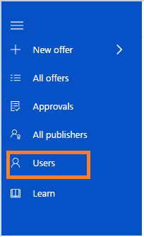
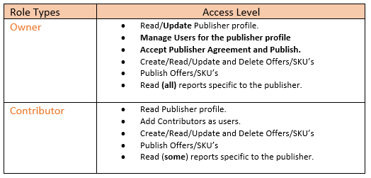

# Managing users on cloud partner portal

The Cloud Partner Portal gives you the capability to add users with role based access to virtual machine offers. This helps manage access and permissions while multiple people are working on offers. 

To **add users and assign roles** for offer publishing, follow the steps below:

## Step 1. To add users and assign roles, click the Users tab on the left side navigation pane.

## Step 2. Click Add User.    

## Step 3. Type email address and select a role assignment. 

 You can add the new user as an ‘owner’ or ‘contributor’. 

**Email**: Add the email addresses of teammates who will be working on publishing the offer. Microsoft accounts (Outlook, Hotmail, and Live) and Org IDs are supported.

o	Add a ‘team/group email alias/security group’ in case the individual working on the offer leaves the organization.

o	Ensure that email IDs provided on the Cloud Partner Portal are monitored for any communication from Microsoft.

**Role**: Refer to the table below to identify the appropriate user role type.

## Step 4. Select the Publisher Name for which you are trying to add the new user then click Add to complete the user addition. 

> [!NOTE]
> The ‘publisher names’ for which your email is added as an owner or contributor will show up in the drop-down list of **Publisher** for selection. 

