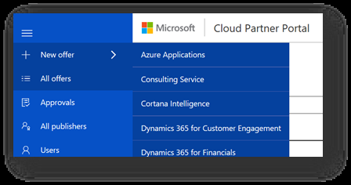

# Create a consulting offer

This article describes how to create and publish a consulting service offer.

## Define your offer

Define your packaged consulting service offering. Focus on fixed scope, fixed duration, estimated fixed price (or free), and primarily presales-oriented offerings for a single customer. Select repeatable packaged engagements that are popular and effective at driving new business for you.

## Create a new offer

To create a new offer, follow these steps.
1. On the main menu of the Cloud Partner Portal, select **New offer**.
1. On the **New offer** menu, select **Consulting service**.

    

## Next steps

The **New Offer** page for the consulting service offer type provides a set of tabs and form fields that you use to create a new offer. The following articles explain how to use the tab to define the offer settings and storefront details for your new offer:

-	[Define offer settings](./cpp-consulting-service-define-offer-settings.md)
-	[Enter storefront details, and whether to publish in the Azure Marketplace or on AppSource](./cpp-consulting-service-storefront-details.md)
