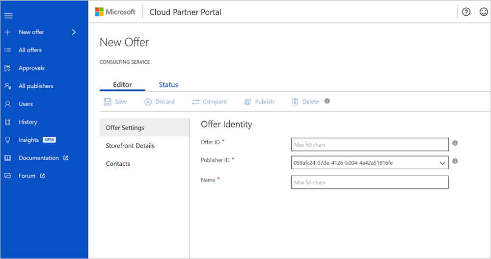
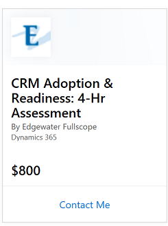

# Offer settings tab

On the **New Offer** screen, the first step is to create the offer identity. The offer identity consists of three parts: **Offer ID**, **Publisher ID**, and **Name**. Each of these parts is covered in the following sections.

### Offer ID*

This identifier is a unique name you create when you first submit the offer. It must consist only of lowercase alphanumeric characters, dashes, or underscores. The **Offer ID** is visible in the URL and affects search engine results. An example is *yourcompanyname_exampleservice*.

As shown in the example, the **Offer ID** is appended to your publisher ID to create a unique identifier. This unique identifier is exposed as a permanent link that can be booked and is indexed by the search engines.

>[!Note]
>After an offer is live, its identifier can't be updated.

### Publisher ID*

This identifier is related to your account. After you sign in with your organizational account, your **Publisher ID** shows up in the drop-down menu.

### Name*

This string displays as the offer name on AppSource or in the Azure Marketplace. The **Name** box is limited to 50 characters. The reviewer might need to edit your title to append the duration and offer type to your offer name.

The following example shows how the offer name is assembled. 

The offer name is composed of four parts:

-   **Duration:** Defined on the **Storefront Details** tab of the editor. Duration can be expressed in hours, days, or weeks.
-   **Type of service:** Defined on the **Storefront Details** tab of the editor. Types of services are `Assessment`, `Briefing`, `Implementation`, `Proof of concept`, and `Workshop`.
-   **Preposition:** Inserted by the reviewer.
-   **Name:** Defined on the **Offer Settings** page.

>[!Note]
>The **Name** box is limited to 50 characters. The reviewer might need to edit your title to append the duration and offer type to your offer name.

The following list provides several well-named offer names:

-   Essentials for Professional Services: 1-Hr Briefing
-   Cloud Migration Platform: 1-Hr Briefing
-   PowerApps and Microsoft Flow: 1-Day Workshop
-   Azure Machine Learning Services: 3-Wk PoC
-   Brick and Click Retail Solution: 1-Hr Briefing
-   Bring Your Own Data: 1-Wk Workshop
-   Cloud Analytics: 3-Day Workshop
-   Power BI Training: 3-Day Workshop
-   Sales Management Solution: 1-Week Implementation
-   CRM Quickstart: 1-Day Workshop
-   Dynamics 365 for Sales: 2-Day Assessment

After you fill out the **Offer Settings** tab, save your submission. The offer name now appears above the editor, and you can find it in **All Offers**.

## Next steps

Now you can enter [storefront details and determine whether to publish in the Azure Marketplace or on AppSource](./cpp-consulting-service-storefront-details.md).
