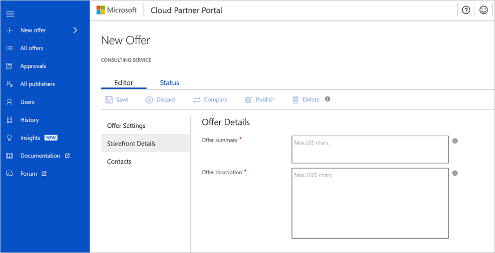

# Storefront Details tab

This article explains how to enter the details for your storefront. The **Storefront Details** tab consists of the following sections:

-   **Offer Details**
-   **Publisher Information**
-   **Listing Details**
-   **Marketing Artifacts**

## Offer details

The **Offer Details** section contains the following boxes:

-   **Offer summary\***
-   **Offer description\***

### Offer summary\*

The offer summary is a brief description of your offer that appears just below the offer name. Use plain text to enter the offer summary, without any line breaks. The following examples are good offer summaries together with their corresponding offer names.

*Example 1*

-   **Offer name**: Cloud Analytics: 3-Day Workshop
-   **Offer summary**: Overview of Microsoft Azure and Power BI,
    assessment of current environment, and mini POC.

*Example 2*

-   **Offer name**: Industrial Azure IoT: 30-Day Proof of Concept
-   **Offer summary**: Create an industrial-connected product pilot to
    securely connect equipment in the field to an Azure IoT Hub solution
    with dashboards, reports, and notifications.

*Example 3*

-   **Offer name**: Professional Services: 1-Hr Briefing
-   **Offer summary**: Overview and demo of preconfigured, extended
    Dynamics 365 for Operations solution that provides enhanced management
    of projects, billing, and resources for professional services.

*Example 4*

-   **Offer name**: Power BI in Your World: 4-Hr Workshop
-   **Offer summary**: Get up and running with your first dashboard and
    learn best practices. For up to 12 students, conducted on-site.

*Example 5*

-   **Offer name**: Dynamics and Projects: 3-Day Assessment
-   **Offer summary**: Requirements gathering and assessment for an ERP
    solution designed for professional services firms and project-driven
    businesses.

### Offer description\*

Enter the description of the consulting service offer in the **Offer description** box. A good offer description covers exact details of what the engagement looks like and the end deliverable to the customer. It should clearly help the customer understand what they get. Include how your offering relates to the Microsoft product for which you're offering consulting services.

Don't include your email address or phone number in your offer description. A **Contact Me** button is included with your offer to upload leads to the lead management target that you identify for your offer.

Enter the offer description in Markdown format. If you're not familiar with Markdown or formatting for HTML, see [Use Markdown for writing docs](https://docs.microsoft.com/contribute/how-to-write-use-markdown).

Use these formats to make sure that your offer is easy for your customers to read.

Keep your offer description brief and adhere to the character limit because users don't like to read long text. You also can upload marketing brochures, fact sheets, and other documents that describe your offer in deeper detail.

The following example demonstrates a well-composed offer description and its related name and summary:

**Offer name**: Cloud Analytics: 3-Day Workshop

**Offer summary**: Overview of Microsoft Azure and Power BI, assessment
of current environment, and mini POC.

**Offer description**: This 3-day workshop is for technical and business
leaders and is held on-site at the client's facility.

Agenda

Day 1

-   Focuses on how to secure, scale, and organize data within the
    Microsoft cloud by using Azure Data Lake, Azure HDInsight, or Azure SQL Data
    Warehouse.

Day 2

-   Covers how to configure and deploy advanced analytics solutions with
    Microsoft R and Azure Machine Learning.

Day 3

-   Covers how to draw actionable insights and operationalize analytics
    with Power BI and includes a collaborative session to cobuild a Power
    BI dashboard.

Deliverables

By the end of the workshop, the client can define a
high-level plan and an implementation roadmap for data and analytics
solutions in the Microsoft cloud.

The following sample Markdown file is for the previous offer:

    This 3-day workshop is for technical and business leaders and is held on-site at the client’s facility.

      ### Agenda

      **Day 1**

      * Focuses on how to secure, scale, and organize data within the Microsoft cloud by using Azure Data Lake, Azure HDInsight, or Azure SQL Data Warehouse.

      **Day 2**

      * Covers how to configure and deploy advanced analytics solutions with Microsoft R and Azure Machine Learning.

      **Day 3**

      * Covers how to draw actionable insights and operationalize analytics with Power BI and includes a collaborative session to cobuild a Power BI dashboard.

      ### Deliverables
      By the end of the workshop, the client will be able to define a high-level plan and an implementation roadmap for data and analytics solutions in the Microsoft cloud.

## Publisher information

**MPN ID**

Enter your nine-digit Microsoft Partner Network (MPN) ID. If you don't have an
MPN ID, you can get one at the Microsoft Partner Center.

**Partner Center ID**

Enter your new Partner Center ID, if you have one.

**MPN ID**

Enter a secret key to preview your offer on AppSource before it goes live.
This identifier isn't a password.

## Listing details

**Consulting service type**

Microsoft focuses exclusively on fixed scope, fixed duration, estimated or fixed price (or free), and primarily presales-oriented consulting service offerings for a single customer. Types of services are assessment, briefing, implementation, proof of concept, and workshop offers conducted either on-site or virtually. The AppSource consulting services marketplace doesn't support listings for managed or subscription services.

>[!Note]
>AppSource consulting services aren't the appropriate marketplace for subscription or on-demand trainings.

The following five types of offerings are included:

-   **Assessment**: An evaluation of a customer's environment to
    determine applicability of a solution and provide an estimate of
    cost and timing.
-   **Briefing**: An introduction to a solution or a consulting service
    to draw customer interest by using frameworks, demos, and customer
    examples. Briefings must be conducted on-site.
-   **Implementation**: A complete installation that results in a fully
    working solution. For this pilot, Microsoft recommends limiting to
    solutions that can be implemented in one week or less.
-   **Proof of concept**: A limited-scope implementation to determine if
    a solution meets a customer's requirements.
-   **Workshop**: An interactive engagement conducted on a customer's
    premises that can include training sessions, briefings, assessments,
    or demos built on the customer's data or environment.

**Country/region availability**

Select the country and region where this consulting service offer 
is available. A single offer can't be published in multiple countries
or regions. A new offer must be created for each country or region.

>[!Note]
>AppSource consulting services are currently live in the United States, the United Kingdom, and Canada. You can submit an offer for a country/region that isn't yet live, and it will be reviewed and prepared to go live. A minimum number of offers ready to go live are needed to open a new country/region, so offers for countries/regions that aren't live are encouraged.

**Industries**

Select the industries that your consulting service offer is most
applicable to.

**Duration**

Select a number (for example, 3 or 4) under **Duration**, and then
select **Hour**, **Day**, or **Week**.

**Primary products**

To publish to the Azure Marketplace, select **Azure** as the primary
product. Then select the relevant **Solution Areas**.

To publish to AppSource, select **Dynamics 365**, **Power BI**, or
**PowerApps** as your primary product. You also can select other relevant
**Applicable Products**. Then your consulting service offer shows in
listings that are associated with each of these products on AppSource.

**Relevant competencies**

Select competencies relevant to this offer to have them displayed along
with the offer details.

## Marketing artifacts

**Company logo (.png format, 48 x 48 pixels)**

Upload an image that appears on the tile of your offer in the offer
gallery view page. The image must be a .png image with a resolution of
48 x 48 pixels.

**Company logo (.png format, 216 x 216 pixels)**

Upload an image that appears on the details page of your offer. The
image must be a .png image with a resolution of 216 x 216 pixels.

**Videos (limited to four)**

Upload up to four customer case study videos or customer reference
videos. If you don't have any, upload a video that explains your company's
expertise related to the offer. If you have a Power BI or PowerApps
solution showcase, upload the showcase video here. Video links must be
for YouTube or Vimeo.

**Documents (limited to three)**

Upload the marketing brochure that describes your consulting service
offer in detail. You also can upload a company overview,
fact sheets, or case studies. Make sure that your documents use the current
names of featured products and don't feature Microsoft competing products.

**Screenshots (limited to five)**

Upload up to five images that provide more information about your offer,
its deliverables, or your company. A snippet of your
marketing brochure, a relevant slide from a presentation, or an image
that shows company momentum or expertise are some examples.

## Next steps

You're now ready to [publish your consulting services](./cpp-consulting-service-publish-offer.md) offer.
