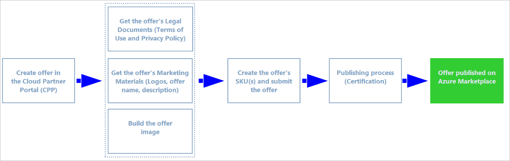

# Containers

<table> <tr> <td>This section explains how to publish a container image to the <a href="https://azuremarketplace.microsoft.com">Azure Marketplace</a>.  
The container offer type supports Docker container images provisioned as <a href="https://docs.microsoft.com/azure/aks/index">Azure Kubernetes Service</a> instances or <a href="https://docs.microsoft.com/azure/container-instances/container-instances-overview">Azure Container Instances</a> and hosted in an <a href="https://docs.microsoft.com/azure/container-registry">Azure Container Registry</a> repository. </td> <td></td> </tr> </table>

## Offer components

This section outlines the elements of publishing a container, and is intended as a guide for the publisher to the Azure Marketplace. Publishing's divided into the following main parts:

- [Prerequisites](./cpp-prerequisites.md) - lists the technical and business requirements before creating or publishing a container offer.
- [Create the offer](./cpp-create-offer.md) -lists the steps required to create a new container offer entry using the Cloud Partner Portal.
- [Prepare the technical assets](./cpp-create-technical-assets.md) - how to create the technical assets for a container solution as an offer on the Azure Marketplace.
- [Publish the offer](./cpp-publish-offer.md) - how to submit the offer for publishing to the Azure Marketplace.

## Container publishing process

The following diagram illustrates the high-level steps in publishing a VM offer.

The high-level steps for publishing a container offer are:

1. Create the offer - Provide detailed information about the offer. This information includes: the offer description, marketing materials, support information, and asset specifications.
2. Create the business and technical assets - Create the business assets (legal documents and marketing materials) and technical assets for the associated solution (the containers images hosted in an Azure Container Registry.
3. Create the SKU - Create the SKU(s) associated with the offer. A unique SKU is required for each image you're planning to publish.
4. Certify and publish the offer - After the offer and the technical assets are completed, you can submit the offer. This submission starts the publishing process. During this process, the solution is tested, validated, certified, then "goes live" on the Azure Marketplace.

## Next steps

Before you consider these steps, you must meet the [technical and business requirements](./cpp-prerequisites.md) for publishing a container to the Microsoft Azure Marketplace.