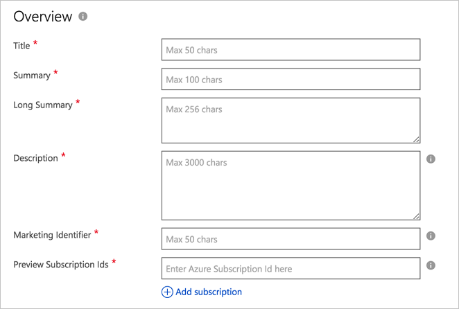

# Container Marketplace tab

The **Marketplace** tab of the **New Offer** page enables you to provide your prospective customers with marketing, sales, and legal information and agreements and manage leads generated from the marketplace. Add your marketing-specific content to the **Overview** section.

## Overview

In this section, you enter the general information about your Azure Marketplace Offer.  An asterisk (*) appended to the field name indicates that it's required.

The following table describes the purpose and content of these fields. Required fields are indicted by an asterisk (*).

|    Field                  |       Description                                                            |
|  ---------                |     ---------------                                                          |
| **Title\***                 | Title of the offer. It will be displayed prominently in the marketplace.  Maximum length is 50 characters. |
| **Summary\***               | Short summary of the offer. Maximum length is 100 characters. |
| **Long Summary\***          | Longer summary of the offer (though it could be the same as the **summary**).  Maximum length is 256 characters. |
| **Description\***           | Description of the offer.  Maximum length is 3000 characters, supports simple HTML formatting.
| **Marketing Identifier**  | A unique URL to associate to this offer, which typically includes your organization and solution name. Maximum length is 50 characters.   |
| **Preview Subscription Ids\*** | Add one to 100 subscription identifiers of previewers. These white-listed subscriptions will have access to the offer once it's published, before it goes live. |
|  |  |

## Next steps

Use the [Support](./cpp-support-tab.md) tab to provide the technical and user support resources for your offer.