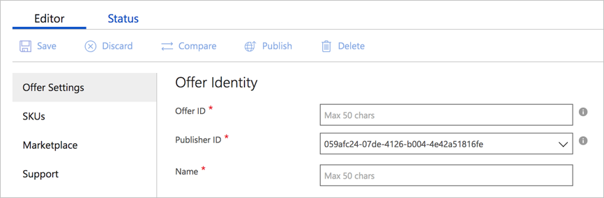

# Container Offer Settings tab

The **Containers > New Offer** page opens with the focus on the **Offer Settings** tab. 

## Offer Identity settings

Under **Offer Identity**, you must provide information for the fields described in the following table. An asterisk (*) appended to the field name indicates that it's required. 

|  **Field**       |     **Description**                                                          |
|  ---------       |     ---------------                                                          |
| **Offer ID\***       | A unique identifier (within a publisher profile) for the offer. This identifier will be visible in product URLs and insights reports. It has a maximum length of 50 characters, and can use lowercase alphanumeric characters and dashes (-). (The identifier can't end with a dash.) **Note:** This field can't be changed after an offer goes live.   For example, if Contoso publishes an offer with offer ID **sample-container**, it's assigned the Azure Marketplace URL `https://azuremarketplace.microsoft.com/marketplace/apps/contoso.sample-container?tab=Overview`. |
| **Publisher ID\***     | Your organization's unique identifier in the Azure Marketplace. All your offerings should be associated with your publisher ID. This value can't be changed after the offer's saved. |
| **Name\***          | The display name for your offer. This name is displayed in the Azure Marketplace and in the Cloud Partner Portal. It can have a maximum of 50 characters. We recommend using a  recognizable brand name for your product. Don’t include your organization's name unless that's how your product is marketed. If you are marketing this offer in other websites and publications, ensure that the name is exactly the same across all publications. |
|  |  |

Select **Save** to save your Offer Settings.

## Next steps

Use the [SKUs](./cpp-skus-tab.md) tab to configure the SKUs for your offer.
