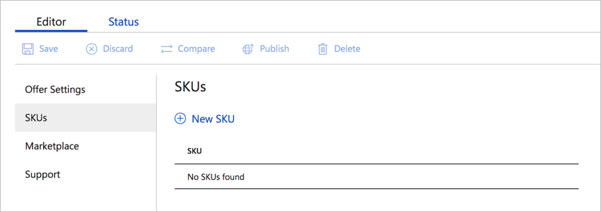
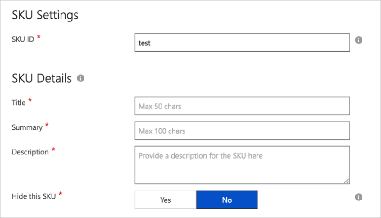
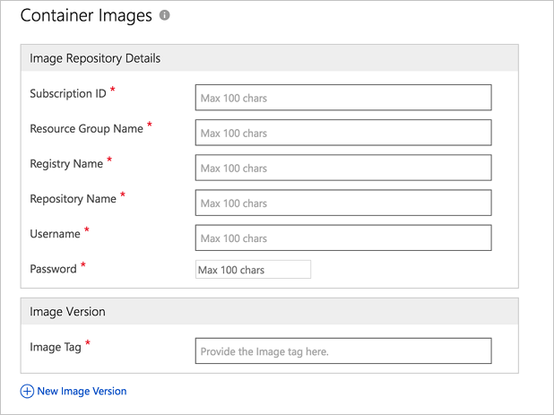

# Container SKUs tab

The **SKUs** tab of the **New Offer** page enables you to create one or more SKUs and associate them to your new offer.  You can use different SKUs to differentiate a solution by feature sets, billing models, or other characteristic.

## SKU Settings

When you start creating a new offer, there aren't any SKUs associated with the offer. To create a new SKU, follow these steps:

1. In the SKUs tab, select **New SKU**

   

2. Provide the required SKU and container information. Each SKU corresponds to a container image. There are two parts to a SKU:

    -   SKU metadata
    -   Container metadata

### SKU metadata

The SKU metadata contains storefront display information for the container listing.

### Container metadata

The container metadata has reference information of your image repository details inside Azure Container Registry (ACR). Azure Marketplace copies this image into a Marketplace-specific, public registry and then makes the image available for customers after certification. All requests from the Azure user to consume an Azure Marketplace container image are served from the Marketplace's public registry, not ACR.

    
The **Image Repository Details** in the previous screen capture contains the following fields.  Required fields are indicted by an asterisk (*).

-   **Subscription ID\*** - The Azure subscription ID where the ACR is present.
-   **Resource group name\*** - The resource group name of the ACR.
-   **Registry name\*** - The ACR name.
-   **Repository name\*** - The repository name. After this name is set, this value can't be changed. Use a unique name to avoid a conflict with other offers in your account.
-   **Username\*** - The username (admin username) associated with the ACR image.
-   **Password\*** - The password associated with the ACR image.

    >[!NOTE]
    >The username and password are required to ensure that partners have access to the ACR mentioned in the publishing process.

### Image Version

When publishing a container image, you can provide one or more image tags, and SHA digests.

**Image Tag\* or Digest**
 
- This tag or digest must include a `latest` tag and a version tag (for example, starting with `xx.xx.xx-` where xx is a number). They should be [manifest tags](https://github.com/estesp/manifest-tool) to target multiple platforms. All tags referenced by a manifest tag must also be added so we can upload them. 
- You can add several versions of container using tags. All manifest tags (except `latest`) must start with either `X.Y-` or `X.Y.Z-` where X, Y, Z are integers.   For example, if a `latest` tag points to  `1.0.1-linux-x64`, `1.0.1-linux-arm32`, and `1.0.1-windows-arm32`, these tags need to be added here.

>[!NOTE]
>Remember to add a **test tag** to your image so you can identify the image during testing.

## Next steps

Use the [Marketplace tab](./cpp-marketplace-tab.md) to create a marketplace description for your offer. 
