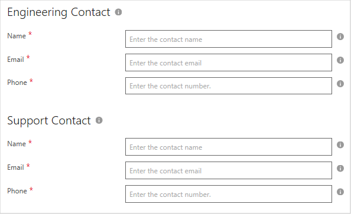

# Azure application Contacts tab

Use the **Contacts** tab to provide engineering and customer support information for your Dynamics 365 for Customer Engagement offer.

## Specify customer and engineering contacts

Supply the following values to define the primary **Engineering Contact** and for your offer. Required fields are indicted by an asterisk (*).

|    Field        |  Description                    |
|    ---------    |  ---------------                |
|  **Name\***       |  Name of the engineering contact for your app. This contact will receive technical communications from Microsoft.   |
|  **Email\***      |  Email address of the engineering contact  |
|  **Phone\***      |  Phone number of the engineering contact  |
|  |  |

Supply the following values to define the primary **Support Contact** and for your offer.

|    Field        |   Description                   |
|    ---------    |  ---------------                |
|  **Name\***       |  Name of the customer support contact for your app. This contact will receive support-related communications from Microsoft.   |
|  **Email\***      |  Email address of the customer support contact  |
|  **Phone\***      |  Phone number of the customer support contact  |
|  |  |

## Next steps

After you verify that you have required [technical assets](./cpp-create-technical-assets.md) for your offer, you are ready to [publish the Dynamics 365 for Customer Engagement offer](./cpp-publish-offer.md).
