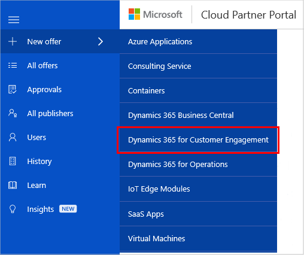

# Create a Dynamics 365 for Customer Engagement application offer

This section describes how to create and publish a Dynamics 365 for Customer Engagement application offer for the AppSource Marketplace. Every offer appears as its own entity in the marketplace and is composed of the following groupings of assets and supporting services: offer details, package technical information, marketing artifacts, support information, and optional Test Drive specifications. 

## New Offer form

Sign in to the [Cloud Partner Portal](https://cloudpartner.azure.com/), and then select **+ New offer** on the left menu bar. On the New offer menu, select **Dynamics 365 for Customer Engagement**:

The **New Offer** form is displayed, showing the initial [**Offer Settings** tab](./cpp-offer-settings-tab.md).

## Next steps

The **New Offer** page provides a set of tabs and form fields that you'll use to create a new offer. The following articles explain how to define the asset groups and supporting information for your new offer.

* [Offer Settings tab](./cpp-offer-settings-tab.md)
* [Technical Info tab](./cpp-technical-info-tab.md)
* [Test Drive tab](./cpp-testdrive-tab.md)
* [Storefront Details tab](./cpp-storefront-details-tab.md)
* [Contacts tab](./cpp-contacts-tab.md)
