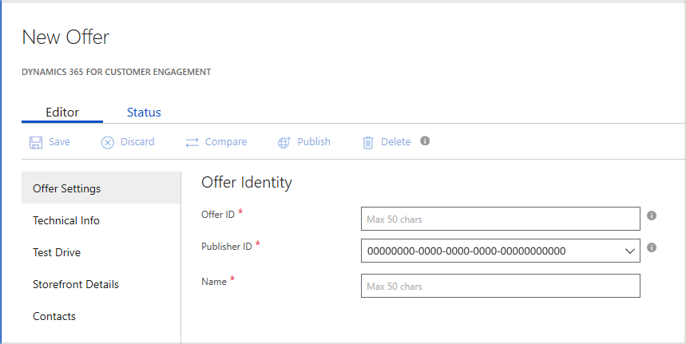

# Dynamics 365 for Customer Engagement Offer Settings tab

This article describes how to configure the offer settings for a Dynamics 365 for Customer Engagement application.

The **Dynamics 365 for Customer Engagement** > **New Offer** page opens with the focus on the **Offer Settings** tab.  An asterisk (*) appended to the field name indicates that it's required.

## Offer Settings fields

The following table describes the fields in this tab. Required fields are indicted by an asterisk (*).

|    Field         |       Description                                                            |
|  ---------       |     ---------------                                                          |
| **Offer ID\***   | A unique identifier (within a publisher profile) for the offer. This identifier will be visible in product URLs and insights reports. It has a maximum length of 50 characters, and can use lowercase alphanumeric characters and dashes (-). (The identifier can't end with a dash.) **Note:** This field can't be changed after an offer goes live because it's tied to the offer's marketplace base URL.  |
| **Publisher ID\***  | Your organization's unique identifier in the Azure Marketplace. All your offerings should be associated with your publisher ID. This value can't be changed after the offer is saved. |
| **Name\***       | The display name for your offer. This name is displayed in the AppSource Marketplace. It can have a maximum of 50 characters. We recommend using a  recognizable brand name for your product. Don’t include your organization's name unless that's how your product is marketed. If you are marketing this offer in other websites and publications, ensure that the name is exactly the same across all publications. |
|  |  |

Select **Save** to save your offer settings.

## Next steps

Use the [Technical Info tab](./cpp-technical-info-tab.md) to configure the application and package information for your offer.
