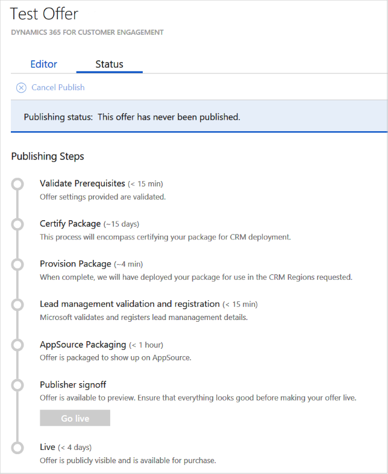

# Publish a Dynamics 365 for Customer Engagement offer

After you create a new offer by providing the information on the **New Offer** page, you can publish the offer. Select **Publish** to start the publishing process.

The following diagram shows the main steps in the publishing process for an offer to "go live".

  

## Detailed description of publishing steps

The following table describes each publishing step, with a time estimate (maximum) to complete each step.
The following table describes each publishing step. An estimated time to finish each step is also given.

|    Publishing Step             |   Time      |   Description                                                              |
|  -------------------           | --------    | ---------------                                                            |
| Validate prerequisites         | 15 min   | Offer information and offer settings are validated.                        |
| Certification                  | 1 week | Offer is analyzed by the Azure Certification Team. The offer is scanned for viruses, malware, safety compliance, and security issues. The offer is checked to see that it meets all the eligibility criteria. For more information, see [prerequisites](./cpp-prerequisites.md). Feedback is provided if an issue is found. |
| Packaging | 1 hour  | Offer’s technical assets are packaged for customer use and the lead systems are configured and setup. |
|  Publisher sign out             |  -        | Final publisher review and confirmation before the offer goes live. You can deploy your offer in the selected subscriptions (in the offer information steps) to verify that it meets all your requirements.  Select **Go Live** so your offer can move to the next step. |
| Packaging                 | 1 hour | The finished offer is replicated in marketplace production systems and regions. | 
| Live                           | 4 days |Offer is released, replicated to the required regions, and made available to the public. |
|  |  |  |

## Next steps

Allow for up to 10 business days for the publishing process to finish and the offer is released. After you finish the publishing process, your offer will be listed in the [Microsoft AppSource Marketplace](https://appsource.microsoft.com/marketplace/apps/).
