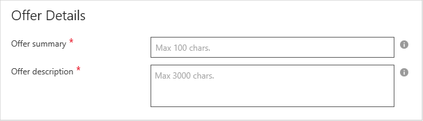
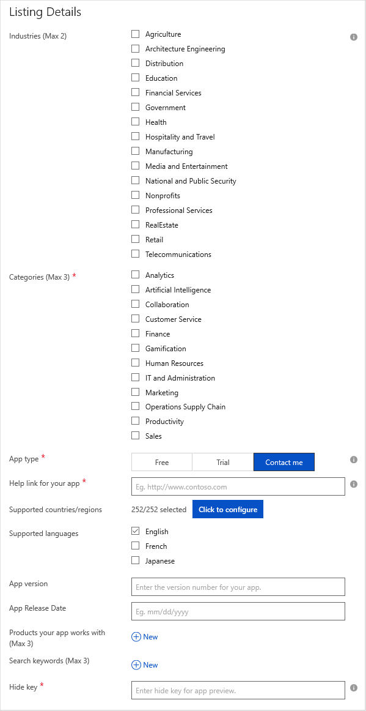
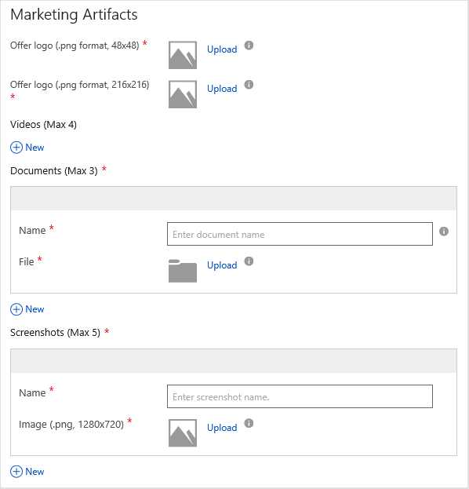
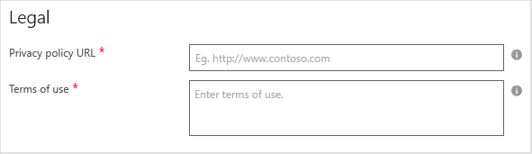

# Dynamics 365 for Customer Engagement Storefront Details tab

Use the **Storefront Details** tab to provide sales and marketing information and artifacts.  This tab contains the following six sections: **Offer Details**, **Listing Details**, **Marketing Artifacts**, **Legal**, **Customer Support**, **Lead Management**.  A label appended with an asterisk (*) indicates that it is required.

## Offer Details section

You will provide the summary and description of your offer in this section.  This information is prominently displayed in the marketplace.
 

Where the following table describes the fields in this tab. Required fields are indicted by an asterisk (*). 

|    **Field**          |  **Description**               |
|  ---------------      |  ---------------               |
|  Offer Summary\*        | Summary of your offer's value proposition. It will appear on your offer's search page. Format is plain text with a maximum of 100 characters. |
|  Offer Description\*    | Description that will appear on your app detail page. Format is simple HTML (including p, em, ul, li, ol, and header tags) with a maximum of 1300 characters.  |
|  |  | 

## Listing Details section

You will provide details about the marketplace listing in this section.

Where the following table describes the fields in this tab. Required fields are indicted by an asterisk (*). 

|    **Field**          |  **Description**               |
|  ---------------      |  ---------------               |
|  Industries           | Select the industries (maximum two) that the app best aligns to. If none applies, you can select zero options.  |
|  Categories\*         | Select the categories that are relevant to the app. Select between one and three options.  |
|  App type\*           | Select the type of trial that is enabled for the app on AppSource. **Free** indicates your app can be used without charge; **Trial** indicates that customers can try your app for a short period without charge; and **Contact me** indicates that customers can request a trial of the app on AppSource.  |
| Help link for your app\* | URL for online documentation or other help resource for the app.  |
| Supported countries/regions | A popup dialog enables the selection of the geographic regions where the app is offered.  Worldwide distribution is the default. |
| Supported languages   | Select the languages that your app supports. Currently only a few language options are supported.  (If your app supports additional languages that are not on this list, continue to publish your offer and email this information to: appsource\@microsoft.com.)  |
| App version           | Version number for the app    |
| App Release Date      | Release/publishing date of the app |
| Products your app works with | Products or services that your app inter-operates with. You can list maximum of three products. To list a product, click on **+New** and enter the name of a product in the displayed text box.  |
| Search keywords       | Set of keywords associated with the app, with a maximum of three keywords.  AppSource allows customer to search based on keywords.  Choose general, common words that users will likely use to search for your app.  |
|  Hide key\*           | A secret key that is combined with the offer URL to allow you to preview the offer before it goes live.  This key is *not* a password.  It can only contain alphanumeric characters.  |
|  |  |

## Marketing Artifacts section

In this section, you will provide marketing collateral: logo images, promotional or instructional videos, product documentation, and user interface screenshots.

Where the following table describes the fields in this tab: 

|      Field            |    Description                 |
|  ---------------      |  ---------------               |
| Offer logo (png format, 48x48)\* | Upload an image that will display on your app's search page. Format is PNG and size must be 48 x 48 pixel. |
| Offer logo (png format, 216x216)\* | Upload an image that will display on your app's detail page. Format is PNG and size must be 216 x 216 pixel. |
| Videos                | Upload promotional or instructional videos for the app, with a maximum of four.  For each video, fill in the video name, URL (YouTube or Vimeo only), and associated thumbnail in PNG format and sized 1280 x 720 pixel.  | 
| Documents\*             | Upload product promotional or instructional documents in PDF format, with a maximum of three.  For each document, provide a document name.  |
| Screenshots\*           | Upload a maximum of five images of the app UI in PNG format and sized 1280 x 720 pixels.  These  screenshots will appear on the AppSource detail page for your app. |
|  |  |

## Legal section

You will provide *privacy policy* and *terms of use* for your app in this section.

Where the following table describes the fields in this tab: 

|      Field            |    Description                 |
|  ---------------      |  ---------------               |
| Privacy Policy URL\*    | URL of the online privacy policy for your app.  |
| Terms of use\*          | Terms of use for your app in plain text.  AppSource customers are required to accept these terms before they can try your app. |
|  |  |

## Customer Support section

In this section, you will provide the **Support URL** for your app.

## Lead Management section

In this section, you will provide the mechanism to handle leads generated by your offer listing.  Typically leads are stored in customer relationship management (CRM) systems.  The following destinations are supported: **None**, **Azure Table**, **Dynamics CRM Online**, **HTTPS Endpoint**, **Marketo**, and **Salesforce**.  For more information, see [Get customer leads](../../cloud-partner-portal-orig/cloud-partner-portal-get-customer-leads.md).

## Next steps

Next, you will provide technical and customer support information in the [Contacts tab](./cpp-contacts-tab.md). 
