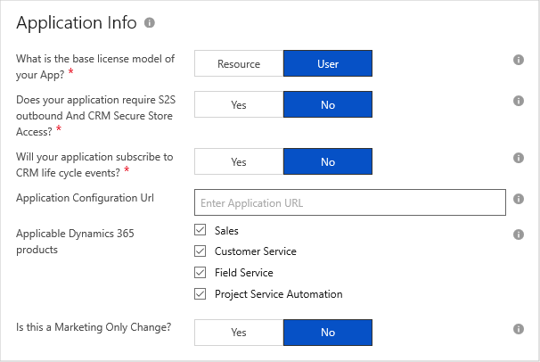
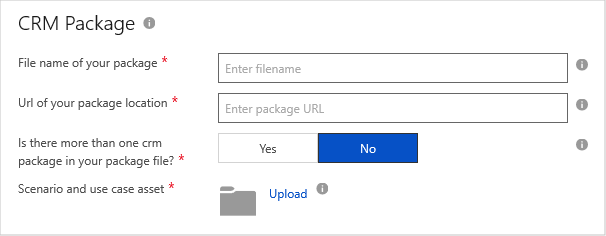

# Dynamics 365 for Customer Engagement Technical Info tab

The **Technical Info** tab of the **New Offer** page enables you to specify detailed information about your Dynamics 365 for Customer Engagement application, including CRM package and marketing logo assets.  This tab is divided into four sections: **Application Info**, **CRM Package**, **CRM Package Availability**, and **Marketing Artifacts**. An appended asterisk (*) on a field name indicates that it is required. 

## Application Info section

You will provide details about your Dynamics 365 application in this section.

The following table describes these fields. Required fields are indicted by an asterisk (*).

|      Field                    |    Description                  |
|    ---------                  |  ---------------                |
|   Base license model\*          |  License model determines how customers are assigned  your application in the Dynamics 365 Admin Center. **Resource** licensing is instance-based, whereas **User** licenses are assigned one per tenant.  |
|  S2S outbound & CRM Secure Store Access\* |  Enables configuration of CRM Secure Store or Server-to-Server (S2S) outbound access. *This feature requires specialized consideration from the Dynamics 365 Team during the certification phase.* Microsoft will contact you to complete additional steps to support this feature.  |
| Subscribe to CRM life-cycle events\* | Integration with Dynamics 365 Life Cycle events requires you to provide a dedicated service that is registered through a special agreement with Microsoft. *This feature requires specialized consideration from the Dynamics 365 Team during the certification phase.* You will be contacted to complete additional steps to support this capability.  |
| Application Configuration Url | URL of the web page that enables the user to configure the application |
| Applicable Dynamics 365 products  | Select the Dynamics 365 products that this offer applies to. This offer will show up under selected products in AppSource.  |
| Marketing Only Change         | Setting this option to Yes indicates that only marketing/descriptive changes have been made to the existing offer.  Such changes allow the offer to bypass the certification and provisioning stages.  |
|  |  |

## CRM Package section

You will provide details about your AppSource package file in this section.  This information will be used by the Dynamics 365 validation and certification teams.

The following table describes these fields.  Required fields are indicted by an asterisk (*).

|      Field                    |    Description                  |
|    ---------                  |  ---------------                |
|  Filename of your package\*     |  Filename of your package (.zip).  This name is *not* public and will be used internally by Dynamics 365 certification team.  |
|  Url of package location\*      |  URL of an Azure Storage account that contains the uploaded package file. This URL should include a read-only SAS key to allow our team to pick up your package for verification.  |
| More than one crm package\*     | Select Yes ONLY if you are supporting multiple versions of crm with different packages.  Each version will have a corresponding package file tht you must create individually.  |
| Scenario and use case asset\*   | Enables the upload of a functional specification document for your application, for use by the Dynamics 365 validation team.  The preferred format for this spec is the [E2E User Scenario Template](https://isvdocumentation.blob.core.windows.net/d365documentation/Power%20Platform%20E2E%20document.docx).  |
|  |  |

## CRM Package Availability section

In this section, select which geographic regions your application will be available to customers.  Deploying to the following sovereign regions *require special permission and validation* during the certification process: [Germany](https://docs.microsoft.com/azure/germany/), [US Government Cloud](https://docs.microsoft.com/azure/azure-government/documentation-government-welcome), and TIP.

## Marketing Artifacts section

This section requires you to upload an application logo that will be used to represent your package in the AppSource Marketplace.  The logo image must be in the PNG format and be of size 255 x 115 pixels.

## Next steps

We recommend that you offer a demonstration of your application by completing the [Test Drive tab](./cpp-testdrive-tab.md)
