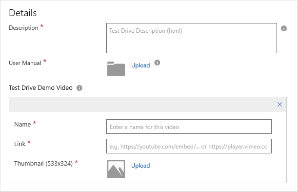
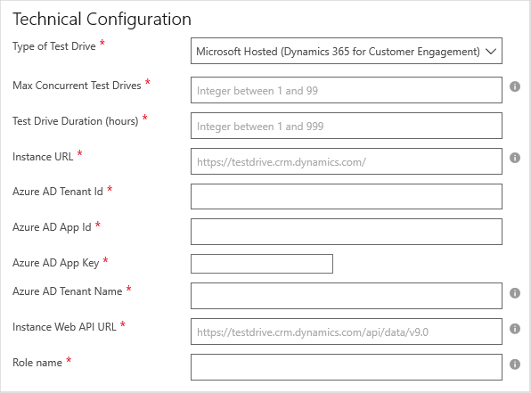

# Dynamics 365 for Customer Engagement application Test Drive tab

Use the **Test Drive** tab to create a trial experience for your customers.  It provides customers with a hands-on, self-guided trial of your offer's key features and benefits, demonstrated in a real-world implementation scenario.  Of the trial options available, Test Drive is the most effective at generating high-quality leads and increased conversion of those leads.  For more information, see [What is Test Drive?](../test-drive/what-is-test-drive.md)

The Test Drive experience for Dynamics 365 applications automatically runs as a Microsoft-hosted solution.  For more information, see [Hosted Test Drive](https://docs.microsoft.com/azure/marketplace/cloud-partner-portal/test-drive/hosted-test-drive).

The Test Drive tab has three potential sections: **Test Drive**, **Details**, and **Technical Configuration**.  The last two sections are only displayed after you enable Test Drive functionality.  An asterisk (*) appended to the field name indicates that it’s required. 

## Test Drive section

To enable this functionality, select **Yes** to **Enable a Test Drive**.

## Details section

You will provide basic Test Drive information in the **Details** section.   

The following table describes the fields required to set up the test drive for your Dynamics 365 application. Required fields are indicted by an asterisk (*).

|      Field                    |    Description                  |
|    ---------                  |  ---------------                |
|      Description\*            |   Describe what can be done on your Test Drive. You can use basic HTML tags to format this description. For example, &lt;p&gt;, &lt;em&gt;, &lt;ul&gt;, &lt;li&gt;, &lt;ol&gt;, and headings.  |
|  User Manual\*                |   Upload a user manual that your customers can use to walk through the Test Drive experience. This document must be a .pdf file. |
|  Test Drive Demo Video (optional) |  You can provide a video walkthrough of your Test Drive. A customer can watch this video before they take a test drive. Provide a URL to the video on YouTube or Vimeo. If you select **+ Add Video**, you’ll be prompted to provide the following information:<ul><li>Name</li><li>URL</li><li>Thumbnail (in PNG format, 533 x 324 pixels)</li></ul>  |
|   |   |

## Technical Configuration section

in this section, you will provide technical details about your test drive.

Where the fields have the following purposes.  Required fields are indicted by an asterisk (*).

|      Field                    |    Description                  |
|    ---------                  |  ---------------                |
| Type of Test Drive\*            | Choose **Microsoft Hosted (Dynamics 365 for Customer Engagement)**.  |
| Max Concurrent Test Drives\*    | Number of concurrent instances of an active Test Drive at any given point of time. Each user will consume a Dynamics license while their Test Drive is active, so you will need to ensure you have at least this many Dynamics licenses available for Test Drive users. Recommended value of 3-5.  |
| Test Drive Duration (hours)\*   | Maximum number of hours the user's Test Drive instance will be active for. After this period is exceeded, the instance will be deprovisioned from your tenant. Recommended value of 2-24 hours depending on the complexity of your app. The user can always request another Test Drive if they run out of time and want to re-evaluate.  |
| Instance URL\*                  | URL that the Test Drive will initially navigate to. This is typically the URL of your Dynamics 365 instance that has your app and sample data installed onto.  |
| Azure AD Tenant ID\*            | GUID of the Azure tenant for your Dynamics 365 Instance. To retrieve this value, login to Azure portal and navigate to **Azure Active Directory** > **Select Properties** > **Copy the Directory ID**.  |
| Azure AD App ID\*               | GUID of your Azure AD application  |
| Azure AD App Key\*              | Secret of your Azure AD application, for example: `IJUgaIOfq9b9LbUjeQmzNBW4VGn6grr1l/n3aMrnfdk=` |
| Azure AD Tenant Name\*          | Name of the Azure tenant for your Dynamics 365 instance. Use the format of <tenantname.>onmicrosoft.com, for example: `testdrive.onmicrosoft.com`  |
| Instance Web API URL\*          | Web API URL for your Dynamics 365 Instance. You can retrieve this value by logging into your Microsoft Dynamics 365 instance and navigating to **Settings** > **Customization** > **Developer Resources** > **Instance Web API (Copy this URL)**. Example value: `https://testdrive.crm.dynamics.com/api/data/v9.0`  |
| Role name\*                     | Name of the custom Dynamics 365 security role you have created for your Test Drive and will be assigned to the users when they run it, for example `testdriveuser`. |
|  |  |

After you provide all the required information, select **Save**.

## Next steps

Next you will provide marketing and sales information in the [Storefront Details tab](./cpp-storefront-details-tab.md).

