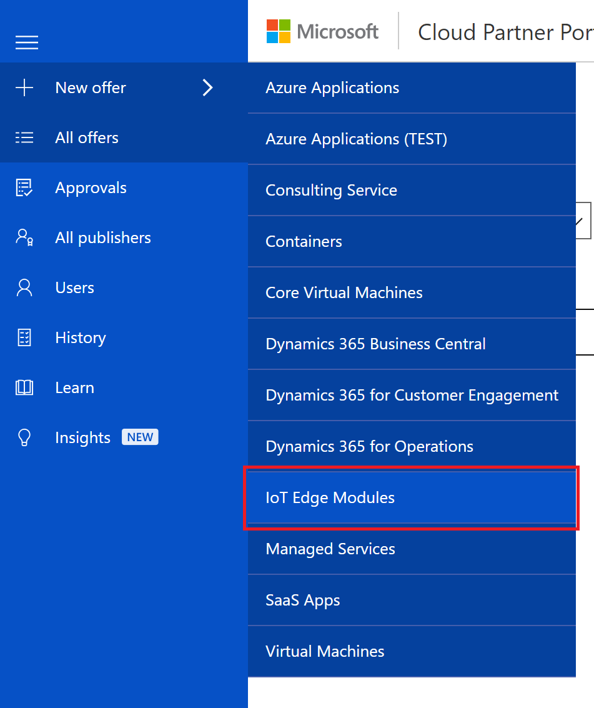

# Create a new IoT Edge module offer with the Cloud Partner Portal

This article describes how to create and publish an IoT Edge module offer entry for the Azure Marketplace. Every offer appears as its own entity in Azure Marketplace and is associated with one or more SKUs.  An IoT Edge module offer is composed of the following groupings of assets and supporting services:

|  **Asset group**   |  **Description**  |
|  ---------------   |  ---------------  |
|    SKUs            |  The smallest deployable unit of an offer. A single offer (product class) can have multiple SKUs associated with the offer. You can use SKUs to differentiate between supported features and billing models. |
|  Marketplace       | Contains marketing, legal and lead management assets and specifications.  <ul><li> Marketing assets include offer name, description, and logos</li> <li> Legal assets include a privacy policy, terms of use, and other legal documentation</li>  <li> Lead management policy enables you to specify how to handle leads from the Azure Marketplace end-user portal.</li> </ul> |
| Support            | Contains support contact and policy information |

## New Offer form 

Sign in to the [Cloud Partner Portal](https://cloudpartner.azure.com/), and then select **+ New Offer** on the left menu bar. On the New Offer menu, select **IoT Edge Modules** to display the **New Offer** form and start the process of defining assets for a new ioT Edge Module offer. 

## Next steps

The **New Offer** page for the IoT Edge module offer type provides a set of tabs and form fields that you'll use to create a new offer. Each of the following articles explains how to use the tab to define the asset groups and supporting services for your new IoT Edge module offer.

- [Offer Settings tab](./cpp-offer-settings-tab.md)
- [SKUs tab](./cpp-skus-tab.md)
- [Marketplace tab](./cpp-marketplace-tab.md)
- [Support tab](./cpp-support-tab.md)
