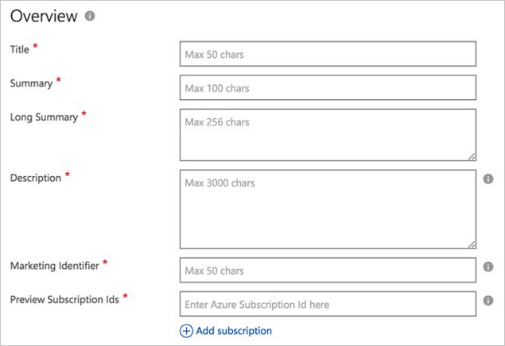
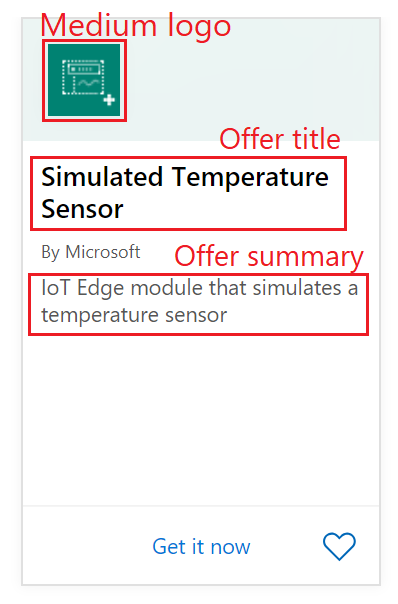
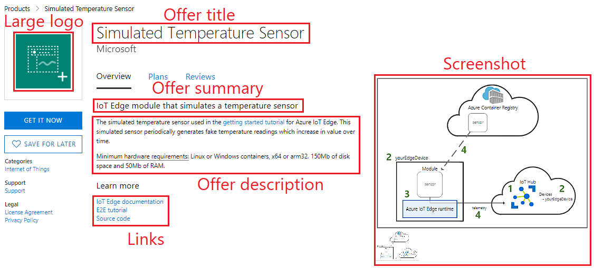
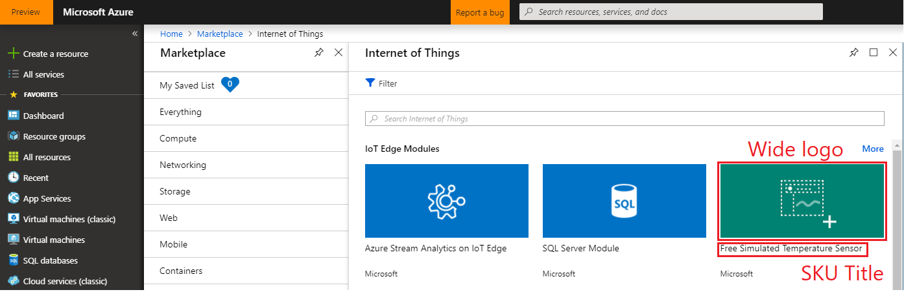
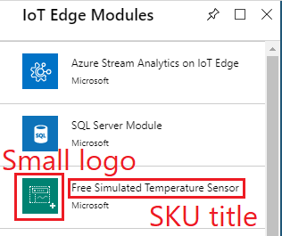
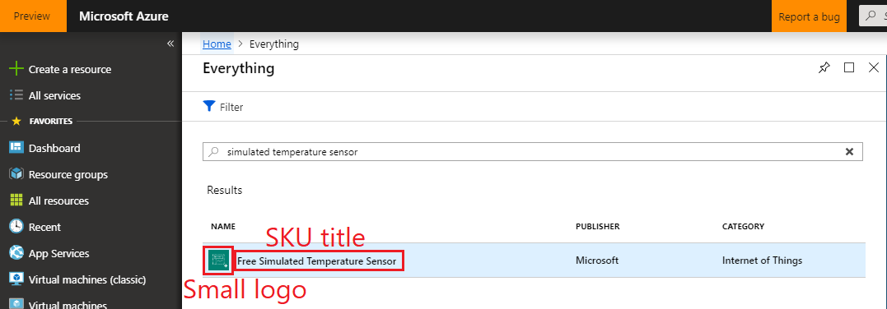
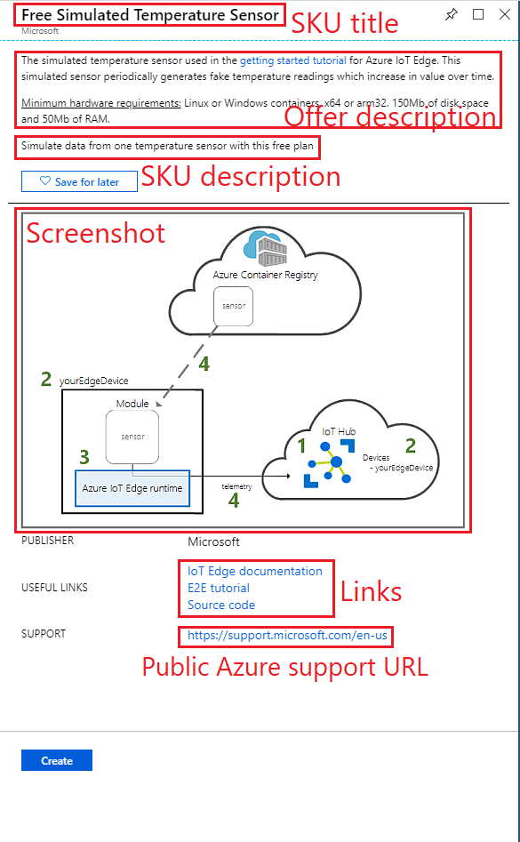
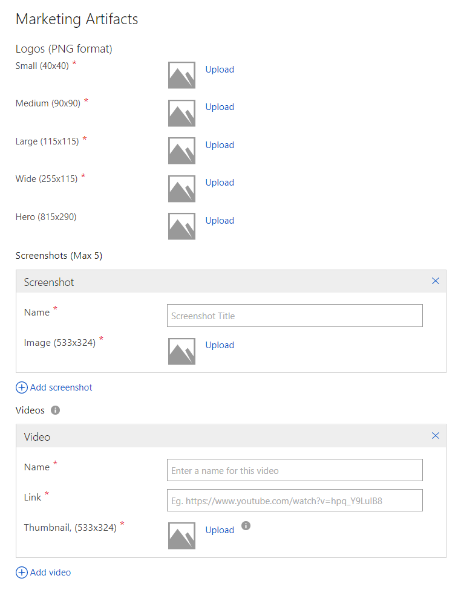

# IoT Edge module Marketplace tab

The **Marketplace** tab of the **New Offer** page enables you to provide your prospective customers with marketing, sales, and legal information and agreements and manage leads generated from the marketplace. This long form is divided into four sections: **Overview**, **Marketing Artifacts**, **Lead Management**, and **Legal**.

## Overview

In this section, you enter the general information about your Azure Marketplace Offer.  An asterisk (*) appended to the field name indicates that it's required.

The following table describes the purpose and content of these fields. Required fields are indicted by an asterisk (*).

|  **Field**                |     **Description**                                                          |
|  ---------                |     ---------------                                                          |
| **Title\***                 | Title of the offer. It will be displayed prominently in the marketplace.  Maximum length of 50 characters. <!--ADD PICTURE IN ACTION-->|
| **Summary\***               | Short summary of the offer. Maximum length of 100 characters. <!--ADD PICTURE IN ACTION-->|
| **Long Summary\***          | Longer summary of the offer (though it could be the same as the **summary**).  Maximum length of 256 characters. <!--ADD PICTURE IN ACTION-->|
| **Description\***           | Description of the offer.  Maximum length of 3000 characters, supports simple HTML formatting.  It must include a *minimum hardware requirements* paragraph at the bottom. for example:   
<u>Minimum hardware requirements:</u> Linux x64 and arm32  OS, 1 GB of RAM, 500 Mb of storage

| **Marketing Identifier\***  | A unique URL to associate to this offer, typically includes your organization and solution name, maximum length 50 characters.  For example:   `https://azuremarketplace.microsoft.com/marketplace/apps/contoso.sampleIoTEdgeModule`  |
| **Preview Subscription IDs** | Add one to 100 subscription identifiers of previewers. These white-listed subscriptions will have access to the offer once it's published, before it goes live. |
| **Useful Links**          | Multi-selection of business and technical categories that offer can be best associated with.  A maximum of 10 allowed. Make sure to add at least one link to your documentation and one link to the compatible IoT Edge devices from the [Azure IoT device catalog](https://catalog.azureiotsolutions.com/). |
| **Suggested Categories\*** | Pick up to five categories. They'll be shown on your product details page. In the browse pages, all IoT Edge modules are shown under the *Internet of Things \> IoT Edge module* category.|
|  |  |

### Offer example

 The following examples show how the offer **Title**, **Summary**, **Description**, **Logos**, and **Screenshots** fields appear in different views.

 
#### On the Azure Marketplace website:

- When browsing offers:

    

- When looking at offer details:

    

#### On the Azure portal website:

- When browsing offers:

    

    

- When searching for an offer:

    

- When looking at offer details:

    

## Marketing Artifacts

This section has the following subsections: **Logos**, **Screenshot**, and **Videos**. 

>[!Note]
>Logos are the only required marketing artifacts, however all are highly recommended for best customer appeal.

|  **Field**                |     **Description**                                                          |
|  ---------                |     ---------------                                                          |
| *Logos*  | See the previous screen captures to see how and where your logos will be used.  |
| **Small\***                 | 40x40 pixel PNG format                                                     |
| **Medium\***                | 90x90 pixel PNG format                                                     |
| **Large\***                 | 115x115 pixel PNG format                                                  |
| **Wide\***                  | 255x115 pixel PNG format                                                   |
| **Hero**                  | 815x290 pixel PNG format.  Optional, however once uploaded the hero icon cannot be deleted. |
| *Screenshots*  | Screenshots are displayed on your product details page. They're a good way to visually communicate what your IoT Edge module does and how it works. You can show architecture diagrams or use case illustrations for instance. Optional, but maximum of five screenshots per SKU. |
| **Name**                  | Name or title. Maximum length of 100 characters.                             |
| **Image**                 | Screen capture image, 533x324 pixel PNG format                               |
| *Videos*  | Videos are displayed on your product details page. They're a good way to visually communicate what your IoT Edge module does and how it works. |
| **Name**                  | Name or title. Maximum length of 100 characters.                             |
| **Link**                  | Video URL, hosted on YouTube or Vimeo                                        |
| **Thumbnail**             | 533x324 pixel PNG format                                                     |
|  |  |

### Logo guidelines

<!-- It seems like this section could be better located in some common area, maybe an AMP Marketing/Design section 
+1 this should all be in a common area and referenced from here to that location.-->

All the logos uploaded to the Cloud Partner Portal should follow the guidelines:

*  The Azure design has a simple color palette. Keep the number of primary and secondary colors on your logo low.
*  The theme colors of the Azure Portal are white and black. Avoid using these colors as the background color for your logos. Use a color that will make your logos prominent in the Azure portal. We recommend simple primary colors. If you're using a transparent background, make sure that the logos/text aren't white, black, or blue.
*  Don't use a gradient background on your logo.
*  Avoid placing text—even your company or brand name—on the logo. The look and feel of your logo should be "flat" and should avoid gradients.
*  Don't stretch the logo.

#### Hero logo

The Hero logo is optional.

>[!Important]
>After the Hero logo is uploaded, it can't be deleted.

Use the following guidelines for a Hero logo: 

*  Black, white, and transparent backgrounds aren't allowed.
*  Avoid using any light color as the background for the logo.  The publisher display name, plan title and the offer long summary are displayed in white font color, and must stand out against the background.
*  Avoid using most text when you're designing the logo. The publisher name, plan title, the offer long summary, and a create button are embedded programmatically inside the logo when the offer's listed. 
* Include an unused rectangular space on the  right-side of your hero logo. This blank space is 415x100 pixels, and offset from the left by 370 pixels.  

<!-- P2: woudl be nice to also have an picture int he context of iot edge of the hero image
As an example, the following hero icon is for the Azure Container Service.

-->

## Lead management

This section enables you set up the options for collecting customer leads generated from your Azure Marketplace offers. You can select the following storage options from a dropdown list.

* **None** - the default, lead information is not collected.
* Azure Table - written to the Azure table specified by a connection string.
* Dynamics CRM Online - written to the [Microsoft Dynamics 365 Online](https://dynamics.microsoft.com/) instance, specified by a URL and authentication credentials.
* HTTPS Endpoint - written to the specified HTTPS endpoint as a JSON payload.
* Marketo - written to the specified [Marketo](https://www.marketo.com/) instance, specified by server ID, munchkin ID, and form ID.
* Salesforce - written to a [Salesforce](https://www.salesforce.com/) database, specified by an object Identifier.

After you successfully publish your offer, the lead connection is verified and a test lead is automatically sent to the destination that you configured. 

>[!Note]
>Lead information should be continuously managed and these settings should be promptly updated whenever changes are made to your customer management architecture.

<!-- there is missing some marketing imagess
1. inside azure portal the wide logo/regular logo
2. inside azure portal the top curation section
3. amp.com the pricing tab
4. amp.com the tile -->

## Legal

This section lets you provide the two legal documents that are required for each offer: Privacy Policy and the Terms of Use.

|  **Field**                    |     **Description**                                                          |
|  ---------                    |     ---------------                                                          |
| **Privacy Policy URL\***      | URL to your posted privacy policy                                            |
| **Use Standard Constract\***  | Whether to use the standard Microsoft contract template.  For more information, see [Standard Contract](https://docs.microsoft.com/azure/marketplace/standard-contract).   |
| **Terms of use\***            | *Terms of use* as inline simple HTML or link to your posted terms of use page     |
|  |  |

## Next steps

Use the [Support](./cpp-support-tab.md) tab to provide the technical and user support resources for your offer.
