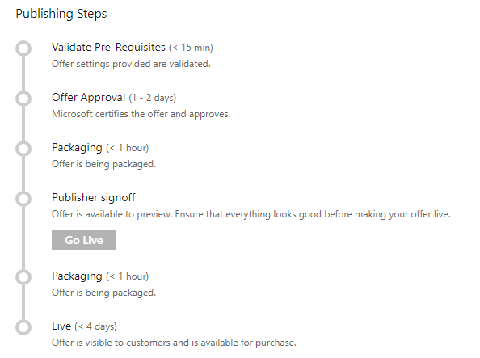

# Publish IoT Edge module offer

>[!Important]
>Starting March 30th, 2020, we'll begin moving management of your IoT Edge module offers to Partner Center. After the migration, you'll create and manage your offers in Partner Center. Follow the instructions in [Create an IoT Edge module offer](https://aka.ms/AzureCreateIoT) to manage your migrated offers.

 After you create a new offer by providing the information on the **New Offer** page, you can publish the offer. Select **Publish** to start the publishing process.

The following diagram shows the main steps in the publishing process for an offer to "go live".

## Detailed description of publishing steps

The following table describes each publishing step, with a time estimate (maximum) to complete each step.
<!-- P2: we need to tell them that if an offer seems stuck in a step, to know that they should file a support ticket (link to support ticket doc) -->

|  **Publishing Step**           | **Time**    | **Description**                                                            |
|  -------------------           | --------    | ---------------                                                            |
| Validate prerequisites         | 15 min   | Offer information and offer settings are validated.                        |
| Certification                  | 2 weeks | Offer is analyzed by the Azure Certification Team. This step will perform scans for viruses, malware, safety compliance, and security issues. It will also verify that this IoT Edge module offer meets all eligibility criteria (see [prerequisites](./cpp-prerequisites.md) and [preparing your technical assets](./cpp-create-technical-assets.md)). Feedback is provided if an issue is found. |
| Packaging | 1 hour  | Offer's technical assets are packaged for customer use and the lead systems are configured and setup. |
|  Publisher sign off             |  -        | Final publisher review and confirmation before the offer goes live. You can deploy your offer in the selected subscriptions (in the offer information steps) to verify that it meets all your requirements.  Select **Go Live** so your offer can move to the next step. |
| Packaging                 | 1 hour | Finalized offer is replicated in marketplace production systems and regions. | 
| Live                           | 4 days |Offer is released, replicated to the required regions, and made available to the public. |

Allow for up to 10 business days for the publishing process to finish and the offer is released. After you finish the publishing process, your IoT Edge module offer will be listed in the [Microsoft Azure Marketplace](https://azuremarketplace.microsoft.com/marketplace/apps/category/internet-of-things?page=1&subcategories=iot-edge-modules).

## Next steps

- [Update an existing IoT Edge module offer on Azure Marketplace](./cpp-update-existing-offer.md)
