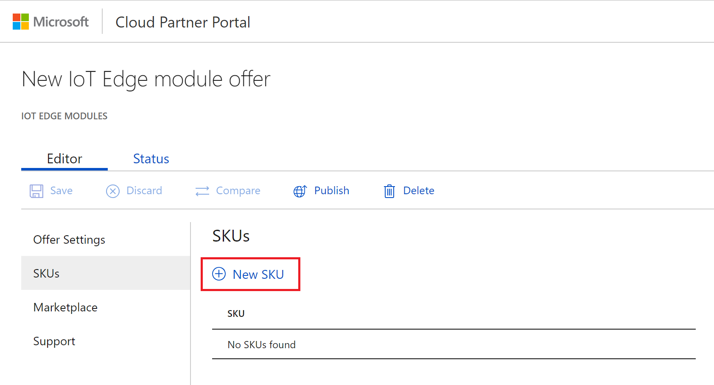
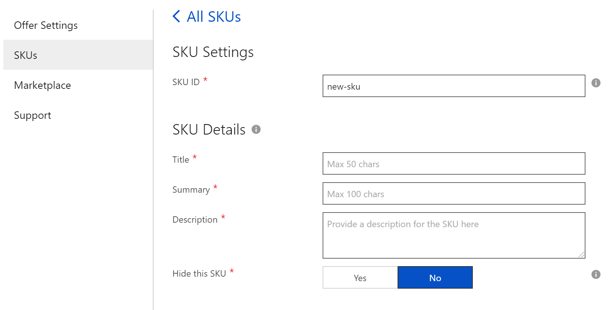
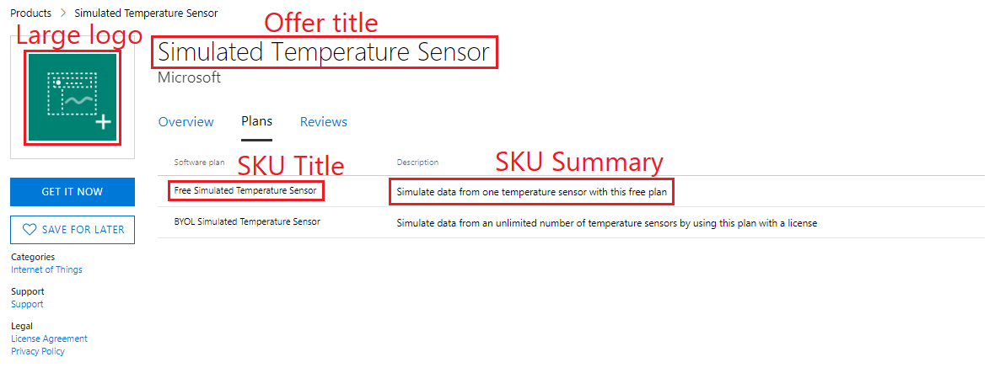
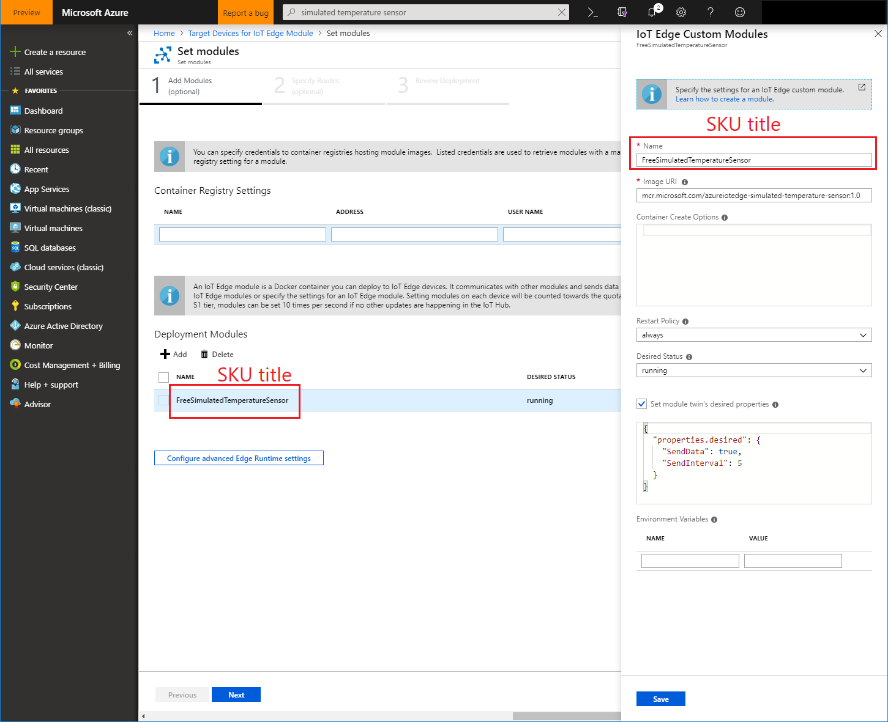
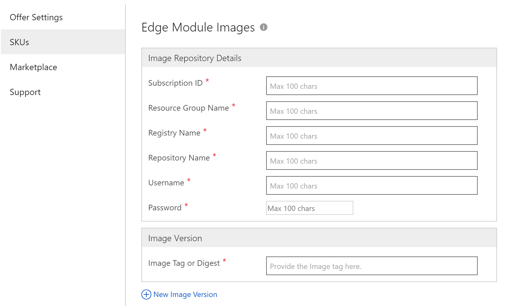
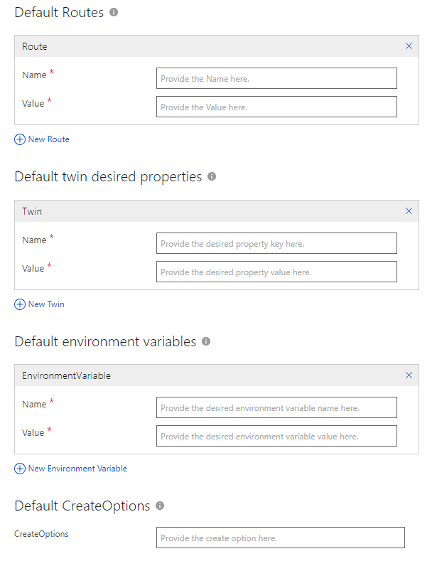

# IoT Edge module SKUs tab

The **SKUs** tab of the **New Offer** page enables you to create one or more SKUs and associate them to your new offer.  You can use different SKUs to differentiate a solution by feature sets, billing models, or some other characteristic.

## SKU Settings

When you start creating a new offer, there aren't any SKUs associated with the offer. To create a new SKU, follow these steps:

- On the **IoT Edge Modules > New Offer** page, select the **SKUs** tab.
- Under SKUs, select **+ New SKU** to open a dialog box.

  

- On the **New SKU** dialog box, enter an identifier for the SKU and then select **OK**.
(The following table gives the identifier naming conventions.)

The **SKUs** tab is refreshed and displays the fields that you edit to configure the SKU. An asterisk (*) appended to the field name indicates that it's required.

|  **Field**       |     **Description**                                                          |
|  ---------       |     ---------------                                                          |
| **SKU ID\***       | Identifier for this SKU. This name has a maximum of 50 characters, consisting of lowercase alphanumeric characters or dashes (-), but can't end with a dash. **Note:** You can't change this name after the offer's published. The name is publicly visible in product URLs. |
|  |  |

## SKU Details

Configure the **SKU Details** to define how your SKU will be displayed on the Azure Marketplace and Azure Portal websites.

The following table describes the purpose, content, and formatting for fields under **SKU Details**. Required fields are indicted by an asterisk (*).

|  **Field**       |     **Description**                                                          |
|  ---------       |     ---------------                                                          |
| **Title\***        | Title for this SKU. Maximum length of 50 characters.   It will be shown in the Azure Portal and will be used as a default module name (without spaces and special characters) when it's deployed. See the pictures below to see exactly where this field is displayed.|
| **Summary\***      | Short summary of this SKU. Maximum length of 100 characters. Do **NOT** summarize the offer, just the SKU.  This summary will be shown in the Azure Marketplace. See the pictures below to see exactly where this field is displayed.|
| **Description\***  | Short description of this SKU.Maximum length of 3000 characters. Do NOT describe the offer but just this SKU. It will be shown in the azure marketplace and in the Azure portal. In the Azure portal, it will be appended to the Marketplace Description describing the offer defined in the Marketplace tab.  It can be the same as the SKU Summary. See the pictures below to see exactly where this field is displayed.|
| **Hide this SKU\*** | Keep the default setting, which is **No**. |
|  |  |

### SKU example

 The following examples show how the SKU **Title**, **Summary**,  and **Description** fields appear in different views.
 

#### On the Azure Marketplace website:

- When looking at SKU details:

    

#### On the Azure Portal website:

- When browsing SKUs:

    

    

- When searching for SKUs:

    

- When looking at SKU details:

    

- When deploying the module:
    
    

## SKU content

Under **Edge Module Images**, provide the information we need to upload your IoT Edge module.

Give us access to your [Azure Container Registry](https://azure.microsoft.com/services/container-registry/) (ACR) that contains your IoT Edge module image so that we can upload it and certify it. After it's published, your IoT Edge module will be copied and distributed using a public container registry hosted by the Azure Marketplace.

You can target multiple platforms and provide several versions through tags. Learn more about [tags and versioning in "Prepare your IoT Edge module technical assets"](./cpp-create-technical-assets.md).

The following table describes the purpose, contents, and formatting of the fields for the sections **Image Repository Details** and **Image Version**.  Required fields are indicted by an asterisk (*).

|  **Field**       |     **Description**                                                          |
|  ---------       |     ---------------                                                          |
|  |  ***Image Repository Details***    |
| **Subscription ID\***        | The Azure subscription ID of your ACR.|
| **Resource group name\***      | The resource group name of your ACR.|
| **Registry name\***  | Your ACR registry name. Only copy the registry name, NOT the login server name (for example, without the `azurecr.io`.) |
| **Repository name\***  | The repository name of your ACR that contains your IoT Edge module. **Note:** After the name is set, it can't be changed  later. Use a unique name to ensure that no other offer in your account has the same name. |
| **Username\*** | The username associated with your ACR (admin username). |
| **Password\*** | The password associated with your ACR. |
|    |  ***Image Version***   |
| **Image Tag or Digest\*** | It must at least include a `latest` tag and a version tag (for example, starting with `xx.xx.xx-` where xx is a number). They should be [manifest tags](https://github.com/estesp/manifest-tool) to target multiple platforms. All tags referenced by a manifest tag must also be added so we can upload them. You can add several versions of an IoT Edge module using tags. All manifest tags (except `latest`) must start with either `X.Y-` or `X.Y.Z-` where X, Y, Z are integers. Learn more about [tags and versioning in "Prepare your IoT Edge module technical assets"](./cpp-create-technical-assets.md).   For example, if a `latest` tag points to  that points to `1.0.1-linux-x64`, `1.0.1-linux-arm32`,  , and `1.0.1-windows-arm32`, these 6 tags needs to be added here. |
|  |  |

### Help your customers launch by using default settings

Define the most common settings to deploy your IoT Edge module. Optimize customer deployments by letting them launch your IoT Edge module out-of-the-box with these defaults.

The following table describes the purpose, contents, and formatting of the fields for **Default Routes**, **Default twin desired properties**, **Default environment variables**, and **Default CreateOptions**.

|  **Field**       |     **Description**                                                          |
|  ---------       |     ---------------                                                          |
| **Default routes**        | Each default route name and value must be fewer than 512 characters. You can define up to 5 default routes. Make sure to use a correct [route syntax](https://docs.microsoft.com/azure/iot-edge/module-composition#declare-routes) in your route value. To refer to your module, use its default module name, which will be your **SKU Title** without spaces and special characters. To refer to other modules not yet known, use the `<FROM_MODULE_NAME>` convention to let your customers know that they need to update this info. Learn more about [IoT Edge routes](https://docs.microsoft.com/azure/iot-edge/module-composition#declare-routes).   For example, if module `ContosoModule` listens for inputs on `ContosoInput` and output data at `ContosoOutput`, it makes sense to define the following 2 default routes: - Name #1: `ToContosoModule` - Value #1:`FROM /messages/modules/<FROM_MODULE_NAME>/outputs/* INTO BrokeredEndpoint("/modules/ContosoModule/inputs/ContosoInput")` - Name #2: `FromContosoModuleToCloud` - Value #2: `FROM /messages/modules/ContonsoModule/outputs/ContosoOutput INTO $upstream`   |
| **Default twin desired properties**      | Each default twin desired properties name and value must be fewer than 512 characters. You can define up to 5 name/value twin desired properties. Values of twin desired properties must be valid JSON, non-escaped, without arrays and with a maximum nested hierarchy of 4. Learn more about [twin desired properties](https://docs.microsoft.com/azure/iot-edge/module-composition#define-or-update-desired-properties).   For example, if a module supports a dynamically configurable refresh rate via twin desired properties, it makes sense to define the following default twin desired property:  - Name #1: `RefreshRate` - Value #1: `60`|
| **Default environment variables**  | Each default environment variables name and value must be fewer than 512 characters. You can define up to 5 name/value environment variables.  For example, if a module requires to accept terms of use before being started, you can define the following environment variable:  - Name #1: `ACCEPT_EULA` - Value #1: `Y`|
| **Default createOptions**  | The createOptions must be fewer than 512 characters. It must be valid JSON, non-escaped. Learn more about [createOptions](https://docs.microsoft.com/azure/iot-edge/module-composition#configure-modules).   For example, if a module requires bind a port, you can define the following createOptions:   `"HostConfig":{"PortBindings":{"5012/tcp":[{"HostPort":"5012"}]}`|
|   |   |

Select **Save** to save your SKU settings. 

## Next steps

Use the [Marketplace tab](./cpp-marketplace-tab.md) to create a marketplace description for your offer.
