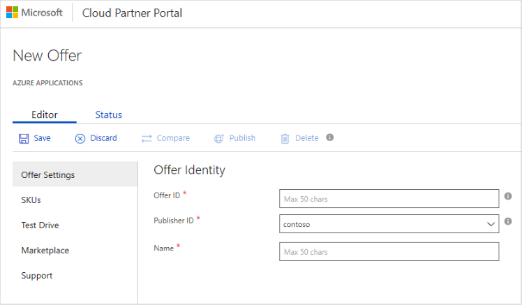

# Create Azure Marketplace and AppSource offers

One essential purpose of the Cloud Partner Portal is to enable publishers to create (and then publish) offers to the Microsoft Azure and AppSource Marketplaces.  This operation always begins with selecting the desired offer type from the [New offer menu](../portal-tour/cpp-new-offer-menu.md).  In response, the appropriate **New Offer** page is displayed for that offer type.  For example, the following image shows the default **New Offer** page for an Azure application type.

There are two tab selections available in the horizontal menubar displayed towards the top of this page: 
- **Editor** tab - Enables the entry of information and uploading of assets for the new offer instance.  This tab is displayed by default.
- **Status** tab - Provides the publishing status, and lists any validation and review issues. 

When you create an offer, you use the **Editor** tab to enter information about that offer. 

## Editing operations

The horizontal toolbar, located above the data input area, displays the following buttons:

|   Button    |   Purpose                                                          |
|   ------    |  --------                                                          |
| **Save**    | Saves any recent data entry changes.  You must manually save changes before you navigate away from the page or your changes are lost. | 
| **Discard** | Discards recent data entry changes (since the last save)             |
| **Compare** | Compares the state of the current offer with the published offer.  Only enabled after an offer has been successfully published.  |
| **Publish** | Begins the publishing process for this offer                       |
| **Delete**  | Deletes this offer after it is created but before it has been published. |
|   |   |

## Editing tabs

When creating an offer, you supply the required and optional data in each tab located in the left-hand vertical column of the **New Offer** page.  Standard user interface controls--such as text boxes, drop-down menus, and check boxes--are displayed for data collection.  Although the specific collection of editing tabs depends upon the offer type, the following table lists some of the common tabs.

|      Tab name       |   Purpose                                                            |
|      --------       |   -------                                                            |
| **Offer Settings**  | Collects offer and publisher identity information.                    |
| **SKUs**            | Defines the technical and business characteristics for each stock-keeping unit (SKU) version of your offer |
| **Test Drive**      | For those types that support this optional feature, defines a demonstration for your offer.  For more information, see [What is Test Drive?](../test-drive/what-is-test-drive.md)  |
| **Marketplace** or **Storefront** | Collects text strings, documents, and images used to list the offer in the marketplace |
| **Support**         | Collects contact information for customer, engineering, and online support  |
|  |  |

The content of the similarly named tabs may differ among different offer types.  Offer-specific details of these tabs are provided within the "Create offer" section for each offer type.

## Next steps

After you create and save an offer, and before or after you publish it, you can [view its status](./cpp-view-status-offer.md).
