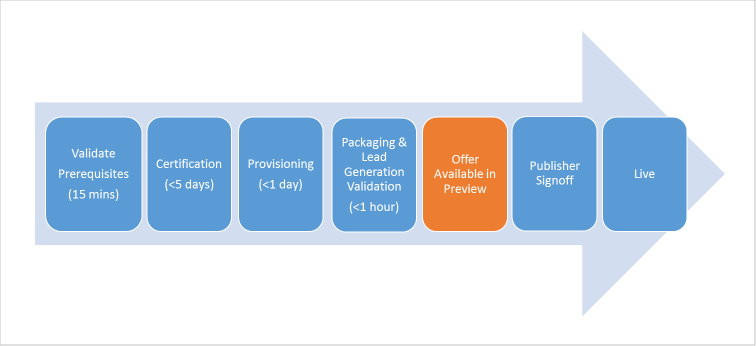

# Publish Azure Marketplace and AppSource offers

Once you've populated all the offer details, it's time to publish your offer and take it "live" on Azure Marketplace. There are a few stages the offer goes through. Make sure both your marketing content and your technical assets meet the quality requirements, to be Azure Certified and go live on the website.  The following diagram illustrates the general offer publishing process.  This process differs somewhat among the various offer types.

## Publishing Process

Use the following steps to publish your offer.

1. Click **Publish** under the **Editor** tab to start the publishing process.
2. Under the **Status** tab, you see the **Publishing Steps** in flowchart form.  This form also specifies the current status of your offer, and reported issues.
3. Once you verify everything looks correct and works properly in preview, you are ready to go live. Click **Go Live** under the **Status** tab and Microsoft will take your offer into production and on the appropriate marketplace. Typically, go live takes several hours.

At any point in the publishing process, you can also sign in and click the **All Offers** tab to view the latest status for any of your offers. You can click directly on the status for your offer and see the details on where your offer is in the publishing process.

## Canceling the publishing request

You might start the process of publishing and have a need to cancel your request. You can only cancel a publishing request once the publish request reaches the *Publisher sign out* step. To cancel, click **Cancel Publish**. The publishing status resets to Step 1, and to republish, you must click **Publish** and follow the steps in the **Status** tab.

## Next steps

During the publishing process, it is useful to monitor the [offer status](./cpp-view-status-offer.md) until the offer goes live. 
