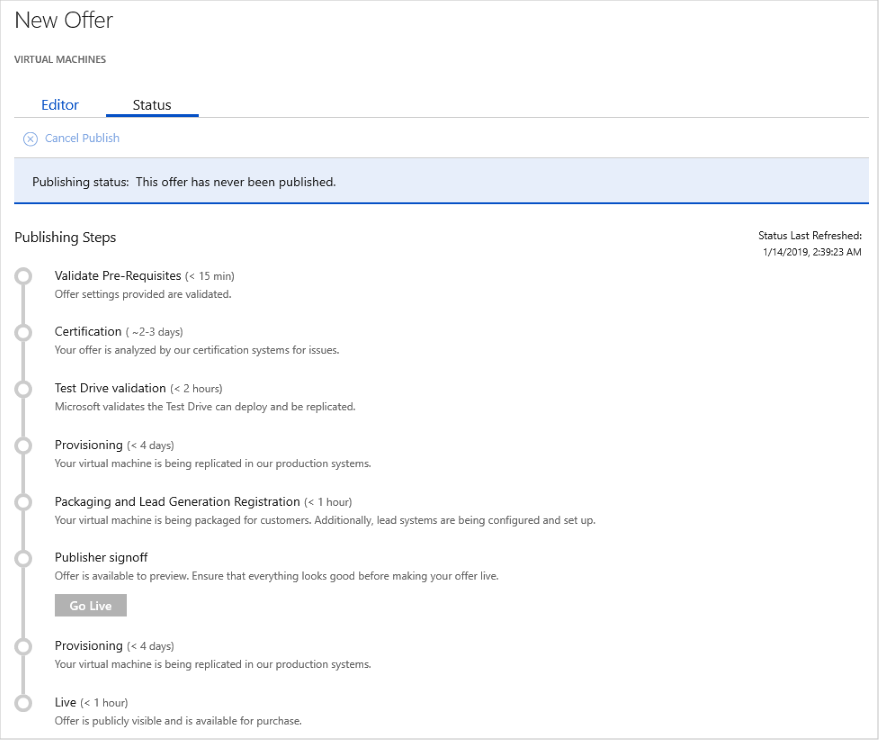
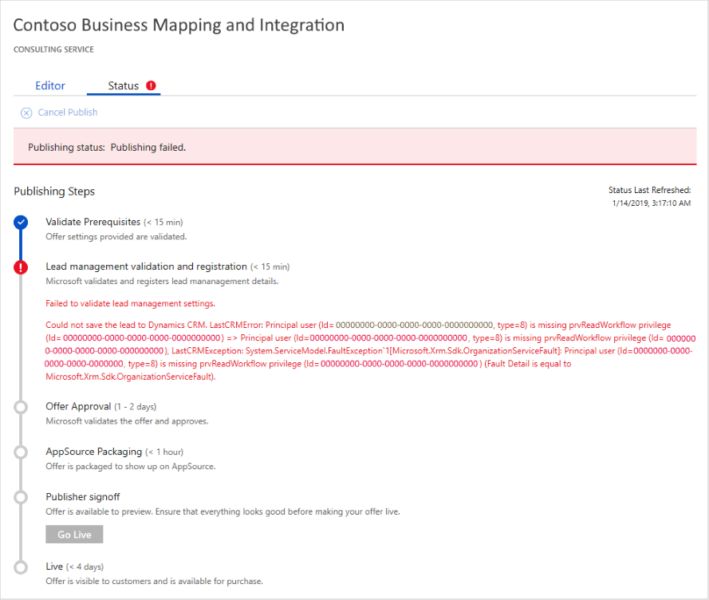
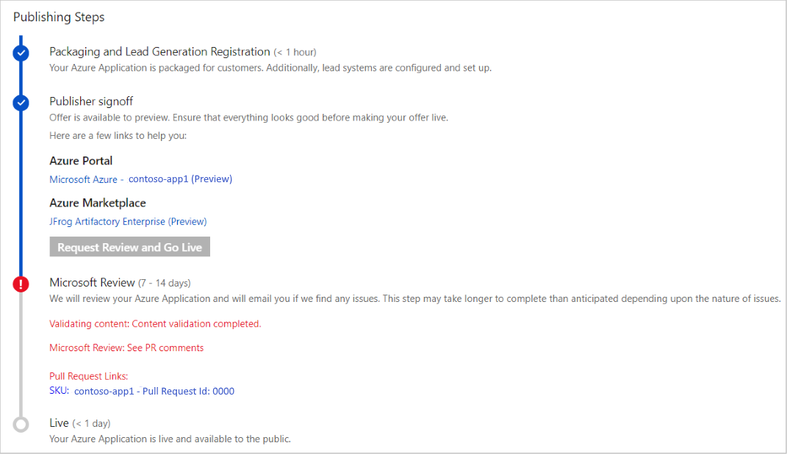

# View the publishing status of Azure Marketplace and AppSource offers

After you create an offer, and especially during the publishing process, you can view the status of your offer in the Cloud Partner Portal.  Overall publishing status is available in the [**All Offers**](../portal-tour/cpp-all-offers-page.md) and [**Approvals**](../portal-tour/cpp-approvals-page.md) pages of the portal.  One of the following status indicators should be displayed for each offer.  

|            Status              |   Description                                                           |
|            ------              |   -----------                                                           |
| **-**                          | Offer has been created but publishing process has not begun.            |
| **Publish in progress**        | Offer is working its way through the steps of the publishing process.   |
| **Publish failed**             | A critical issue was discovered during validation or review by Microsoft. |
| **Publish canceled**           | The publisher has canceled the offer publishing process.  This state does not delist an existing offer in the marketplace. | 
| **Awaiting publisher sign out** | Offer was reviewed by Microsoft, and now awaits a final verification by the publisher. |
| **Delisted**                   | A previously published offer in the marketplace has been removed.      | 
|  |  |

## Publishing status details 

More detail about the status on an offer as it goes through the publishing process is found in the **Status** tab of the **New Offer** page.  This page lists all the publishing steps for that offer type.  *Note that the number and specific steps often differ among offer types.*  This page also indicates any outstanding issues raised by the Microsoft validation and review steps, which often require action by the publisher before the publishing process can proceed.  For example, the following image shows the **Status** tab for a new virtual machine offer. 

The next example **Status** tab for a consulting service, showing a reported error in the lead management settings.  Because lead management is required for consulting services, this error must be corrected before publishing can continue.

The final example status of an Azure application shows a critical Microsoft review issue.  It contains a hot link to the Azure DevOps item that contains detailed information about this review issue.  For more information, see [Publish Azure application offer](cpp-publish-offer.md).

## Next steps

To correct outstanding issues or update offer settings, you must [update an offer](./cpp-update-offer.md). 
